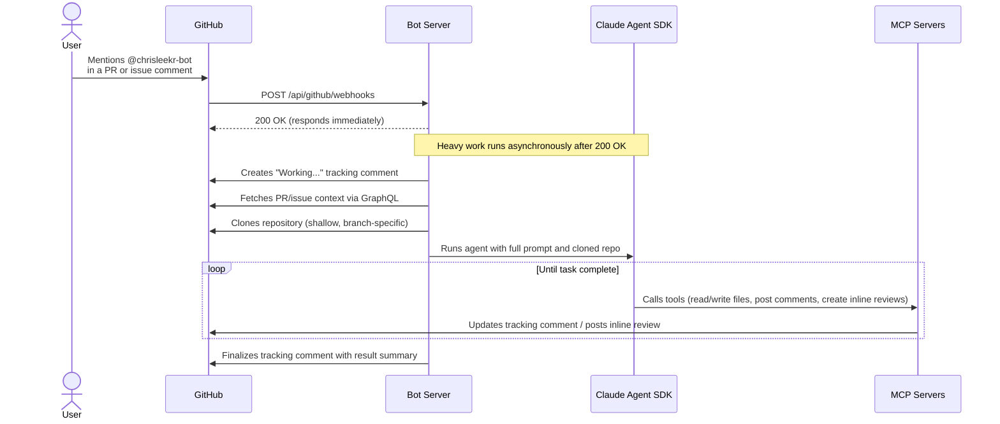

# GitHub App Playground - @chrisleekr-bot

GitHub App that responds to `@chrisleekr-bot` mentions on PRs and issues — powered by Claude Agent SDK.

Ported from [claude-code-action](https://github.com/anthropics/claude-code-action) tag mode to a standalone webhook server.

## Features

- **Code review**: Mention `@chrisleekr-bot` on a PR for AI-powered code review
- **Code changes**: Ask the bot to fix bugs, refactor, or implement features
- **Q&A**: Ask questions about the codebase on issues or PRs
- **Extensible**: Add new webhook events, MCP servers, or behaviors

## Setup

See [docs/SETUP.md](./docs/SETUP.md) for the full GitHub App creation and configuration guide.

### Quick Start (Development)

```bash
cp .env.example .env   # Fill in credentials (see SETUP.md for details)
bun install
bun run dev
```

## Architecture



See [CLAUDE.md](./CLAUDE.md) for a quick architecture overview and [docs/ARCHITECTURE.md](./docs/ARCHITECTURE.md) for the full request-flow diagram and directory structure.

## Deployment

See [docs/DEPLOYMENT.md](./docs/DEPLOYMENT.md) for Docker build args, health probes, resource sizing, and graceful shutdown details.

## Extending

See [docs/EXTENDING.md](./docs/EXTENDING.md) for how to add new webhook event handlers and MCP servers.

## Contributing

See [CONTRIBUTING.md](./CONTRIBUTING.md) for local setup, testing, linting, and commit message conventions.

## License

Private
