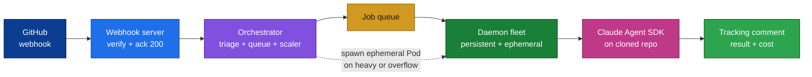

# GitHub App Playground: @chrisleekr-bot

A GitHub App that responds to `@chrisleekr-bot` mentions on pull requests and issues, powered by the Claude Agent SDK. Every event is handed to a daemon for execution; when triage flags a job as heavy or the queue overflows, the orchestrator spawns an ephemeral daemon Pod on demand so one deployment can serve both trivial chores and long-running refactors.

📖 **Documentation:** <https://chrisleekr.github.io/github-app-playground/>

## What it does

- **Code review**: mention the bot on a PR for AI-powered review.
- **Code changes**: ask it to fix bugs, refactor, or implement features.
- **Q&A**: ask questions about the codebase on issues or PRs.
- **Extensible**: add new webhook events or MCP servers without touching the core pipeline.

## Architecture at a glance


```mermaid
flowchart LR
    GH["GitHub<br/>webhook"]:::entry
    SRV["Webhook server<br/>verify + ack 200"]:::guard
    RTR["Orchestrator<br/>triage + queue + scaler"]:::decide
    QUEUE["Job queue"]:::store
    FLEET["Daemon fleet<br/>persistent + ephemeral"]:::target
    AGT["Claude Agent SDK<br/>on cloned repo"]:::work
    CMT["Tracking comment<br/>result + cost"]:::done
    GH --> SRV --> RTR --> QUEUE --> FLEET --> AGT --> CMT
    RTR -. spawn ephemeral Pod<br/>on heavy or overflow .-> FLEET
    classDef entry fill:#0b3d91,stroke:#061d4a,color:#ffffff
    classDef guard fill:#1f6feb,stroke:#0b3d91,color:#ffffff
    classDef decide fill:#8250df,stroke:#4b1d99,color:#ffffff
    classDef store fill:#d29922,stroke:#7d5c00,color:#1a1a1a
    classDef target fill:#1a7f37,stroke:#0b4a1e,color:#ffffff
    classDef work fill:#bf3989,stroke:#71204f,color:#ffffff
    classDef done fill:#2da44e,stroke:#0b4a1e,color:#ffffff
```

See [Architecture](https://chrisleekr.github.io/github-app-playground/ARCHITECTURE/) for the full flow, including idempotency, triage, and the pipeline stages.

## Quick start

```bash
cp .env.example .env            # Fill in credentials
bun install
bun run dev:deps                # Local Valkey + Postgres (required for the orchestrator)
bun run dev                     # Watch mode
```

Full setup, configuration reference, architecture diagrams, and deployment recipes live in the [documentation site](https://chrisleekr.github.io/github-app-playground/).

## Documentation

The docs site is built from Markdown in `docs/` using [MkDocs Material](https://squidfunk.github.io/mkdocs-material/). To preview locally:

```bash
bun run docs:install            # One-time: pip install -r docs/requirements.txt
bun run docs:serve              # Live reload at http://localhost:8000
bun run docs:build              # Strict build, run before opening a doc PR
```

## Contributing

See [CONTRIBUTING.md](./CONTRIBUTING.md) for local setup, testing, linting, and commit message conventions. Any PR that touches env-var validation, dispatch logic, or MCP surfaces must update the matching page under `docs/` in the same change, see the `## Documentation` section of [CLAUDE.md](./CLAUDE.md).

## License

MIT
