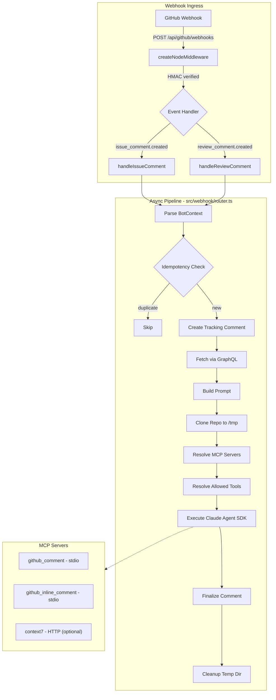

# Architecture

## Overview

A GitHub App webhook server that responds to `@chrisleekr-bot` mentions on PRs and issues.
Webhook events are processed asynchronously through a pipeline that clones the repository,
builds a prompt with full context, and runs the Claude Agent SDK with MCP servers.

## Request Flow



## Directory Structure

```
src/
├── app.ts              # HTTP server entry point, webhook registration, health probes
├── config.ts           # Zod-validated environment variables
├── logger.ts           # Pino structured logging
├── types.ts            # Core interfaces (BotContext, FetchedData, etc.)
├── core/               # Processing pipeline
│   ├── checkout.ts     # Clone repo to temp directory
│   ├── context.ts      # Parse webhook payloads → BotContext
│   ├── executor.ts     # Run Claude Agent SDK
│   ├── fetcher.ts      # GraphQL queries for PR/issue data
│   ├── formatter.ts    # Format fetched data for prompt
│   ├── prompt-builder.ts # Build full Claude prompt
│   ├── tracking-comment.ts # Manage progress comment
│   └── trigger.ts      # Detect @chrisleekr-bot mention
├── mcp/                # MCP server definitions
│   ├── registry.ts     # Resolve active servers per request
│   └── servers/
│       ├── comment.ts       # update_claude_comment tool
│       ├── inline-comment.ts # create_inline_comment tool
│       └── context7.ts      # Library docs via Context7 HTTP server
├── utils/
│   ├── retry.ts        # Exponential backoff
│   └── sanitize.ts     # Content sanitization pipeline
└── webhook/
    ├── router.ts       # Async pipeline orchestrator + idempotency
    └── events/         # One file per event type
```

## Key Design Decisions

- **Async processing**: Webhook responds 200 within 10s; heavy work runs after.
- **Repo checkout**: Each request clones to a unique temp dir so Claude operates on real files via `cwd`.
- **MCP servers**: stdio servers spawn as child processes with env vars; Context7 is an optional HTTP server.
- **Idempotency**: Two-layer guard. Fast path: in-memory `Map` keyed by `X-GitHub-Delivery` (lost on restart). Durable: `isAlreadyProcessed()` checks GitHub for an existing tracking comment marker — survives pod restarts and OOM kills.
- **Tracking comment**: Always created/updated via the issues API regardless of event type.

## Deployment

Docker image uses a multi-stage build: `development` (build) → `deps` (prod only) → `production`.
