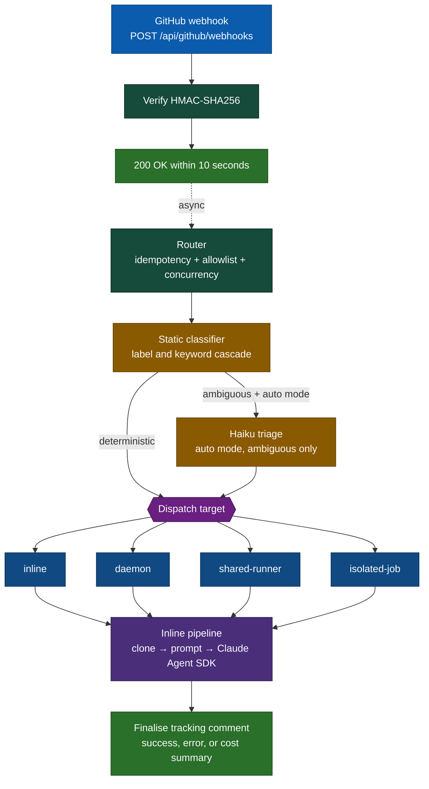

# Architecture

A single HTTP server process receives GitHub webhook events, acknowledges within 10 seconds, and runs the heavy work asynchronously. Every event walks the same path: verify → route → classify → dispatch → run the inline pipeline → finalise the tracking comment.

## Request flow

```mermaid
flowchart TD
    GH["GitHub webhook<br/>POST /api/github/webhooks"]:::entry
    VERIFY["Verify HMAC-SHA256"]:::guard
    ACK["200 OK within 10 seconds"]:::ack
    ROUTE["Router<br/>idempotency + allowlist + concurrency"]:::guard
    SC["Static classifier<br/>label and keyword cascade"]:::decide
    TR["Haiku triage<br/>auto mode, ambiguous only"]:::decide
    TGT{{"Dispatch target"}}:::fork
    IN["inline"]:::target
    DM["daemon"]:::target
    SR["shared-runner"]:::target
    IJ["isolated-job"]:::target
    PIPE["Inline pipeline<br/>clone → prompt → Claude Agent SDK"]:::work
    FIN["Finalise tracking comment<br/>success, error, or cost summary"]:::done

    GH --> VERIFY --> ACK
    ACK -. async .-> ROUTE
    ROUTE --> SC
    SC -->|deterministic| TGT
    SC -->|ambiguous + auto mode| TR
    TR --> TGT
    TGT --> IN
    TGT --> DM
    TGT --> SR
    TGT --> IJ
    IN --> PIPE
    DM --> PIPE
    SR --> PIPE
    IJ --> PIPE
    PIPE --> FIN

    classDef entry fill:#0b5cad,stroke:#083e74,color:#ffffff
    classDef guard fill:#164a3a,stroke:#0d2c24,color:#ffffff
    classDef ack fill:#2a6f2a,stroke:#1a4d1a,color:#ffffff
    classDef decide fill:#8a5a00,stroke:#5c3d00,color:#ffffff
    classDef fork fill:#6a2080,stroke:#451454,color:#ffffff
    classDef target fill:#114a82,stroke:#0a2f56,color:#ffffff
    classDef work fill:#4a2e7a,stroke:#311f50,color:#ffffff
    classDef done fill:#2a6f2a,stroke:#1a4d1a,color:#ffffff
```

## Key concepts

- **Async processing.** The webhook handler must respond within 10 seconds, so the router fires the pipeline with `fire-and-forget` semantics after the 200 OK is queued. Every box downstream of `ACK` runs after the HTTP response is already on the wire.
- **Idempotency is two-layered.** The fast path is an in-memory `Map` keyed by the `X-GitHub-Delivery` header — cheap, but lost on restart. The durable path asks GitHub whether a tracking comment already exists for the delivery — surviving pod restarts, OOM kills, and crash loops. Set `DATABASE_URL` to keep dispatch-decision history across restarts; without it, idempotency is in-memory only.
- **One request, one clone.** Each delivery clones the repo into a unique temp directory under `CLONE_BASE_DIR`. Claude operates on local files via `cwd`. The directory is removed after the run regardless of outcome.
- **MCP servers.** Tracking-comment updates, inline PR reviews, and (optionally) Context7 library docs are exposed as MCP servers the agent can call. Git changes are made via the Bash tool against the cloned repo, not through a dedicated MCP server.

## Dispatch Flow

The router picks one of four targets per event. Auto mode lets an LLM classifier make the choice when the deterministic cascade is ambiguous; every other mode short-circuits before the LLM call.

### Targets

The four concrete execution targets (see `src/shared/dispatch-types.ts`):

| Target          | When used                                                                                                                             |
| --------------- | ------------------------------------------------------------------------------------------------------------------------------------- |
| `inline`        | Default single-pod mode. The webhook server runs the pipeline in-process.                                                             |
| `daemon`        | A long-running worker process accepts job offers over WebSocket and executes the pipeline. Useful for horizontal scaling without K8s. |
| `shared-runner` | An internal HTTP endpoint (`INTERNAL_RUNNER_URL`) hosts a pool; the dispatcher POSTs the job and the pool handles the pipeline.       |
| `isolated-job`  | A Kubernetes Job is spawned per request with a DinD sidecar. Appropriate for untrusted repos or long, resource-heavy tasks.           |

`auto` is a platform-wide _mode_ (`AGENT_JOB_MODE=auto`), not a target — it resolves per event into one of the four above.

### Cascade

1. **Label.** If the triggering PR or issue carries `bot:shared`, `bot:job`, or a similar label, the target is fixed and the LLM is never called.
2. **Keyword.** Deterministic keywords in the mention body (e.g. "run on isolated") can force a target. Still no LLM.
3. **Triage.** In `AGENT_JOB_MODE=auto`, if steps 1–2 returned "ambiguous", a single-turn Haiku call classifies the request (`mode`, `confidence`, `complexity`, `rationale`). At or above `TRIAGE_CONFIDENCE_THRESHOLD`, the returned `mode` is used. Below the threshold, the router falls back to `DEFAULT_DISPATCH_TARGET`.
4. **Non-auto fallback.** In any mode other than `auto`, an ambiguous classifier result yields `DEFAULT_DISPATCH_TARGET` directly — no LLM call.
5. **Capacity guard.** The isolated-job queue enforces `MAX_CONCURRENT_ISOLATED_JOBS`. Requests beyond that enqueue on a bounded Valkey list (`PENDING_ISOLATED_JOB_QUEUE_MAX`); when the list is full, the request is rejected with reason `capacity-rejected`.
6. **Infra guard.** If the chosen target's infrastructure (K8s credentials, Valkey, Postgres, shared-runner URL) is not configured, the router records `infra-absent` and falls back.

### Why each request was routed the way it was

Every dispatch decision writes a `dispatch_reason` log field and, when `DATABASE_URL` is configured, a `dispatch_decisions` row. The eight canonical values (from `src/shared/dispatch-types.ts`) are listed in [Observability](OBSERVABILITY.md).

## Directory layout

| Directory           | Responsibility                                                                                                           |
| ------------------- | ------------------------------------------------------------------------------------------------------------------------ |
| `src/webhook/`      | Event routing (`router.ts`) and per-event handlers (`events/`, one file per event type).                                 |
| `src/core/`         | The inline pipeline: context → fetch → format → prompt → checkout → execute → finalise.                                  |
| `src/ai/`           | Provider-agnostic LLM client (Anthropic + Bedrock) used by triage.                                                       |
| `src/orchestrator/` | WebSocket server, daemon registry, job queue, triage. Embedded in the webhook server when `AGENT_JOB_MODE !== "inline"`. |
| `src/daemon/`       | Standalone worker process. WebSocket client that accepts one job offer at a time.                                        |
| `src/k8s/`          | Isolated-job target: Job spawner, pending queue, drainer.                                                                |
| `src/mcp/`          | MCP server registry. Add new servers here.                                                                               |
| `src/db/`           | Postgres layer. Migration runner, connection singleton, observability queries. Active only when `DATABASE_URL` is set.   |
| `src/shared/`       | Types shared between server and daemon (WebSocket messages, dispatch enums).                                             |
| `src/utils/`        | Retry, sanitisation, circuit breaker.                                                                                    |

## Further reading

- [Configuration](CONFIGURATION.md) — every environment variable the app reads.
- [Deployment](DEPLOYMENT.md) — Docker build args, health probes, resource sizing.
- [Extending](EXTENDING.md) — add webhook handlers and MCP servers.
