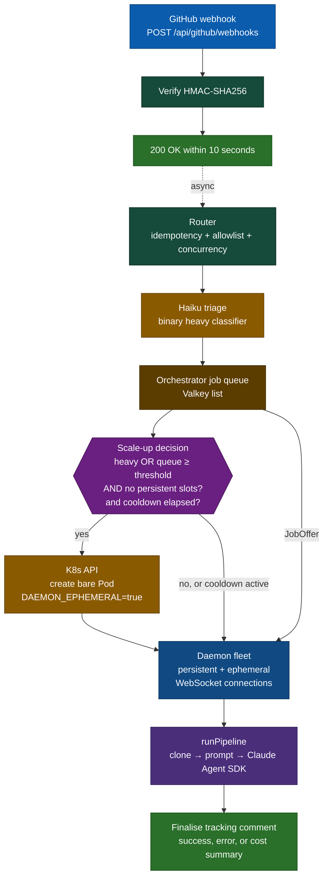
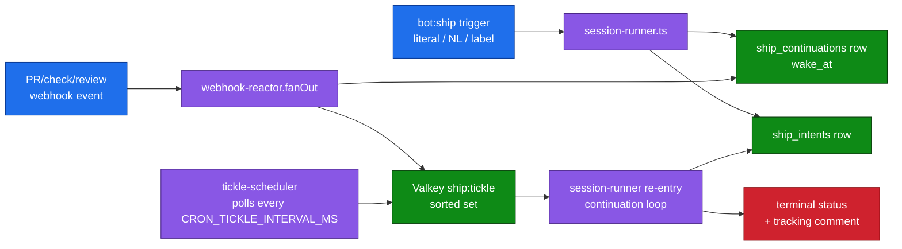

# Architecture

A single HTTP server process receives GitHub webhook events, acknowledges within 10 seconds, and asynchronously hands each event to a daemon for execution. Every event walks the same path: verify → route → classify → enqueue → daemon claims the job → run the pipeline → finalise the tracking comment.

## Request flow

```mermaid
flowchart TD
    GH["GitHub webhook<br/>POST /api/github/webhooks"]:::entry
    VERIFY["Verify HMAC-SHA256"]:::guard
    ACK["200 OK within 10 seconds"]:::ack
    ROUTE["Router<br/>idempotency + allowlist + concurrency"]:::guard
    TR["Haiku triage<br/>binary heavy classifier"]:::decide
    QUEUE["Orchestrator job queue<br/>Valkey list"]:::store
    SCALE{{"Scale-up decision<br/>heavy OR queue ≥ threshold<br/>AND no persistent slots?<br/>and cooldown elapsed?"}}:::fork
    SPAWN["K8s API<br/>create bare Pod<br/>DAEMON_EPHEMERAL=true"]:::decide
    FLEET["Daemon fleet<br/>persistent + ephemeral<br/>WebSocket connections"]:::target
    PIPE["runPipeline<br/>clone → prompt → Claude Agent SDK"]:::work
    FIN["Finalise tracking comment<br/>success, error, or cost summary"]:::done

    GH --> VERIFY --> ACK
    ACK -. async .-> ROUTE
    ROUTE --> TR
    TR --> QUEUE
    QUEUE --> SCALE
    SCALE -->|yes| SPAWN
    SPAWN --> FLEET
    SCALE -->|no, or cooldown active| FLEET
    QUEUE -->|JobOffer| FLEET
    FLEET --> PIPE
    PIPE --> FIN

    classDef entry fill:#0b5cad,stroke:#083e74,color:#ffffff
    classDef guard fill:#164a3a,stroke:#0d2c24,color:#ffffff
    classDef ack fill:#2a6f2a,stroke:#1a4d1a,color:#ffffff
    classDef decide fill:#8a5a00,stroke:#5c3d00,color:#ffffff
    classDef fork fill:#6a2080,stroke:#451454,color:#ffffff
    classDef target fill:#114a82,stroke:#0a2f56,color:#ffffff
    classDef work fill:#4a2e7a,stroke:#311f50,color:#ffffff
    classDef store fill:#5c3d00,stroke:#3d2900,color:#ffffff
    classDef done fill:#2a6f2a,stroke:#1a4d1a,color:#ffffff
```

## Key concepts

- **Async processing.** The webhook handler must respond within 10 seconds, so the router fires `processRequest` with `fire-and-forget` semantics after the 200 OK is queued. Every box downstream of `ACK` runs after the HTTP response is already on the wire.
- **Idempotency is two-layered.** The fast path is an in-memory `Map` keyed by the `X-GitHub-Delivery` header — cheap, but lost on restart. The durable path (`isAlreadyProcessed` in `src/core/tracking-comment.ts`) scans GitHub issue/PR comments for the hidden delivery marker embedded in the tracking comment, so duplicate deliveries are still detected across pod restarts, OOM kills, and crash loops — this works **without** `DATABASE_URL`. `DATABASE_URL` is only required to persist execution/dispatch history across restarts; it is not what provides durable idempotency.
- **One request, one clone.** Each delivery clones the repo into a unique temp directory under `CLONE_BASE_DIR` **on the daemon host**. Claude operates on local files via `cwd`. The directory is removed after the run regardless of outcome.
- **The webhook server never runs the pipeline.** Only daemons execute `runPipeline`. The webhook server is the orchestrator — it enqueues jobs and optionally spawns additional ephemeral daemons.
- **Every orchestrator runs a queue worker.** `src/orchestrator/queue-worker.ts` polls `queue:jobs` via `LMOVE` into a per-instance processing list (`queue:processing:{instanceId}`), offers the job to a locally-connected daemon, and atomically re-queues it to the head when no local daemon can take it. Multi-orchestrator HA: `LMOVE` grants exactly-once claim across instances, `selectDaemon` inherently restricts to daemons whose WebSocket is held by this process, so the offer/accept round-trip stays in-process and `pendingOffers` never needs shared state. Crash recovery is handled by each orchestrator draining its own processing list at startup, and by a cross-instance reaper (`src/orchestrator/valkey-cleanup.ts`) that drains processing lists owned by instances whose `orchestrator:{id}:alive` liveness key (`src/orchestrator/instance-liveness.ts`) has expired.
- **MCP servers.** Tracking-comment updates, inline PR reviews, and (optionally) Context7 library docs are exposed as MCP servers the agent can call. Git changes are made via the Bash tool against the cloned repo, not through a dedicated MCP server.

## Dispatch Flow

Dispatch collapsed to a single target: `daemon`. Every job is claimed by some daemon in the fleet over WebSocket. The only question the router answers is **which reason put the job there** — and whether an ephemeral daemon needs to be spawned so the fleet has capacity.

### Single target, four reasons

Canonical source: `src/shared/dispatch-types.ts`.

- `DispatchTarget` = `"daemon"` (singleton — kept as a field for DB/log stability).
- `DispatchReason` is one of:

| Reason                      | When the router sets it                                                                                                   |
| --------------------------- | ------------------------------------------------------------------------------------------------------------------------- |
| `persistent-daemon`         | Routed to an existing persistent daemon. The default, hot path.                                                           |
| `ephemeral-daemon-triage`   | Triage flagged the job as heavy → orchestrator spawned an ephemeral daemon Pod to claim it.                               |
| `ephemeral-daemon-overflow` | Queue length ≥ `EPHEMERAL_DAEMON_SPAWN_QUEUE_THRESHOLD` → orchestrator spawned an ephemeral daemon Pod to drain overflow. |
| `ephemeral-spawn-failed`    | Spawn was required but the K8s API call failed. Job is rejected with a tracking-comment infra error.                      |

### Scale-up model

The fleet is two-tiered:

- **Persistent daemons** are long-lived and deployed out-of-band (Helm, kubectl, plain `docker run`). They set `DAEMON_EPHEMERAL` unset or `false` and stay connected to the orchestrator indefinitely.
- **Ephemeral daemons** are bare Pods spawned on demand by the orchestrator via the Kubernetes API. They run the same daemon image with `DAEMON_EPHEMERAL=true`, connect over WebSocket, claim one or more jobs, and exit after `EPHEMERAL_DAEMON_IDLE_TIMEOUT_MS` of idle.

On every event, the orchestrator evaluates a scale-up rule:

1. **Triage.** A single-turn Haiku call returns `{ heavy, confidence, rationale }`. `heavy = true` is one scale-up trigger.
2. **Overflow.** If the job queue length is `≥ EPHEMERAL_DAEMON_SPAWN_QUEUE_THRESHOLD` and the persistent pool has no free slots, that's the other trigger.
3. **Cooldown.** Scale-ups are rate-limited by `EPHEMERAL_DAEMON_SPAWN_COOLDOWN_MS`. During cooldown, heavy/overflow signals do **not** spawn — the job falls back to `persistent-daemon` routing and waits for persistent capacity.
4. **Spawn.** When both a trigger fires and cooldown has elapsed, the orchestrator calls the K8s API to create a bare Pod running the daemon image with `DAEMON_EPHEMERAL=true`. Only a true K8s API failure yields `ephemeral-spawn-failed`; the job is then rejected with a tracking-comment infra error.

The newly-spawned ephemeral daemon connects via WebSocket, is registered into the fleet with `isEphemeral: true`, claims the job from the queue, runs it, then drains and exits after the idle timeout.

### Why each request was routed the way it was

Every dispatch decision writes a `dispatch_reason` log field and, when `DATABASE_URL` is configured, an `executions` row. The four canonical values are listed above and in [Observability](OBSERVABILITY.md).

## Directory layout

| Directory           | Responsibility                                                                                                                             |
| ------------------- | ------------------------------------------------------------------------------------------------------------------------------------------ |
| `src/webhook/`      | Event routing (`router.ts`) and per-event handlers (`events/`, one file per event type).                                                   |
| `src/core/`         | The pipeline: context → fetch → format → prompt → checkout → execute → finalise. `pipeline.ts` is the single execution path (daemon-side). |
| `src/ai/`           | Provider-agnostic LLM client (Anthropic + Bedrock) used by triage.                                                                         |
| `src/orchestrator/` | WebSocket server, daemon registry, job queue, job dispatcher, triage, ephemeral-daemon scaler. Embedded in the webhook server process.     |
| `src/daemon/`       | Standalone worker process (persistent or ephemeral). WebSocket client that accepts job offers and runs `src/core/pipeline.ts`.             |
| `src/k8s/`          | Ephemeral daemon Pod spawner (`ephemeral-daemon-spawner.ts`).                                                                              |
| `src/mcp/`          | MCP server registry. Add new servers here.                                                                                                 |
| `src/db/`           | Postgres layer. Migration runner, connection singleton, observability queries. Active only when `DATABASE_URL` is set.                     |
| `src/shared/`       | Types shared between server and daemon (WebSocket messages, dispatch enums).                                                               |
| `src/utils/`        | Retry, sanitisation, circuit breaker.                                                                                                      |

## PR shepherding reactor + continuation flow

The new `bot:ship` lifecycle (flag-gated; see [SHIP.md](SHIP.md)) is event-driven rather than long-running. A trigger creates a `ship_intents` row and persists a `ship_continuations` row with `wake_at`. Two paths advance the session:

```mermaid
flowchart LR
    Trigger["bot:ship trigger<br/>literal / NL / label"]:::input
    SessRunner["session-runner.ts"]:::core
    Intent["ship_intents row"]:::store
    Cont["ship_continuations row<br/>wake_at"]:::store

    WebhookEvt["PR/check/review<br/>webhook event"]:::input
    Reactor["webhook-reactor.fanOut"]:::core
    TickleSet["Valkey ship:tickle<br/>sorted set"]:::store

    Cron["tickle-scheduler<br/>polls every CRON_TICKLE_INTERVAL_MS"]:::core
    Reentry["session-runner re-entry<br/>continuation loop"]:::core
    Terminal["terminal status<br/>+ tracking comment"]:::output

    Trigger --> SessRunner
    SessRunner --> Intent
    SessRunner --> Cont

    WebhookEvt --> Reactor
    Reactor --> Cont
    Reactor --> TickleSet

    Cron --> TickleSet
    TickleSet --> Reentry
    Reentry --> Intent
    Reentry --> Terminal

    classDef input fill:#1f6feb,stroke:#0b3d99,color:#ffffff
    classDef core fill:#8957e5,stroke:#4c2889,color:#ffffff
    classDef store fill:#0e8a16,stroke:#063d09,color:#ffffff
    classDef output fill:#cf222e,stroke:#85090e,color:#ffffff
```

The reactor (`fanOut`) writes `wake_at = now()` and `ZADD ship:tickle 0 <intent_id>` so the next cron tick (typically under 30s) re-enters the runner. This keeps daemon slots free between iterations and gives the bot crash-restart safety: on boot, `tickle-scheduler` reconciles missed wakes from Postgres into Valkey before the periodic timer's first tick.

## Further reading

- [Bot Workflows](BOT-WORKFLOWS.md) — registry-driven `bot:*` label + `@chrisleekr-bot` comment dispatch, the composite ship cascade, and how to add a new workflow. Source of truth: `src/workflows/registry.ts`.
- [Configuration](CONFIGURATION.md) — every environment variable the app reads.
- [Daemon](DAEMON.md) — persistent vs ephemeral daemon lifecycle and K8s deployment.
- [Deployment](DEPLOYMENT.md) — Docker build args, health probes, resource sizing.
- [Extending](EXTENDING.md) — add webhook handlers and MCP servers.
