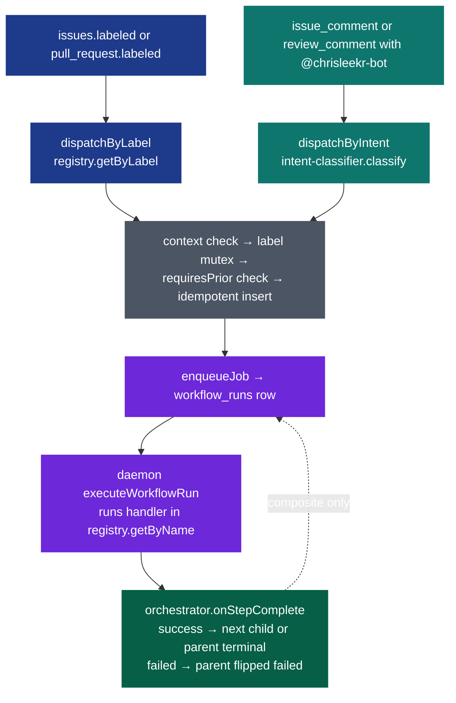

# Bot Workflows

The bot ships with a small, registry-driven set of workflows. Each workflow is triggered by applying a `bot:*` label or by posting a comment that mentions `@chrisleekr-bot` — both paths resolve to the same `workflow_runs` row via `src/workflows/dispatcher.ts`.

This page is the canonical reference for each workflow, the dispatch flow, and how to add a new one. Keep it in sync with the registry (see [Extending](#extending-adding-a-new-workflow)).

## Dispatch flow



Composite workflows like `ship` insert a child row per step. When the child completes, `orchestrator.onStepComplete` locks the parent row, advances `state.currentStepIndex`, and either enqueues the next step or flips the parent terminal. See `specs/20260421-181205-bot-workflows/contracts/handoff-protocol.md` for the transaction invariants.

## Workflows

### triage

- **Label**: `bot:triage`
- **Accepted context**: `issue`
- **Inputs**: issue title + body, plus a fresh clone of the repo (the handler runs the Claude Agent SDK with `Read`/`Grep`/`Glob`/`Bash`/`Write` against the working tree).
- **Outputs**:
  - `state.valid` — boolean verdict
  - `state.confidence` — 0-1 float from the agent's self-assessment
  - `state.summary` — one-paragraph rationale
  - `state.recommendedNext` ∈ {`plan`, `stop`}
  - `state.evidence` — array of `{file, line?, note?}` cites
  - `state.report` — full `TRIAGE.md` markdown (with sections: Method, Verdict, What was inspected, Findings, Reasoning, Recommended next step). Embedded verbatim into the tracking comment.
- **Stop conditions**:
  - Agent writes both `TRIAGE.md` and `TRIAGE_VERDICT.json`; verdict JSON validates against the Zod schema.
  - When `valid === false`, the handler returns `failed` so the `bot:ship` cascade halts at this step (no plan/implement/review).
  - Missing markdown, malformed JSON, or an SDK error all map to `failed` with a specific `reason`.
- **Example trigger**: add label `bot:triage`, or comment "`@chrisleekr-bot triage this`"

### plan

- **Label**: `bot:plan`
- **Accepted context**: `issue`
- **Requires prior**: a successful `triage` run on the same issue **with `state.valid === true`** (the dispatcher's `requiresPrior: 'triage'` gate plus the triage handler's own `valid=false → failed` return together enforce this).
- **Inputs**: issue body + triage state
- **Outputs**: `state.plan` — a `PLAN.md` markdown string written by a multi-turn agent session over a clone of the repo, captured via `runPipeline({ captureFiles: ["PLAN.md"] })` before workspace cleanup. Plus `costUsd` / `turns` / `durationMs` metadata. The full `PLAN.md` body is embedded verbatim into the tracking comment.
- **Stop conditions**: agent writes `PLAN.md`; pipeline reports success or failure. No turn cap (`AGENT_MAX_TURNS` defaults to unset; `DEFAULT_MAXTURNS` also unset).
- **Example trigger**: `@chrisleekr-bot plan this out`

### implement

- **Label**: `bot:implement`
- **Accepted context**: `issue`
- **Requires prior**: a successful `plan` run
- **Inputs**: issue body + saved plan markdown (carried forward as the prompt trigger body)
- **Outputs**: `state.pr_number`, `state.pr_url`, `state.branch`, `state.report` (full `IMPLEMENT.md` body — Summary / Files changed / Commits / Tests run / Verification), `state.costUsd`, `state.turns`. The agent is asked to write `IMPLEMENT.md` before finishing; the handler captures it pre-cleanup and embeds it in the tracking comment.
- **PR detection**: `findRecentOpenedPr` filters on `pr.user?.type === "Bot"` plus `created_at >= since - 5s`. It deliberately does **not** match on a hard-coded slug — dev installs publish as `chrisleekr-bot-dev[bot]` and prod as `chrisleekr-bot[bot]`, so a slug check produces false negatives.
- **Stop conditions**: pipeline pushes a branch and opens a PR, OR pipeline fails. If the pipeline reports success but `findRecentOpenedPr` returns null, the handler fails with `"implement completed but no PR was found"`. The handler does NOT poll CI or reviewer state — that is `review`'s job.
- **Example trigger**: `@chrisleekr-bot implement this`

### review

- **Label**: `bot:review`
- **Accepted context**: `pr`
- **Inputs**: PR title, failing check names, unresolved review comments
- **Outputs**: `state.failing_checks`, `state.unresolved_comments`, `state.report` (full `REVIEW.md` body — Summary / CI status / Review comments / Commits pushed / Outstanding), `state.costUsd`, `state.turns`. The agent is asked to write `REVIEW.md` before finishing; the handler captures it pre-cleanup and embeds it in the tracking comment.
- **Stop conditions** (from `src/workflows/handlers/review.ts`):
  - `FIX_ATTEMPTS_CAP = 3` — max consecutive CI-fix attempts per PR
  - `POLL_WAIT_SECS_CAP = 900` — 15-minute reviewer-patience window
  - The handler NEVER calls `octokit.rest.pulls.merge` (FR-017) — merging is a human action.
- **Example trigger**: add label `bot:review` on the PR, or comment "`@chrisleekr-bot review this PR`"

### ship (composite)

- **Label**: `bot:ship`
- **Accepted context**: `issue`
- **Steps**: `triage → plan → implement → review`
- **Outputs**: rolled-up `state.stepRuns` plus terminal status on the parent row
- **Resume semantics** (`src/workflows/handlers/ship.ts`):
  - `bot:ship` is re-applicable on a target whose prior parent row is **terminal** (the partial unique index only blocks in-flight parents).
  - Per-step staleness rules:
    - `triage` — fresh iff succeeded AND `state.valid === true` AND `state.recommendedNext === 'plan'` (an invalid verdict halts the cascade rather than poisoning future ship runs)
    - `plan` — fresh iff succeeded AND created after the last triage success
    - `implement` — fresh iff succeeded AND the recorded PR is still open
    - `review` — always stale
  - The first stale step becomes `startIndex`; prior-step run ids are carried forward in `state.stepRuns`.
- **Example trigger**: add label `bot:ship`, or comment "`@chrisleekr-bot ship this`"

## Comment intent classifier

Comments that mention `@chrisleekr-bot` are routed through `src/workflows/intent-classifier.ts`, which returns `{ workflow, confidence, rationale }` using a single-turn Haiku call. Rules:

- `confidence < INTENT_CONFIDENCE_THRESHOLD` (default `0.75`) → the dispatcher posts a short clarification reply (FR-009) instead of dispatching.
- `workflow === "unsupported"` → refusal reply (FR-010).
- `workflow ∈ registry` → same dispatch as the label path.

The classifier treats the comment body as untrusted input: it wraps the body in an opaque `<user-comment>` delimiter, strips prompt-like control tokens, and rejects any model output that doesn't validate against a closed-enum Zod schema (T037a).

Override the threshold per environment:

```text
INTENT_CONFIDENCE_THRESHOLD=0.60   # looser — more dispatches, more clarifications skipped
INTENT_CONFIDENCE_THRESHOLD=0.90   # stricter — only very confident asks dispatch
```

## Extending: adding a new workflow

1. **Add a handler**. Create `src/workflows/handlers/<name>.ts` exporting `handler: WorkflowHandler` — the handler takes a `WorkflowRunContext` and returns a `HandlerResult` (`succeeded` | `failed` | `handed-off`).
2. **Register it**. Append one `RegistryEntry` to `rawRegistry` in `src/workflows/registry.ts` — name, label (`bot:<name>`), accepted context, optional `requiresPrior`, optional `steps` for composite workflows, and the handler reference. The Zod schema validates at module load, so a mistyped entry fails the process at boot (FR-023/024).
3. **Document it**. Add a section here matching the template used for the five built-ins above — label, accepted context, inputs, outputs, stop conditions, example trigger. The doc-sync rule in `CLAUDE.md` makes this mandatory for any PR touching `src/workflows/`.
4. **Test it**. Add at least one unit test under `test/workflows/handlers/<name>.test.ts` covering the happy path plus one failure mode. Integration via `test/workflows/dispatcher.test.ts` is automatic — if the registry entry is valid, dispatch works.
5. **Update the classifier prompt**. If the new workflow should be reachable via comments, extend the system prompt in `src/workflows/intent-classifier.ts` (the enum is driven by the registry, but the prompt narrative needs to mention the new workflow).

See the source of truth:

- Registry: `src/workflows/registry.ts`
- Dispatcher: `src/workflows/dispatcher.ts`
- Orchestrator (composite cascade): `src/workflows/orchestrator.ts`
- Hand-off protocol: `specs/20260421-181205-bot-workflows/contracts/handoff-protocol.md`
