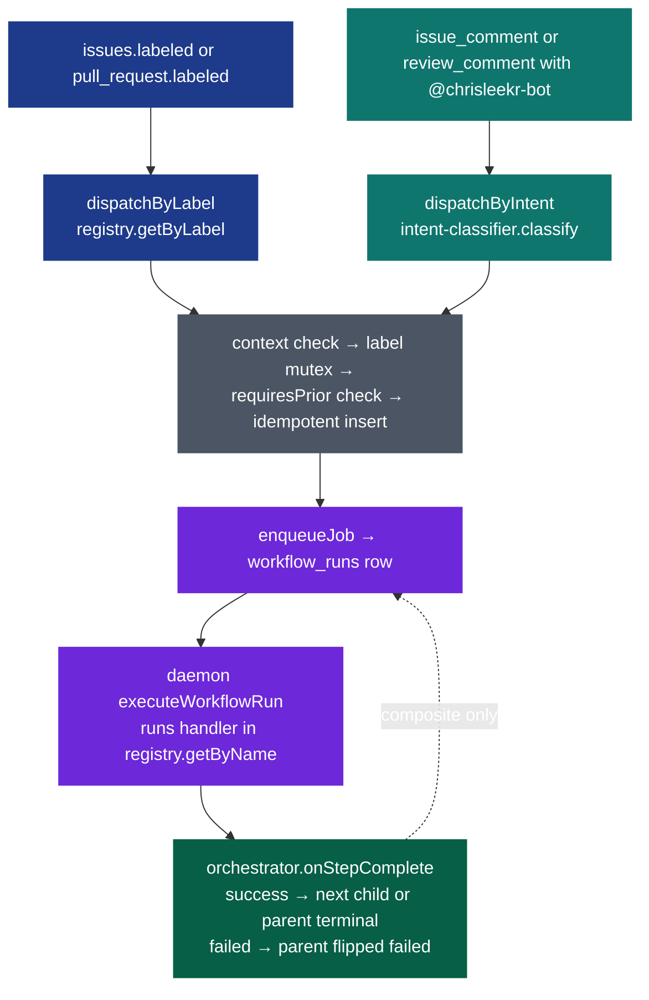

# Bot Workflows

The bot ships with a small, registry-driven set of workflows. Each workflow is triggered by applying a `bot:*` label or by posting a comment that mentions `@chrisleekr-bot` — both paths resolve to the same `workflow_runs` row via `src/workflows/dispatcher.ts`.

This page is the canonical reference for each workflow, the dispatch flow, and how to add a new one. Keep it in sync with the registry (see [Extending](#extending-adding-a-new-workflow)).

## Design principle: one verb, one artifact

Every workflow is named after the senior-engineer move it performs and produces a single Markdown deliverable that becomes the body of the tracking comment. The verbs map 1:1 to the loop a senior dev runs on every issue / PR.

| Workflow    | Senior-dev verb                                     | Artifact                            | Side effects                                    |
| ----------- | --------------------------------------------------- | ----------------------------------- | ----------------------------------------------- |
| `triage`    | "Is this actionable? Reproduce if it claims a bug." | `TRIAGE.md` + `TRIAGE_VERDICT.json` | none                                            |
| `plan`      | "What's the approach?"                              | `PLAN.md`                           | none                                            |
| `implement` | "Write the code, open the PR."                      | `IMPLEMENT.md`                      | new branch, commits, PR                         |
| `review`    | "Find bugs in the diff before declaring done."      | `REVIEW.md`                         | inline review comments via `pulls.createReview` |
| `resolve`   | "Fix CI, answer reviewer feedback."                 | `RESOLVE.md`                        | new commits on head branch, replies to comments |
| `ship`      | composite — runs all five end-to-end                | rolled-up `state.stepRuns`          | as above, per step                              |

The `review` and `resolve` verbs are deliberately separate. `review` proactively reads the diff and posts findings; `resolve` reactively answers existing review feedback and fixes failing CI. Conflating them ("just one workflow that handles a PR") was the design mistake the 2026-04-25 rename corrected — the old `review` workflow only did resolution work and never actually reviewed code.

## Dispatch flow



Composite workflows like `ship` insert a child row per step. When the child completes, `orchestrator.onStepComplete` locks the parent row, advances `state.currentStepIndex`, and either enqueues the next step or flips the parent terminal. See `specs/20260421-181205-bot-workflows/contracts/handoff-protocol.md` for the transaction invariants.

## Workflows

### triage

- **Label**: `bot:triage`
- **Accepted context**: `issue`
- **Inputs**: issue title + body, plus a fresh clone of the repo (the handler runs the Claude Agent SDK with `Read`/`Grep`/`Glob`/`Bash`/`Write` against the working tree).
- **Method**: the agent classifies the issue (bug / feature / refactor / docs / unclear). For **bug-class** issues the agent MUST attempt to actually run the failing case — there is no turn cap. Reproduction commands typically include `bun test path/to/specific.test.ts`, `bun run typecheck`, fresh tests written under `/tmp`, or CLI invocations the issue describes. The senior-dev rule is "never decide a bug is real by reading code — run it."
- **Outputs**:
  - `state.valid` — boolean verdict
  - `state.confidence` — 0-1 float from the agent's self-assessment
  - `state.summary` — the agent's verdict rationale; length is uncapped (the agent writes as much as the verdict honestly requires). Embedded into the failed-cascade `reason` line when `valid === false`.
  - `state.recommendedNext` ∈ {`plan`, `stop`}
  - `state.evidence` — array of `{file, line?, note?}` cites
  - `state.reproduction` — `{ attempted: boolean, reproduced: boolean | null, details: string }`. `attempted=false` means non-bug class. `reproduced=null` with `attempted=true` means the agent honestly tried but couldn't reach a verdict (needs prod data, external service we lack). The agent never lies about reproduction status.
  - `state.report` — full `TRIAGE.md` markdown with sections: Verdict, What was inspected, **Reproduction** (commands run + output + conclusion), Findings, Reasoning, Recommended next step. Embedded verbatim into the tracking comment.
- **Stop conditions**:
  - Agent writes both `TRIAGE.md` and `TRIAGE_VERDICT.json`; verdict JSON validates against the Zod schema (which now requires `reproduction`).
  - When `valid === false`, the handler returns `failed` so the `bot:ship` cascade halts at this step (no plan/implement/review/resolve).
  - Missing markdown, malformed JSON, or an SDK error all map to `failed` with a specific `reason`.
- **Example trigger**: add label `bot:triage`, or comment "`@chrisleekr-bot triage this`"

### plan

- **Label**: `bot:plan`
- **Accepted context**: `issue`
- **Requires prior**: a successful `triage` run on the same issue **with `state.valid === true`** (the dispatcher's `requiresPrior: 'triage'` gate plus the triage handler's own `valid=false → failed` return together enforce this).
- **Inputs**: issue body + triage state
- **Outputs**: `state.plan` — a `PLAN.md` markdown string written by a multi-turn agent session over a clone of the repo, captured via `runPipeline({ captureFiles: ["PLAN.md"] })` before workspace cleanup. Plus `costUsd` / `turns` / `durationMs` metadata. The full `PLAN.md` body is embedded verbatim into the tracking comment.
- **Stop conditions**: agent writes `PLAN.md`; pipeline reports success or failure. No turn cap (`AGENT_MAX_TURNS` defaults to unset; `DEFAULT_MAXTURNS` also unset).
- **Example trigger**: `@chrisleekr-bot plan this out`

### implement

- **Label**: `bot:implement`
- **Accepted context**: `issue`
- **Requires prior**: a successful `plan` run
- **Inputs**: issue body + saved plan markdown (carried forward as the prompt trigger body)
- **Outputs**: `state.pr_number`, `state.pr_url`, `state.branch`, `state.report` (full `IMPLEMENT.md` body — Summary / Files changed / Commits / Tests run / Verification), `state.costUsd`, `state.turns`. The agent is asked to write `IMPLEMENT.md` before finishing; the handler captures it pre-cleanup and embeds it in the tracking comment.
- **PR detection**: `findRecentOpenedPr` filters on `pr.user?.type === "Bot"` plus `created_at >= since - 5s`. It deliberately does **not** match on a hard-coded slug — dev installs publish as `chrisleekr-bot-dev[bot]` and prod as `chrisleekr-bot[bot]`, so a slug check produces false negatives.
- **Stop conditions**: pipeline pushes a branch and opens a PR, OR pipeline fails. If the pipeline reports success but `findRecentOpenedPr` returns null, the handler fails with `"implement completed but no PR was found"`. The handler does NOT poll CI or reviewer state — that is `resolve`'s job, after `review` runs.
- **Example trigger**: `@chrisleekr-bot implement this`

### review

- **Label**: `bot:review`
- **Accepted context**: `pr`
- **Inputs**: PR title + body, full PR diff via `git diff origin/<base>...HEAD` against a fresh clone, plus branch-staleness diagnostics (commits behind base, fork status).
- **Method**: the agent operates as a senior engineer — reads every changed file in full, cross-references with the rest of the repo for callers/tests/related code, runs `bun test` / `bun run typecheck` / `bun run lint` when uncertain, and only posts findings it can defend with evidence. Each finding has a severity prefix:
  - `[blocker]` — must fix before merge (correctness, security)
  - `[major]` — should fix before merge (likely bug, missing test)
  - `[minor]` — nice to fix (readability)
  - `[nit]` — taste, optional
- **Outputs**: `state.head_sha`, `state.changed_files`, `state.additions`, `state.deletions`, `state.branch_state` (`{ commits_behind_base, commits_ahead_of_base, is_fork }`), `state.report` (full `REVIEW.md` — Summary / What was checked / Findings / Reasoning), `state.costUsd`, `state.turns`. The agent posts each finding as a separate inline comment via `mcp__github_inline_comment__create_inline_comment` (one MCP call per finding) — never as a single bundled review POST. This guarantees each finding lands on the right line with its own resolvable thread, instead of one wall-of-text comment at the top of the PR.
- **Progress visibility**: the handler seeds the tracking comment (via `setState` + `tryReserveTrackingCommentId`) before invoking the pipeline and threads the reserved id into `RunPipelineOverrides.trackingCommentId`. The agent updates the same comment via `mcp__github_comment__update_claude_comment` at five `[update tracking comment]` checkpoints in the prompt — branch refresh, file walk, finding count, posting findings, final REVIEW.md — so the user sees live progress instead of waiting blind for a final report. Without the seed/handoff, `pipeline.ts` would create-and-finalize its own comment and the handler's mid-run updates would target the wrong id; with it, the handler owns the comment lifecycle end-to-end.
- **No-findings case**: the agent MUST still post a top-level review body listing exactly what was checked (files read in full, classes of issue scanned, tests run) and why no issues were flagged. Silence looks indistinguishable from "didn't actually look."
- **Branch refresh**: if the PR head is behind base AND not on a fork, the agent rebases onto base, resolves conflicts honestly (reads the surrounding code, runs typecheck + tests, doesn't take ours/theirs blindly), and force-pushes with `--force-with-lease`. Fork PRs get a comment asking the contributor to rebase. See `src/workflows/handlers/branch-refresh.ts`.
- **Stop conditions**: agent writes `REVIEW.md`; pipeline reports success. **Push policy**: the only acceptable push from `review` is `git push --force-with-lease` after a clean rebase onto base (same diff, fresh head SHA — see Branch refresh above). The handler never creates commits with code changes (those belong to `implement` / `resolve`), never calls `pulls.merge`, and never posts an `APPROVE` or `REQUEST_CHANGES` review (FR-017 — those are human prerogatives).
- **Example trigger**: add label `bot:review` on the PR, or comment "`@chrisleekr-bot review this PR`"

### resolve

- **Label**: `bot:resolve`
- **Accepted context**: `pr`
- **Inputs**: PR title, failing check names, count of open top-level review comments, branch-staleness diagnostics.
- **Method**: classify each open reviewer comment (Valid / Partially Valid / Invalid / Needs Clarification), fix valid ones with new commits, reply to all four classes appropriately. Fix failing CI when there is a clear root cause. Refresh the branch first if it's stale (same logic as `review`).
- **Outputs**: `state.failing_checks`, `state.top_level_comments`, `state.branch_state`, `state.report` (full `RESOLVE.md` body — Summary / CI status / Review comments / Commits pushed / Outstanding), `state.costUsd`, `state.turns`. The agent is asked to write `RESOLVE.md` before finishing; the handler captures it pre-cleanup and embeds it in the tracking comment.
- **Progress visibility**: same seed/handoff pattern as `review` — the handler `setState`s a "Resolve starting" message before the pipeline, hands the reserved tracking-comment id to `RunPipelineOverrides.trackingCommentId`, and the agent posts `[update tracking comment]` checkpoints at branch-refresh, CI-fix, comment-classification, and final RESOLVE.md steps. Reviewer-thread replies are posted via `gh api repos/<owner>/<repo>/pulls/<num>/comments/<id>/replies -X POST` (the bot's `gh` and `git` calls authenticate via `GH_TOKEN` / `GITHUB_TOKEN` injected from the GitHub App installation token by `buildProviderEnv` in `src/core/executor.ts`).
- **Stop conditions** (from `src/workflows/handlers/resolve.ts`):
  - `FIX_ATTEMPTS_CAP = 3` — max consecutive CI-fix attempts per PR
  - `POLL_WAIT_SECS_CAP = 900` — 15-minute reviewer-patience window
  - The handler NEVER calls `octokit.rest.pulls.merge` (FR-017) — merging is a human action.
- **Example trigger**: add label `bot:resolve` on the PR, or comment "`@chrisleekr-bot fix the CI failures`" / "`@chrisleekr-bot address the review comments`"

### ship (composite)

- **Label**: `bot:ship`
- **Accepted context**: `issue`
- **Steps**: `triage → plan → implement → review → resolve` (the bot writes the code, then reviews its own work, then resolves anything the review surfaced — closes the senior-dev loop end-to-end)
- **Outputs**: rolled-up `state.stepRuns` plus terminal status on the parent row
- **Resume semantics** (`src/workflows/handlers/ship.ts`):
  - `bot:ship` is re-applicable on a target whose prior parent row is **terminal** (the partial unique index only blocks in-flight parents).
  - Per-step staleness rules:
    - `triage` — fresh iff succeeded AND `state.valid === true` AND `state.recommendedNext === 'plan'` (an invalid verdict halts the cascade rather than poisoning future ship runs)
    - `plan` — fresh iff succeeded AND created after the last triage success
    - `implement` — fresh iff succeeded AND the recorded PR is still open
    - `review` — always stale (the bot self-reviews on every ship iteration; cheap relative to letting a stale review stand)
    - `resolve` — always stale
  - The first stale step becomes `startIndex`; prior-step run ids are carried forward in `state.stepRuns`.
- **Cost note**: every ship pays for both `review` and `resolve` agent runs. Per project direction (2026-04-25), accuracy beats cost — closing the loop justifies the extra spend.
- **Example trigger**: add label `bot:ship`, or comment "`@chrisleekr-bot ship this`"

## User-facing surfaces

Each workflow run produces two GitHub-visible signals: a **tracking comment** (the bot's working/result body) and a **reaction set** on the user's trigger comment.

### Tracking comments

- `triage`, `plan`, and `implement` post an **up-front "starting…" comment** as soon as they fetch the issue title, before the (multi-minute) agent run. The terminal `setState` call rewrites the same comment with the verdict / plan / PR link. Skipping the up-front write would leave the user staring at an empty issue while the daemon worked.
- `review` and `resolve` already post upfront; behaviour unchanged.
- For composite parents (`ship`), the tracking comment is rendered as a **verbose composite**: the parent's narrative followed by one `### <emoji> <step> — <status>` block per child step, each linking back to the child's own tracking comment via deep `#issuecomment-<id>` anchors. The composite refresh is triggered automatically by `tracking-mirror.setState` whenever a child run writes — the cascade walks `parent_run_id` and re-renders the parent's body so the user always sees the latest child status on the surface they're already watching.

### Trigger-comment reactions

Comment-driven workflows stack four GitHub reactions on the user's trigger comment so the lifecycle is visible without scrolling:

| Stage                                                   | Reaction      | Where it fires                                                                                                     |
| ------------------------------------------------------- | ------------- | ------------------------------------------------------------------------------------------------------------------ |
| Trigger detected, before classifier                     | 👀 `eyes`     | `src/webhook/events/issue-comment.ts`, `review-comment.ts` (after allowlist)                                       |
| Job dispatched to a daemon                              | 🚀 `rocket`   | `src/workflows/dispatcher.ts` (after `enqueueJob`)                                                                 |
| Workflow succeeded                                      | 🎉 `hooray`   | `src/daemon/workflow-executor.ts` for atomic runs; `src/workflows/orchestrator.ts` for composite parents (cascade) |
| Workflow failed (handler error, daemon disconnect, OOM) | 😕 `confused` | `workflow-executor.ts`, `orchestrator.ts`, `src/orchestrator/connection-handler.ts` (orphan path)                  |

GitHub reactions are additive — the combined set is the audit trail. Label-triggered runs (`bot:ship` via label apply) skip reactions silently because no comment exists to react on. Reaction failures (e.g., missing `reactions:write` scope) are logged at warn level and swallowed; they never block a workflow.

### Failure surface on daemon disconnect

When a daemon dies abruptly (OOM, pod eviction, network partition), `connection-handler.cleanupAfterDisconnect` walks every in-flight `workflow_runs` row owned by that daemon, finds the topmost ancestor (so a child step failure shows up on the parent's surface), and:

1. Updates the ancestor's tracking comment with an `❌ Daemon disconnected (likely OOM)` message and resume instructions.
2. Adds 😕 `confused` to the user's trigger comment.

This closes the silent-failure window that previously left users staring at a stale "starting…" comment after an OOM. The liveness reaper still flips the `workflow_runs.status` to `failed`; the cleanup path only owns the user-visible surface.

### Re-trigger / resume

Re-triggering `ship` (re-applying the `bot:ship` label or re-commenting the intent) walks the prior runs via `computeStartIndex` in `src/workflows/handlers/ship.ts`: succeeded `triage`/`plan` rows are reused, succeeded `implement` is reused only while its PR is still open, and `review`/`resolve` always re-run. A failed `implement` row from a prior crash means resume picks up at `implement` — the row is not "succeeded" so `isFresh` returns false and the step is re-queued.

## Comment intent classifier

Comments that mention `@chrisleekr-bot` are routed through `src/workflows/intent-classifier.ts`, which returns `{ workflow, confidence, rationale }` using a single-turn Haiku call. Rules:

- `confidence < INTENT_CONFIDENCE_THRESHOLD` (default `0.75`) → the dispatcher posts a short clarification reply (FR-009) instead of dispatching.
- `workflow === "unsupported"` → refusal reply (FR-010).
- `workflow ∈ registry` → same dispatch as the label path.

The classifier prompt distinguishes `review` (proactive code review — find bugs, post inline findings) from `resolve` (reactive — fix CI, answer feedback). Comments like "review this PR" / "do a code review" / "check for issues" map to `review`; comments like "fix CI" / "address the comments" / "respond to the feedback" map to `resolve`. The split mirrors the verb-per-workflow design.

The classifier treats the comment body as untrusted input: it wraps the body in an opaque `<user-comment>` delimiter, strips prompt-like control tokens, and rejects any model output that doesn't validate against a closed-enum Zod schema (T037a).

Override the threshold per environment:

```text
INTENT_CONFIDENCE_THRESHOLD=0.60   # looser — more dispatches, more clarifications skipped
INTENT_CONFIDENCE_THRESHOLD=0.90   # stricter — only very confident asks dispatch
```

## Branch refresh (`review` and `resolve`)

Both PR-side workflows compute branch staleness via `octokit.rest.repos.compareCommitsWithBasehead` before dispatching the agent prompt. The result is injected as a "Branch state" section in the prompt with one of three directives:

- **Up-to-date** — one-line no-op so the agent doesn't waste turns probing.
- **Same-repo behind base** — rebase onto base, resolve conflicts (reading the surrounding code; running typecheck + the affected tests; never taking ours/theirs blindly), then `git push --force-with-lease`. After push, head SHA changes — the agent must re-fetch any cached state.
- **Fork PR behind base** — the bot's installation token can't push to a fork's branch, so the agent posts a top-level PR comment asking the contributor to rebase, then proceeds against the stale head and flags affected findings in the final report.

Always-rebase semantics (per project direction 2026-04-25): if the branch is outdated, refresh first regardless of conflict risk. The cost of resolving conflicts well is far smaller than the cost of reviewing/resolving against stale code.

## Extending: adding a new workflow

1. **Add a handler**. Create `src/workflows/handlers/<name>.ts` exporting `handler: WorkflowHandler` — the handler takes a `WorkflowRunContext` and returns a `HandlerResult` (`succeeded` | `failed` | `handed-off`). Capture exactly one Markdown artifact (`<NAME>.md`) so the tracking comment is self-documenting.
2. **Register it**. Append one `RegistryEntry` to `rawRegistry` in `src/workflows/registry.ts` — name, label (`bot:<name>`), accepted context, optional `requiresPrior`, optional `steps` for composite workflows, and the handler reference. The Zod schema validates at module load, so a mistyped entry fails the process at boot (FR-023/024).
3. **Document it**. Add a section here matching the template used for the six built-ins above — verb, accepted context, inputs, method, outputs, stop conditions, example trigger. The doc-sync rule in `CLAUDE.md` makes this mandatory for any PR touching `src/workflows/`.
4. **Test it**. Add at least one unit test under `test/workflows/handlers/<name>.test.ts` covering the happy path plus one failure mode. Integration via `test/workflows/dispatcher.test.ts` is automatic — if the registry entry is valid, dispatch works.
5. **Update the classifier prompt**. If the new workflow should be reachable via comments, extend the system prompt in `src/workflows/intent-classifier.ts` (the enum is driven by the registry, but the prompt narrative needs to mention the new workflow with at least three fixture comments in `test/workflows/fixtures/intent-comments.json`).

See the source of truth:

- Registry: `src/workflows/registry.ts`
- Dispatcher: `src/workflows/dispatcher.ts`
- Orchestrator (composite cascade): `src/workflows/orchestrator.ts`
- Branch-refresh helper: `src/workflows/handlers/branch-refresh.ts`
- Hand-off protocol: `specs/20260421-181205-bot-workflows/contracts/handoff-protocol.md`
