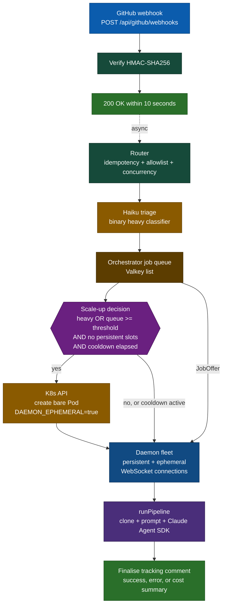
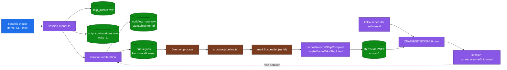
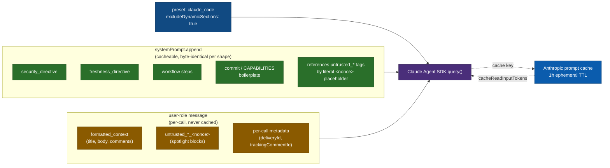

# Architecture

A single HTTP server process receives GitHub webhook events, acknowledges within ten seconds, and asynchronously hands each event to a daemon for execution. Every event walks the same path: verify → route → classify → enqueue → daemon claims the job → run the pipeline → finalise the tracking comment.

## Request flow

## Key concepts

- **Async processing.** The webhook handler responds within ten seconds, so the router fires `processRequest` with fire-and-forget semantics after the 200 OK is queued. Every box downstream of `ACK` runs after the HTTP response is on the wire.
- **Two-layer idempotency.** The fast path is an in-memory `Map` keyed by `X-GitHub-Delivery`. The durable path (`isAlreadyProcessed` in `src/core/tracking-comment.ts`) scans GitHub issue/PR comments for the hidden delivery marker the bot embeds in the tracking comment, so duplicate deliveries are detected across pod restarts, OOM kills, and crash loops: this works **without** `DATABASE_URL`. `DATABASE_URL` is required only to persist execution / dispatch history across restarts.
- **One request, one clone.** Each delivery clones the repo into a unique temp directory under `CLONE_BASE_DIR` **on the daemon host**. Claude operates on local files via `cwd`. On PR events the checkout supplementally fetches `origin/<baseBranch>` (when it differs from the head ref) so the agent's `git diff origin/<baseBranch>...HEAD` and `git rebase origin/<baseBranch>` directives resolve first try. A sibling `${workDir}-artifacts` directory is created outside the checkout and exposed to the agent as `BOT_ARTIFACT_DIR`: workflow summary files (IMPLEMENT.md / REVIEW.md / RESOLVE.md) are written there so they can never be picked up by a `git add` inside the clone. Both directories are removed in the pipeline's `finally` block regardless of outcome.
- **GitHub credential resolution.** `src/core/github-token.ts:resolveGithubToken()` is the single source of the GitHub credential the daemon uses. Default is an App installation token minted just-in-time from the cached `App` singleton in `src/orchestrator/connection-handler.ts`. When `GITHUB_PERSONAL_ACCESS_TOKEN` is set, the helper short-circuits and returns the PAT instead, API/git authentication runs as the PAT owner. Commit author/committer metadata is **not** affected; `src/core/checkout.ts` hard-pins git `user.name`/`user.email` to `chrisleekr-bot[bot]` so commit objects still carry the bot identity. The git credential helper, executor `GH_TOKEN`/`GITHUB_TOKEN` env vars, and MCP server env all consume the resolved string without caring about its source.
- **The webhook server never runs the pipeline.** Only daemons execute `runPipeline`. The webhook server is the orchestrator: it enqueues jobs and optionally spawns ephemeral daemons.
- **Every orchestrator runs a queue worker.** `src/orchestrator/queue-worker.ts` polls `queue:jobs` via `LMOVE` into a per-instance processing list (`queue:processing:{instanceId}`), offers the job to a locally-connected daemon, and atomically re-queues it to the head when no local daemon can take it. Multi-orchestrator HA: `LMOVE` grants exactly-once claim across instances; the offer/accept round-trip stays in-process. Crash recovery is handled by each orchestrator draining its own processing list at startup, plus a cross-instance reaper (`src/orchestrator/valkey-cleanup.ts`) draining processing lists owned by instances whose `orchestrator:{id}:alive` liveness key has expired.
- **MCP servers.** Tracking-comment updates, inline PR reviews, scoped review-thread resolves, daemon-capability reports, repo-memory, and (optionally) Context7 library docs are exposed as MCP servers the agent can call. Git changes are made via the Bash tool against the cloned repo, not through a dedicated MCP server.

## Dispatch flow

Dispatch collapsed to a single target, `daemon`, in migration `004_collapse_dispatch_to_daemon.sql`. Every job is claimed by some daemon in the fleet over WebSocket. The router decides only the **reason** the job lands there and whether to spawn an ephemeral daemon.

### Single target, four reasons

Canonical source: `src/shared/dispatch-types.ts`.

- `DispatchTarget` = `"daemon"` (singleton: kept as a field for DB/log stability).
- `DispatchReason` is one of:

| Reason                      | When the router sets it                                                                                        |
| --------------------------- | -------------------------------------------------------------------------------------------------------------- |
| `persistent-daemon`         | Routed to an existing persistent daemon. The default, hot path.                                                |
| `ephemeral-daemon-triage`   | Triage flagged the job heavy → orchestrator spawned an ephemeral daemon Pod.                                   |
| `ephemeral-daemon-overflow` | Queue length ≥ `EPHEMERAL_DAEMON_SPAWN_QUEUE_THRESHOLD` and persistent pool saturated → spawn drains overflow. |
| `ephemeral-spawn-failed`    | Spawn was required but the K8s API call failed. Job rejected with a tracking-comment infra error.              |

### Scale-up model

The fleet is two-tiered, see [`../operate/runbooks/daemon-fleet.md`](../operate/runbooks/daemon-fleet.md) for the operational view. The decision rule:

1. **Triage.** Single-turn Haiku call returns `{heavy, confidence, rationale}`. `heavy=true` is one trigger.
2. **Overflow.** `queue_length ≥ EPHEMERAL_DAEMON_SPAWN_QUEUE_THRESHOLD` **and** persistent free slots = 0 is the other trigger.
3. **Cooldown.** Spawns are rate-limited by `EPHEMERAL_DAEMON_SPAWN_COOLDOWN_MS`. During cooldown, heavy/overflow signals do **not** spawn: the job falls back to `persistent-daemon` and waits.
4. **Spawn.** When both a trigger fires and cooldown has elapsed, the orchestrator calls the K8s API to create a bare Pod with `DAEMON_EPHEMERAL=true`. Only a true K8s API failure yields `ephemeral-spawn-failed`.

The newly-spawned ephemeral daemon connects via WebSocket, registers with `isEphemeral: true`, claims the job, runs it, then drains and exits after `EPHEMERAL_DAEMON_IDLE_TIMEOUT_MS`.

## WebSocket protocol

Schema in `src/shared/ws-messages.ts` (Zod discriminated union). Validation failures close the WebSocket with `POLICY_VIOLATION`. Every message has an envelope with `id` (UUID) and `timestamp` (ms).

### Server → Daemon

| Type                     | Purpose                                                                                                    |
| ------------------------ | ---------------------------------------------------------------------------------------------------------- |
| `daemon:registered`      | Handshake response after `daemon:register`; carries `heartbeatIntervalMs`, `offerTimeoutMs`, `maxRetries`. |
| `heartbeat:ping`         | Periodic liveness ping.                                                                                    |
| `job:offer`              | Offer a workflow-run job.                                                                                  |
| `scoped-job-offer`       | Offer a scoped job (`scoped-rebase`, `scoped-fix-thread`, `scoped-explain-thread`, `scoped-open-pr`).      |
| `job:payload`            | Full `BotContext` plus overrides (maxTurns, allowedTools, trackingCommentId). Sent after accept.           |
| `job:cancel`             | Abort a running job.                                                                                       |
| `daemon:update-required` | Daemon version mismatch; force exit.                                                                       |

### Daemon → Server

| Type                         | Purpose                                                                                            |
| ---------------------------- | -------------------------------------------------------------------------------------------------- |
| `daemon:register`            | Initial registration with capabilities, resources, `isEphemeral`, `protocolVersion`, `appVersion`. |
| `heartbeat:pong`             | Refresh TTL; carries `activeJobs`, current resources.                                              |
| `job:accept`                 | Claim an offered job.                                                                              |
| `job:reject`                 | Decline with reason (`scoped-kind-unsupported`, `resource-insufficient`, …).                       |
| `job:status`                 | Mid-run progress.                                                                                  |
| `job:result`                 | Workflow-run completion with `ExecutionResult` fields.                                             |
| `scoped-job:completion`      | Scoped job result with kind-specific fields.                                                       |
| `daemon:draining`            | Graceful shutdown initiated.                                                                       |
| `daemon:update-acknowledged` | Ack for `daemon:update-required`.                                                                  |
| `error`                      | Generic error envelope.                                                                            |

## PR shepherding bridge

The `bot:ship` lifecycle does **not** own a separate daemon-execution path. It bridges onto the existing `workflow_runs` pipeline so a single executor surface clones, runs the Agent SDK, and pushes, no parallel implementation to drift between.

The reactor (`fanOut`) writes `wake_at = now()` and `ZADD ship:tickle 0 <intent_id>` so the next cron tick (typically under 30 s) re-enters the runner. This keeps daemon slots free between iterations and gives the bot crash-restart safety: on boot, `tickle-scheduler` reconciles missed wakes from Postgres into Valkey before the periodic timer's first tick.

## System/user trust boundary

The agent executor (`src/core/executor.ts:208`) supports two prompt-layout strategies, selected by `PROMPT_CACHE_LAYOUT`. The legacy layout passes a single user-role string and the unmodified `claude_code` preset systemPrompt: simple, but the preset embeds dynamic sections (`cwd`, platform, shell, OS) that vary per delivery, so the prompt cache key churns and every job pays the 1-hour TTL cache-write surcharge with zero compensating reads.

The `cacheable` layout splits the prompt by trust:

- **Trusted scaffolding** (`security_directive`, `freshness_directive`, workflow steps, commit / CAPABILITIES boilerplate) → `systemPrompt.append`. Built by `buildPromptParts()` in `src/core/prompt-builder.ts:402`. Byte-identical across jobs of the same shape, so the system-prompt prefix becomes a stable cache key.
- **Attacker-influenceable data** (`formatted_context` with title / body / comments, `<untrusted_*>` spotlight blocks with per-call nonce, per-call metadata like delivery ID) → user-role message.
- **Dynamic preset sections** stripped via `excludeDynamicSections: true`.

The per-call nonce on `<untrusted_*>` tags lives only in the user message; the append references those tags by literal `<nonce>` placeholder. The attacker-unpredictable suffix stays intact (so injected user data cannot close the spotlight block with a fixed string) while the append remains byte-identical across calls. The trust boundary is now structural rather than positional: append = trusted, user message = data.

Three handlers ship the split today: the main pipeline (`src/core/pipeline.ts`) reads `config.promptCacheLayout` and conditionally threads `buildPromptParts()` output through; `src/workflows/handlers/triage.ts` and `src/workflows/handlers/plan.ts` do the same with their handler-specific builders. The executor's completion log surfaces `cacheReadInputTokens`, `cacheCreationInputTokens`, and `promptCacheLayout` so operators can verify hits before deciding to roll out further. See [`../operate/configuration.md`](../operate/configuration.md#prompt-cache-layout) for the rollout playbook.

## Scheduled actions

A GitHub App receives no native cron event, so scheduled automation runs on an
internal timer inside the webhook server (`src/scheduler/`), alongside the
ship-tickle scheduler and proposal poller. Each scan enumerates installed
repos (owner-allowlist filtered), reads a `.github-app.yaml` from each,
evaluates every action's cron against a per-action `last_run_at` row, and
claims a due slot with a compare-and-swap UPDATE so multi-replica deployments
never double-fire. A claimed slot enqueues a `scheduled-action` job: a job
kind on the scoped-job rail, which the daemon runs as one agent session
(`src/daemon/scheduled-action-executor.ts`), entity-free and with no tracking
comment. Missed slots are skipped, not backfilled. See
[Scheduled actions](../use/scheduled-actions.md).

## Directory layout

| Directory           | Responsibility                                                                                                                         |
| ------------------- | -------------------------------------------------------------------------------------------------------------------------------------- |
| `src/webhook/`      | Event routing (`router.ts`) and per-event handlers (`events/`, one file per event type).                                               |
| `src/core/`         | Pipeline: context → fetch → format → prompt → checkout → execute → finalise. `pipeline.ts` is the single execution path (daemon-side). |
| `src/ai/`           | Provider-agnostic LLM client (Anthropic + Bedrock) used by triage and the intent / NL classifiers.                                     |
| `src/orchestrator/` | WebSocket server, daemon registry, job queue, dispatcher, triage, ephemeral-daemon scaler. Embedded in the webhook server process.     |
| `src/daemon/`       | Standalone worker process (persistent or ephemeral). WebSocket client that accepts offers and runs `pipeline.ts`.                      |
| `src/k8s/`          | Ephemeral daemon Pod spawner.                                                                                                          |
| `src/mcp/`          | MCP server registry.                                                                                                                   |
| `src/workflows/`    | Registry, dispatcher, composite cascade, ship lifecycle (`ship/`), per-workflow handlers (`handlers/`).                                |
| `src/db/`           | Postgres layer. Migrations, connection singleton, observability queries. Active when `DATABASE_URL` is set.                            |
| `src/shared/`       | Types shared between server and daemon (WebSocket messages, dispatch enums).                                                           |
| `src/utils/`        | Retry, sanitisation, circuit breaker.                                                                                                  |

## Further reading

- [Workflows](../use/workflows/index.md): registry-driven `bot:*` commands. Source of truth: `src/workflows/registry.ts`.
- [`bot:ship` lifecycle](../use/workflows/ship.md), verdict ladder, status state machine.
- [Daemon fleet runbook](../operate/runbooks/daemon-fleet.md): persistent vs ephemeral, scaling, K8s.
- [Configuration](../operate/configuration.md): every environment variable.
- [Extending](extending.md): add a workflow or MCP server.
