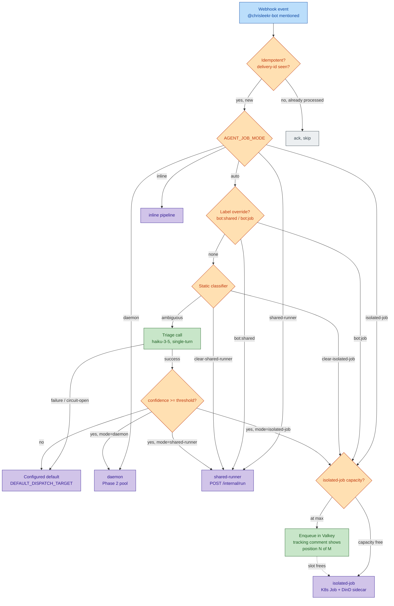

# Dispatch Flow

This document describes how an incoming webhook reaches a dispatch target —
the cascade of checks the router runs before handing a request to
`inline`, `daemon`, `shared-runner`, or `isolated-job`.

The diagram below is the canonical reference for operators investigating
"why did request X land on target Y". For the source-of-truth definitions
of each node, see:

- `src/webhook/router.ts` — `decideDispatch` + `processRequest`
- `src/orchestrator/triage.ts` — triage call, parse, and fallback rules
- `src/k8s/pending-queue.ts` + `src/k8s/pending-queue-drainer.ts` — isolated-job capacity gate and queue drain
- `specs/20260415-000159-triage-dispatch-modes/spec.md` — feature-level behaviour
- `specs/20260415-000159-triage-dispatch-modes/contracts/dispatch-telemetry.md` — log shape and FR-014 aggregate queries

## Cascade — visual

## Node reference

| Node                       | Source of truth                   | What it decides                                                                                                                |
| -------------------------- | --------------------------------- | ------------------------------------------------------------------------------------------------------------------------------ |
| `AGENT_JOB_MODE`           | `src/config.ts`                   | Operator-level override; one of `inline` / `daemon` / `shared-runner` / `isolated-job` / `auto`.                               |
| Label override             | `decideDispatch` (router.ts)      | Repo labels `bot:shared` / `bot:job` short-circuit the cascade.                                                                |
| Static classifier          | `decideDispatch` (router.ts)      | Keyword / path heuristics that can route without calling the LLM.                                                              |
| Triage call                | `runTriage` (triage.ts)           | Single-turn `haiku-3-5` call that returns `{ mode, confidence, complexity, rationale }`.                                       |
| `confidence >= threshold?` | `TRIAGE_CONFIDENCE_THRESHOLD` env | Below-threshold results fall back to `DEFAULT_DISPATCH_TARGET` with `dispatch_reason = "default-fallback"`.                    |
| Triage failure fallback    | `runTriage` (triage.ts)           | Timeout / parse-error / llm-error / circuit-open → `DEFAULT_DISPATCH_TARGET` with `dispatch_reason = "triage-error-fallback"`. |
| Isolated-job capacity gate | `src/k8s/pending-queue.ts`        | Checks `inFlightCount` against `MAX_CONCURRENT_ISOLATED_JOBS`; enqueues to Valkey when at capacity.                            |

## Related telemetry

- Dispatch-decision structured log: see `contracts/dispatch-telemetry.md` §1.
- Operator aggregate queries (events per target, triage rate, confidence/fallback, spend): `src/db/queries/dispatch-stats.ts`.
