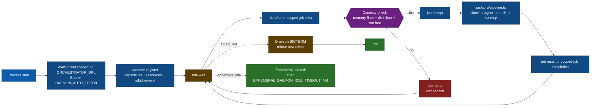

# Runbook — daemon fleet

A daemon is a standalone worker process that connects to the orchestrator over WebSocket, accepts job offers, and runs each job through `src/core/pipeline.ts`. The webhook server never runs the pipeline in-process — every execution happens on a daemon.

## Persistent vs ephemeral

Always qualify which kind you mean. The union of both at any given moment is the **daemon fleet**.

| Type           | How it starts                                                        | Lifetime                                                                         | `DAEMON_EPHEMERAL` |
| -------------- | -------------------------------------------------------------------- | -------------------------------------------------------------------------------- | ------------------ |
| **Persistent** | Deployed out-of-band (Helm, kubectl, `docker run`, systemd).         | Long-lived; stays connected until `SIGTERM` or eviction.                         | unset / `false`    |
| **Ephemeral**  | Spawned on demand by the orchestrator as a bare Pod via the K8s API. | Exits after `EPHEMERAL_DAEMON_IDLE_TIMEOUT_MS` (default 120 s) of no active job. | `true`             |

Only persistent daemons count toward the "persistent pool free slots" the orchestrator uses to decide whether an overflow spawn is warranted. Ephemeral daemons exist specifically to drain the current surge and disappear.

## Daemon lifecycle



## Operational knobs

The full list lives at [`../configuration.md`](../configuration.md#orchestrator-and-daemon). The handful you'll actually touch:

| Variable                           | Default  | Notes                                                                              |
| ---------------------------------- | -------- | ---------------------------------------------------------------------------------- |
| `ORCHESTRATOR_URL`                 | —        | Required. `wss://` in production; `ws://` emits a warning.                         |
| `DAEMON_AUTH_TOKEN`                | —        | Shared secret with the orchestrator.                                               |
| `DAEMON_EPHEMERAL`                 | `false`  | `true` on ephemeral daemon Pods (injected by the spawner). Enables idle-exit.      |
| `EPHEMERAL_DAEMON_IDLE_TIMEOUT_MS` | `120000` | Ephemeral daemons exit after this idle window.                                     |
| `HEARTBEAT_INTERVAL_MS`            | `30000`  | Ping cadence.                                                                      |
| `HEARTBEAT_TIMEOUT_MS`             | `90000`  | Orchestrator eviction threshold. Keep `≥ 2 × HEARTBEAT_INTERVAL_MS`.               |
| `DAEMON_DRAIN_TIMEOUT_MS`          | `300000` | Post-`SIGTERM` grace. Raise to `≥ AGENT_TIMEOUT_MS` to guarantee no mid-run kills. |
| `DAEMON_MEMORY_FLOOR_MB`           | `512`    | Below this, the orchestrator skips the daemon on dispatch.                         |
| `DAEMON_DISK_FLOOR_MB`             | `1024`   | Same, for free disk.                                                               |

## Persistent daemon Deployment

```yaml
apiVersion: apps/v1
kind: Deployment
metadata:
  name: github-app-playground-daemon
  namespace: default
spec:
  replicas: 2
  selector:
    matchLabels:
      app: github-app-playground-daemon
  template:
    metadata:
      labels:
        app: github-app-playground-daemon
    spec:
      terminationGracePeriodSeconds: 300
      containers:
        - name: daemon
          image: chrisleekr/github-app-playground:latest-daemon
          envFrom:
            - secretRef:
                name: daemon-secrets
          env:
            - name: ORCHESTRATOR_URL
              value: "wss://orchestrator.example.internal:3002"
            - name: CLONE_BASE_DIR
              value: "/workspaces"
          volumeMounts:
            - name: bot-workspaces
              mountPath: /workspaces
      volumes:
        - name: bot-workspaces
          emptyDir:
            sizeLimit: 5Gi
```

Match `terminationGracePeriodSeconds` to `DAEMON_DRAIN_TIMEOUT_MS` so `SIGTERM` has time to drain in-flight work before `SIGKILL`.

## Concurrency and scaling

A daemon process handles up to its advertised `maxConcurrentJobs` at a time. Scale **horizontally** by running multiple persistent daemon pods. The orchestrator adds ephemeral daemons for bursts (triage `heavy=true` or queue overflow) — see [`../observability.md`](../observability.md#dispatch-reasons).

### Scale-up rule

On every event the orchestrator evaluates:

1. **Triage.** A single-turn Haiku call returns `{heavy, confidence, rationale}`. `heavy=true` is one trigger.
2. **Overflow.** If `queue_length ≥ EPHEMERAL_DAEMON_SPAWN_QUEUE_THRESHOLD` **and** the persistent pool has zero free slots, that's the other trigger.
3. **Cooldown.** Spawns are rate-limited by `EPHEMERAL_DAEMON_SPAWN_COOLDOWN_MS`. During cooldown, heavy/overflow signals **don't** spawn — the job falls back to `persistent-daemon` and waits.
4. **Spawn.** When both a trigger fires and cooldown has elapsed, the orchestrator creates a bare Pod via the K8s API. A K8s API failure yields `dispatch_reason=ephemeral-spawn-failed` and the job is rejected with a tracking-comment infra error.

## Hard constraints

- `AGENT_TIMEOUT_MS` must stay below the GitHub installation-token TTL (3600 s) so the daemon cannot outlive its credentials.
- `EPHEMERAL_DAEMON_IDLE_TIMEOUT_MS` should be longer than typical heartbeat cadence so a short lull between back-to-back jobs does not cause a premature exit.
- `terminationGracePeriodSeconds` on the daemon Pod should match `DAEMON_DRAIN_TIMEOUT_MS`.

## Common Day-2 issues

| Symptom                                      | Likely cause                                                                                                  |
| -------------------------------------------- | ------------------------------------------------------------------------------------------------------------- |
| Sustained heartbeat eviction                 | Daemon CPU starvation, network partition, or `HEARTBEAT_TIMEOUT_MS` too low.                                  |
| `dispatch_reason=ephemeral-spawn-failed`     | Missing RBAC on `pods` in `EPHEMERAL_DAEMON_NAMESPACE`, missing `daemon-secrets`, or a control-plane issue.   |
| Mid-run kills on rolling deploys             | `terminationGracePeriodSeconds` < `DAEMON_DRAIN_TIMEOUT_MS`.                                                  |
| `executions.status='running'` rows piling up | A daemon died abruptly. The `LIVENESS_REAPER_INTERVAL_MS` reaper flips them to failed; check daemon pod logs. |

## Implementation references

`src/daemon/main.ts`, `src/orchestrator/ws-server.ts`, `src/orchestrator/ephemeral-daemon-scaler.ts`, `src/k8s/ephemeral-daemon-spawner.ts`, `src/core/pipeline.ts`, `src/shared/ws-messages.ts`.
