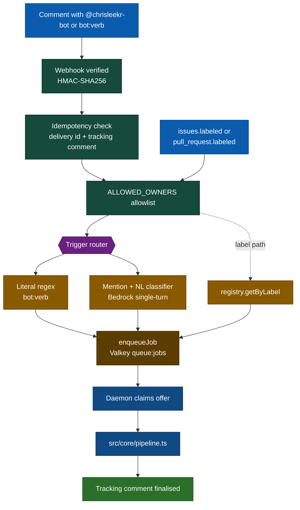

# Invoking the bot

The bot reacts to three kinds of input: mentions in a comment, labels applied to an issue or PR, and (for `bot:ship` only) natural-language asks that include the trigger phrase. All three converge on the same workflow registry — only the **surface** differs in logs.

## The three surfaces

| Surface             | Where you put it     | Example                                                                                                                        |
| ------------------- | -------------------- | ------------------------------------------------------------------------------------------------------------------------------ |
| **Mention + verb**  | Issue or PR comment  | `@chrisleekr-bot triage this` · `@chrisleekr-bot ship this please`                                                             |
| **Literal command** | PR comment           | `bot:ship` · `bot:ship --deadline 2h` · `bot:abort-ship`                                                                       |
| **Label**           | Apply to issue or PR | `bot:triage`, `bot:plan`, `bot:implement`, `bot:review`, `bot:resolve`, `bot:ship`, `bot:stop`, `bot:resume`, `bot:abort-ship` |

The trigger phrase that gates mentions is `@chrisleekr-bot` by default and can be overridden with `TRIGGER_PHRASE` (typically `@chrisleekr-bot-dev` for local development).

## How a comment reaches a workflow

## Idempotency

A duplicate webhook delivery never spawns a duplicate job. The router checks two layers:

1. **Fast in-memory** — a `Map` keyed by the `X-GitHub-Delivery` header, swept every 60 minutes (`src/webhook/router.ts`). Lost on restart.
2. **Durable** — `isAlreadyProcessed` looks for the hidden delivery marker that the bot embeds in its tracking comment. Survives pod restarts, OOM kills, and crash loops; works without `DATABASE_URL`.

If both miss, the request proceeds to the allowlist + concurrency guard.

## What you see while it runs

Comment-driven runs stack four reactions on your trigger comment so the lifecycle is visible at a glance:

| Stage                      | Reaction |
| -------------------------- | -------- |
| Trigger detected           | 👀       |
| Job dispatched to a daemon | 🚀       |
| Workflow succeeded         | 🎉       |
| Workflow failed            | 😕       |

Reactions are additive — the combined set is the audit trail. Label-driven runs skip reactions because there is no comment to react on.

The bot also writes a single **tracking comment** per run. For workflows that take minutes (triage, plan, implement, review, resolve, ship), the comment opens with a "Working…" body and is rewritten in place at major checkpoints and at the terminal state. You only need to watch one comment.

## What gets refused

| Refusal                  | Cause                                                                                                                |
| ------------------------ | -------------------------------------------------------------------------------------------------------------------- |
| Silent skip              | Repository owner is not in `ALLOWED_OWNERS`. No comment is posted.                                                   |
| "Capacity reached" reply | More than `MAX_CONCURRENT_REQUESTS` agent runs are already in flight. Re-invoke later.                               |
| Clarification reply      | Mention-driven request whose intent classifier confidence fell below `INTENT_CONFIDENCE_THRESHOLD` (default `0.75`). |
| "Unsupported" reply      | Mention-driven request whose intent does not map to any registered workflow.                                         |
| `bot:ship` refusal       | Target branch is in `SHIP_FORBIDDEN_TARGET_BRANCHES`, or the PR head is closed / on a fork without push access.      |

See [`use/safety.md`](safety.md) for what the bot will and will not do once a job is accepted.

## Catalog

A complete table of `bot:*` commands lives at [`use/workflows/`](workflows/index.md). The headline shipping workflow is documented at [`use/workflows/ship.md`](workflows/ship.md).
