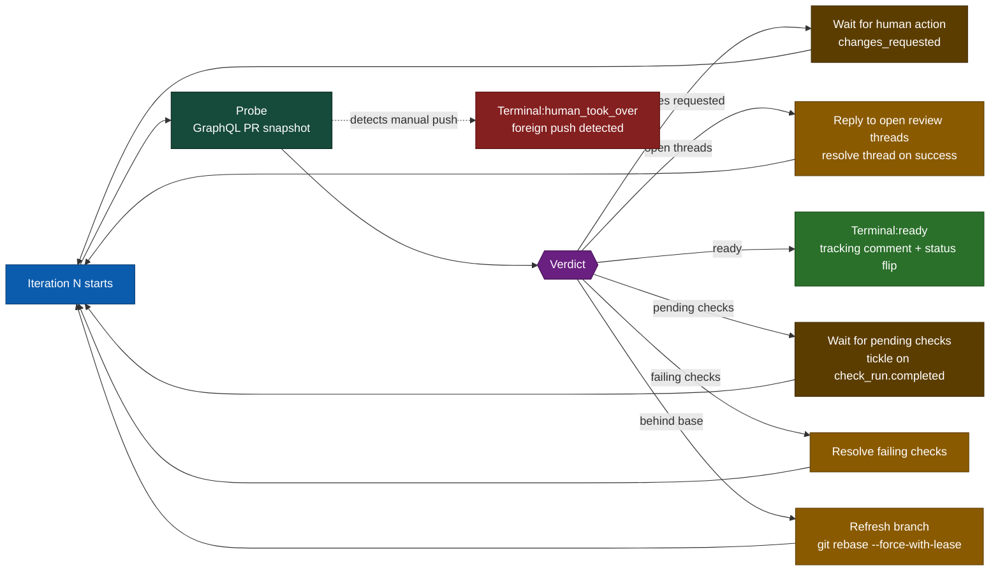
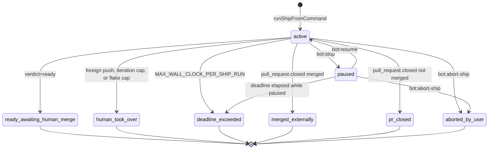

# `bot:ship` — PR shepherding to merge-ready

The shepherding lifecycle takes an open pull request from "needs work" to "ready for human merge". The bot drives the probe → fix → reply → wait loop until the merge-readiness probe says the PR is clean. **The bot never merges**; the final action is always a human's.

The lifecycle lives in `src/workflows/ship/` (entry point `runShipFromCommand` in `session-runner.ts`). Each session is a row in `ship_intents`, with iteration history in `ship_iterations` and wake state in `ship_continuations`.

## How to invoke

| Surface     | Example                                              | Notes                                                                                         |
| ----------- | ---------------------------------------------------- | --------------------------------------------------------------------------------------------- |
| **Literal** | `bot:ship` · `bot:ship --deadline 2h`                | PR comment. Deterministic regex; never costs an LLM call.                                     |
| **Natural** | `@chrisleekr-bot ship this please`                   | Requires the trigger-phrase mention. Without the mention the comment is skipped at zero cost. |
| **Label**   | Apply `bot:ship` (or `bot:ship/deadline=2h`) to a PR | The bot self-removes the label after acting. Re-applying re-triggers.                         |

The four lifecycle verbs are `ship`, `stop`, `resume`, `abort-ship`. All four are available on all three surfaces.

`--deadline` accepts `Nh` / `Nm` / `Ns`. The session deadline is clamped to `MAX_WALL_CLOCK_PER_SHIP_RUN` (default 4h).

## How to monitor

Each session writes a single canonical tracking comment marked with `<!-- ship-intent:{intent_id} -->`. The body shows current phase, last action, next queued action, iteration count, USD spent, deadline, and (on terminal) the blocker category. One comment is enough to know exactly where the bot is.

## How to pause, resume, abort

| Verb             | Effect                                                                                                             | Recoverable?                                                               |
| ---------------- | ------------------------------------------------------------------------------------------------------------------ | -------------------------------------------------------------------------- |
| `bot:stop`       | Sets `ship_intents.status = 'paused'`. Deadline keeps counting down.                                               | Yes — `bot:resume`.                                                        |
| `bot:resume`     | Verifies no foreign push since the pause, clears the cancel flag, re-enqueues the continuation.                    | —                                                                          |
| `bot:abort-ship` | Sets the Valkey cancel flag, waits ≤2 s for a cooperative checkpoint, then force-transitions to `aborted_by_user`. | No. After abort, the bot performs zero further mutating actions on the PR. |

## What runs each iteration

The verdict ladder is ordered: `human_took_over` > `behind_base` > `failing_checks` > `pending_checks` > `mergeable_pending` > `changes_requested` > `open_threads` > `ready`. The first matching rung wins — fixing failing checks always precedes replying to threads, and a manual push always wins outright.

`mergeable=null` is treated specially: the probe backs off through `MERGEABLE_NULL_BACKOFF_MS_LIST` (default `500,1500,4500`); exhausting the list yields a `mergeable_pending` verdict and the session yields rather than spinning.

## Status values

## What the bot will and won't do

| Will                                                                | Won't                                                            |
| ------------------------------------------------------------------- | ---------------------------------------------------------------- |
| Force-push with `--force-with-lease` after a clean rebase onto base | Force-push without rebasing                                      |
| Push fix commits in response to failing CI                          | Merge the PR (`gh pr merge` is statically guarded)               |
| Reply to review threads with the `resolve-review-thread` MCP        | Post `APPROVE` or `REQUEST_CHANGES` reviews                      |
| Mark a draft PR ready-for-review on terminal `ready`                | Cancel a foreign push — manual push wins; the session terminates |
| Self-remove the `bot:ship` label after acting                       | Take any mutating action after `bot:abort-ship`                  |

If the target branch matches `SHIP_FORBIDDEN_TARGET_BRANCHES` (e.g. `main,production`), the trigger is refused before any session is created.

## Re-triggering

Re-applying the `bot:ship` label or re-commenting `bot:ship` on the same PR while a session is **active** is a no-op. Re-applying after the session is **terminal** starts a fresh session — the prior `ship_intents` row is preserved for audit.

## Tuning knobs

Configured at the process level via [`operate/configuration.md`](../../operate/configuration.md#ship). The two you most often touch:

| Variable                      | Default | Effect                                                                                                   |
| ----------------------------- | ------- | -------------------------------------------------------------------------------------------------------- |
| `MAX_WALL_CLOCK_PER_SHIP_RUN` | `4h`    | Hard ceiling on a session's wall-clock budget. Per-invocation `--deadline` is clamped to this value.     |
| `MAX_SHIP_ITERATIONS`         | `50`    | Iteration cap. Firing transitions to `human_took_over` with `terminal_blocker_category='iteration-cap'`. |

## When a human should step in

The tracking comment puts the answer at the top: any terminal status other than `ready_awaiting_human_merge` and `merged_externally` means human attention is needed. `terminal_blocker_category` names which class:

- `flake-cap` — the same failure signature was retried `FIX_ATTEMPTS_PER_SIGNATURE_CAP` times (default 3); investigate the flake.
- `iteration-cap` — the session ran `MAX_SHIP_ITERATIONS` rounds without resolving; re-scope the work.
- `manual-push-detected` — someone pushed to the PR; the bot stepped back. Re-trigger `bot:ship` if you want the bot to take it from here.
- `merge-conflict-needs-human` — the rebase produced conflicts the bot would not resolve confidently.

For Day-2 SQL and the other terminal categories, see [`operate/runbooks/stuck-ship-intent.md`](../../operate/runbooks/stuck-ship-intent.md).
