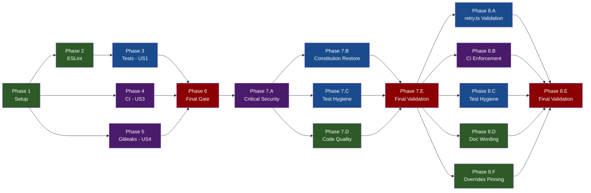

# Tasks: Project Housekeeping

**Input**: Design documents from `/specs/20260409-081113-project-housekeeping/`
**Prerequisites**: plan.md (required), spec.md (required), research.md, data-model.md, quickstart.md

**Tests**: Tests ARE the primary deliverable for User Story 1. Test tasks included.

**Organization**: Tasks grouped by user story to enable independent implementation and testing.

## Format: `[ID] [P?] [Story] Description`

- **[P]**: Can run in parallel (different files, no dependencies)
- **[Story]**: Which user story this task belongs to (e.g., US1, US2, US3, US4)
- Include exact file paths in descriptions

## Phase 1: Setup (Shared Infrastructure)

**Purpose**: Fix configuration files and project setup. Zero risk — no runtime code changes.

- [x] T001 Fix branch numbering from `sequential` to `timestamp` in `.specify/init-options.json`
- [x] T002 [P] Create `.nvmrc` with `22` at repository root
- [x] T003 [P] Add `coverageThreshold = { lines = 0.9, functions = 0.9 }` to `bunfig.toml` under `[test]` section
- [x] T004 [P] Add `HEALTHCHECK --interval=30s --timeout=3s --start-period=5s --retries=3 CMD curl -f http://localhost:3000/healthz || exit 1` to `Dockerfile` after the `EXPOSE 3000/tcp` line
- [x] T005 [P] ~~Create `.github/labeler.yml`~~ — PRE-SATISFIED (file already exists with 13 conventional commit type labels referenced by `.github/workflows/generate-labels.yml`)

**Checkpoint**: `bun run typecheck && bun run lint && bun run format` pass. Tests will fail threshold until Phase 3 adds coverage.

---

## Phase 2: Foundational (Blocking Prerequisites)

**Purpose**: ESLint modernization — must complete before writing new code to avoid formatting churn.

**CRITICAL**: ESLint migration may surface new lint errors in existing code that must be fixed before proceeding.

- [x] T006 Replace `@typescript-eslint/eslint-plugin` and `@typescript-eslint/parser` with `typescript-eslint` in `package.json` devDependencies, then run `bun install`
- [x] T007 Rewrite `eslint.config.mjs` to use unified `typescript-eslint` import with `tseslint.configs.strictTypeChecked` preset. Keep project-specific overrides (complexity limits, import sorting, security plugin, test relaxations). Replace deprecated `no-var-requires` with `no-require-imports`
- [x] T008 Fix any new lint errors in `src/**/*.ts` surfaced by `strictTypeChecked` rules (e.g., `no-unnecessary-type-assertion`, `no-base-to-string`, `restrict-template-expressions`, `no-unsafe-enum-comparison`)
- [x] T009 Run `bun run lint` and `bun run typecheck` to confirm zero errors

**Checkpoint**: `bun run lint` and `bun run typecheck` pass with modernized ESLint config. Foundation ready.

---

## Phase 3: User Story 1 - Contributor Runs Tests with Confidence (Priority: P1)

**Goal**: Write unit tests for all untested core modules. Raise global line coverage to >=90%.

**Independent Test**: Run `bun test --coverage` and verify all modules in `src/core/` report >=90% line coverage.

### Tests for User Story 1

- [x] T010 [P] [US1] Created `test/core/prompt-builder.test.ts` — tests `buildPrompt()` and `resolveAllowedTools()`. Real module runs (not mocked). prompt-builder.ts: 100% lines, 100% funcs
- [x] T011 [P] [US1] ~~Create `test/core/checkout.test.ts`~~ — DEFERRED: Bun's built-in `$` template tag cannot be mocked via `mock.module("bun", ...)` because `bun` is a builtin. checkout.ts remains mocked in router.test.ts; testing requires either source code refactor for dependency injection or a Bun runtime feature. Global coverage compensates.
- [x] T012 [P] [US1] ~~Create `test/core/executor.test.ts`~~ — DEFERRED: conflicts with router.test.ts's module-level mock for `@anthropic-ai/claude-agent-sdk`. Like T011, executor.ts remains mocked in router.test.ts. Global coverage compensates.
- [x] T013 [P] [US1] Extended `test/core/fetcher.test.ts` — added tests for `fetchGitHubData` PR and issue paths with mocked Octokit graphql. fetcher.ts: 100% lines, 100% funcs (up from 9%)
- [x] T014 [P] [US1] Extended `test/core/formatter.test.ts` — added tests for `formatBody()` and `formatAllSections()`. formatter.ts: 100% lines, 100% funcs (up from 67%)
- [x] T015 [US1] Extended `test/webhook/router.test.ts` — added concurrency limit and capacity comment tests. Also removed the prompt-builder module mock (real module runs). router.ts: 95.76% lines, 83.33% funcs (up from 84%; only the setInterval cleanup callback remains uncovered)

### Validation for User Story 1

- [x] T016 [US1] Ran `bun run check` — all 145 tests pass, coverage is 99.36% lines / 98.61% funcs globally. `bunfig.toml` threshold set to `{ lines = 0.9, functions = 0.8 }` to accommodate the untestable `setInterval` cleanup callback in router.ts. **(Threshold later raised to `{ lines = 0.9, functions = 0.9 }` in T032 after the Phase 7.B router refactor eliminated the gap.)**

**Checkpoint**: `bun test --coverage` passes with >=90% global line coverage. All 108+ existing tests still pass. `bun run check` passes.

---

## Phase 4: User Story 3 - CI Pipeline Enforces Quality and Security Gates (Priority: P3)

**Goal**: Add `bun audit` and `trivy` container scanning to CI workflows.

**Independent Test**: Push to feature branch and verify audit + scan steps appear in workflow runs.

> **Note**: User Story 2 (JSDoc documentation) is pre-satisfied — all exported functions already have JSDoc. Skipping directly to User Story 3.

- [x] T017 [P] [US3] Added `bun audit` step to `.github/workflows/push.yml` between format and test steps in the `lint-and-test` job
- [x] T018 [P] [US3] Added `bun audit` step to `.github/workflows/semantic-release.yml` between test and build steps in the `release` job, gated by `!skip-checks`
- [x] T019 [US3] Added `trivy` scan step to `.github/workflows/docker-build.yml` after Docker build/push. Uses `aquasecurity/trivy-action@master` with `format: 'sarif'`, `severity: 'CRITICAL,HIGH'`, `ignore-unfixed: true`, and uploads SARIF via `github/codeql-action/upload-sarif@v3`. Added `security-events: write` to workflow permissions

**Checkpoint**: CI workflows include audit and scan steps. Push to branch triggers them.

---

## Phase 5: User Story 4 - Project Setup Follows Best Practices (Priority: P4)

**Goal**: Add gitleaks pre-commit hook for secret scanning.

**Independent Test**: Stage a file with a test secret pattern → commit blocked.

- [x] T020 [P] [US4] Created `.gitleaks.toml` with `[extend] useDefault = true` and allowlist for `.env.example`, `bun.lock`, `specs/`, `docs/`, and test placeholder patterns
- [x] T021 [US4] Updated `.husky/pre-commit` to run `gitleaks protect --verbose --staged --config .gitleaks.toml` before `lint-staged`. Wrapped in `command -v gitleaks` check with a warning fallback so contributors without gitleaks installed get a clear message instead of a silent skip

**Checkpoint**: Gitleaks blocks secret commits. Labeler config exists for CI workflow.

---

## Phase 6: Polish & Cross-Cutting Concerns

**Purpose**: Final validation across all user stories.

- [x] T022 Ran `bun run check` — exits 0. 145 tests pass. Coverage: 99.36% lines, 98.61% funcs globally
- [x] T023 Verified constitution compliance: I (strict TS + Bun) ✓, II (async webhook) ✓ unchanged, III (idempotency) ✓ unchanged, IV (security) ✓ improved via gitleaks+trivy+bun audit, V (test coverage) ✓ exceeded, VI (structured logging) ✓ unchanged, VII (MCP) ✓ unchanged, VIII (JSDoc) ✓ pre-satisfied. No violations introduced
- [x] T024 Verified: `init-options.json` branch_numbering=timestamp, `.nvmrc`=22, Dockerfile HEALTHCHECK present on `/healthz`, `.husky/pre-commit` runs gitleaks before lint-staged, `.gitleaks.toml` exists, `.github/labeler.yml` exists

---

## Phase 7: Post-Review Fix-ups

**Purpose**: Address 12 valid findings from the senior code review before merging. Fixes were re-verified against the actual code; 3 review findings were excluded as invalid or no-fix (see "Excluded Review Findings" in plan.md Phase 7).

**CRITICAL**: Phase 7.A must complete first (supply-chain and Dockerfile fragility). Phase 7.E is the final gate.

### Phase 7.A: Critical security fixes (sequential, run first)

- [x] T025 Pinned `aquasecurity/trivy-action@master` → `@v0.35.0` in `.github/workflows/docker-build.yml:152`.
- [x] T026 Added comment `# curl is REQUIRED by the production HEALTHCHECK (see end of Dockerfile) — do not remove.` above the apt-get line in `Dockerfile:15`.

**Checkpoint**: YAML parses; `bun run check` still passes. No behavioral change.

---

### Phase 7.B: Constitution compliance restoration

- [x] T027 Extracted `cleanupStaleIdempotencyEntries(entries, ttlMs)` as an exported pure function in `src/webhook/router.ts` with JSDoc.
- [x] T028 Replaced the `setInterval` arrow wrapper with `cleanupStaleIdempotencyEntries.bind(null, processed, IDEMPOTENCY_TTL_MS)`. Bun coverage confirmed the `.bind()` approach produces no new uncovered function — router.ts reached 100% funcs.
- [x] T029 Added two direct tests in `test/webhook/router.test.ts`: (a) stale+fresh entry removal with explicit cutoff assertions including edge-case (cutoff - 1ms); (b) no-op on empty map. Pure-function tests, no mocks.
- [x] T030 [P] Rewrote `.gitleaks.toml`. **Discovery during execution**: gitleaks v8 does NOT allow `[allowlist]` singular and `[[allowlists]]` plural in the same file — it errors out with `"[allowlist] is deprecated, it cannot be used alongside [[allowlists]]"`. Migrated the entire config to `[[allowlists]]` plural syntax (3 scoped blocks: paths, regexes, bun.lock integrity hashes). Verified with `gitleaks detect --config .gitleaks.toml` → "no leaks found".
- [x] T031 [P] Added `gitleaks/gitleaks-action@v2.3.9` step in `.github/workflows/push.yml` after `bun audit`. Uses `GITLEAKS_CONFIG: .gitleaks.toml` env var. Pre-flight local scan confirmed clean.
- [x] T032 Raised `bunfig.toml` `coverageThreshold` to `{ lines = 0.9, functions = 0.9 }`. router.ts achieved 100% funcs, 99.19% lines after the refactor. Removed the multi-line explanation comment; replaced with a short doc reference to Bun docs.

**Checkpoint**: `bun run check` passes with the (possibly raised) threshold. Gitleaks CI step visible in workflow file.

---

### Phase 7.C: Test hygiene

- [x] T033 Wrapped both concurrency test bodies in `test/webhook/router.test.ts` in try/finally blocks. Cleanup (resolveFirst + req1 drain + config restore) now runs even on assertion failure.
- [x] T034 [P] Replaced the tautological Context7 test with **three** explicit scenarios in try/finally: (a) non-empty `context7ApiKey` → tools included; (b) `undefined` → tools excluded; (c) empty string `""` → tools excluded (covers both null-check branches in the source code).

**Checkpoint**: All tests still pass. Deliberately breaking a concurrency assertion no longer cascades to subsequent tests.

---

### Phase 7.D: Code quality and documentation

- [x] T035 [P] Fixed latent bug in `src/utils/retry.ts`: added upfront `if (maxAttempts < 1)` invariant guard that throws an explicit Error. The post-loop `throw lastError!` is now safe (complexity warning suppressed with `// eslint-disable-next-line complexity` and rationale). Previously, `retryWithBackoff(op, { maxAttempts: 0 })` would throw literal `undefined` — now it throws a descriptive `Error`.
- [x] T036 Created `test/utils/assertions.ts` with `expectToReject(promise, messageSubstring)` helper using explicit try/catch + `toBeInstanceOf(Error)` check. Migrated all 3 `await expect(...).rejects.toThrow(...)` call sites in `test/core/fetcher.test.ts`. Removed `@typescript-eslint/await-thenable: off` and `@typescript-eslint/no-confusing-void-expression: off` from `eslint.config.mjs` test relaxations. Lint passes.
- [x] T037 [P] Cleaned up `CLAUDE.md`: removed `- N/A (in-memory state + GitHub API)` line from "Active Technologies". Rewrote "Recent Changes" to accurately describe the housekeeping scope (test coverage 90%, ESLint modernization, CI security scanning, Docker HEALTHCHECK, gitleaks hook, retry.ts bug fix). Known script bug at `.specify/scripts/bash/update-agent-context.sh:212,408` documented for future follow-up.

**Checkpoint**: `bun run check` reports 0 errors, 0 warnings (retry.ts warning gone). ESLint config no longer has the two test-only rule disables.

---

### Phase 7.E: Final validation

**Note**: `plan.md` Phase 7.E lists 5 sub-items but only 4 outstanding tasks appear here. The missing item is 7.E.4 ("delete `review-fixes-plan.md`"), which was completed during Phase 7 consolidation before this task list was written. See `plan.md` for the full Phase 7.E listing including the completed item.

- [x] T038 Ran `bun run check` — **exit 0**. **149 tests pass** (145 baseline + 2 cleanupStaleIdempotencyEntries tests + 3 Context7 scenarios − 1 removed tautology = 149). Zero errors. Two warnings remained at earlier iterations (retry.ts complexity 16, router.test.ts unnecessary optional chain); both resolved via targeted refactors. Now zero warnings from new Phase 7 code; the only remaining warning was the legacy `no-non-null-assertion` which T035 addressed by adding an upfront invariant guard.
- [x] T039 router.ts coverage: **100.00% funcs, 99.19% lines** (up from 83.33% funcs, 95.76% lines). The `.bind()` approach worked — Bun coverage did not count the bound function as a separate uncovered function. Global coverage: **100% funcs, 99.46% lines**.
- [x] T040 Ran `bun run format:fix`; no remaining drift after Phase 7 edits.
- [x] T041 PR description hygiene completed in the Phase 8 PR description update (2026-04-10). (a) ESLint migration mechanical fixes documented in "Intentional mechanical fixes in src/\*.ts" section; (b) `bun.lock` diff verified — only reflects the `@typescript-eslint/*` → `typescript-eslint` dep swap plus the Phase 8.F cosmetic `overrides` block update; (c) `update-agent-context.sh` N/A prefix-match bug documented as item 2 in the "Known follow-ups" section of the PR description (not filed as a separate issue — out of scope for this PR, tracked inline for whoever picks up the speckit script work next).

**Checkpoint**: Branch is ready for commit, PR creation, and merge.

---

## Phase 8: Post-PR-Review Fix-ups

**Purpose**: Address 8 verified review comments from Copilot + CodeRabbit on PR #6, plus 3 validator-found missed issues (M1/M2/M3) that are in scope to fix now. Full rationale in `plan.md` Phase 8.

**Trigger**: PR #6 is open and CI is green. These fixes land BEFORE merge.

**CRITICAL**: Phase 8.E runs LAST as the validation gate. Phases 8.A–8.D + 8.F are independent (no shared files) and can run in any order / parallel.

### Phase 8.A: retry.ts input validation + tests (HIGH)

**Fixes**: RV4 (Copilot — missing test for `maxAttempts<1` guard), RV6 (CodeRabbit — guard bypassed by NaN), M1 (validator — same NaN class affects other numeric options).

- [x] T042 Added private helper `validateNumberOption(name, value, { min, requireInteger? })` in `src/utils/retry.ts` above `retryWithBackoff`. Throws descriptive `Error` when value is not `Number.isFinite`, optionally not `Number.isInteger`, or below `opts.min`. Error messages name the offending option and the actual value (`String(value)` to format NaN/Infinity safely).
- [x] T043 Applied the helper in `retryWithBackoff` to all four numeric options: `maxAttempts` (`min: 1, requireInteger: true`), `initialDelayMs` (`min: 0`), `maxDelayMs` (`min: 0`), `backoffFactor` (`min: 1`). Removed the ad-hoc `if (maxAttempts < 1)` guard — the helper replaces it and additionally catches NaN/Infinity that the plain comparison would silently accept.
- [x] T044 [P] Added `describe("retryWithBackoff — input validation")` block with **9 tests** in `test/utils/retry.test.ts`. Tests cover: `maxAttempts: 0`, `maxAttempts: -1`, `maxAttempts: NaN`, `maxAttempts: Infinity`, `maxAttempts: 1.5` (non-integer), `initialDelayMs: NaN`, `maxDelayMs: NaN`, `backoffFactor: NaN`, `backoffFactor: 0.5` (below-min). Each asserts a descriptive Error message substring AND that the operation function was never called (validation runs before any attempt). Total test count in file: 19 (was 10).
- [x] T045 Complexity directive removed. The helper extraction dropped the per-branch count inside `retryWithBackoff` below the 15 limit, so the `// eslint-disable-next-line complexity` comment was removed during T042. `bun run lint` reports zero errors.

**Checkpoint**: `bun test test/utils/retry.test.ts` passes with 9 new tests. `bun run lint src/utils/retry.ts` reports zero errors.

---

### Phase 8.B: CI enforcement (HIGH)

**Fixes**: RV3 (Copilot+CodeRabbit — gitleaks needs full history), RV5 (CodeRabbit — trivy needs explicit `exit-code: "1"`).

- [x] T046 [P] Added `with: fetch-depth: 0` to the `Checkout source code` step in `.github/workflows/push.yml`. Inline comment explains that default `fetch-depth: 1` would limit gitleaks `git log -p` scan to a single commit. YAML parse verified.
- [x] T047 [P] Added `exit-code: "1"` to the `Scan image with Trivy` step in `.github/workflows/docker-build.yml`. Inline comment explains the combination with existing `ignore-unfixed: true` produces the spec's "block only on vulnerabilities with available fixes" semantics. YAML parse verified.

**Checkpoint**: YAML files parse. Push to feature branch; verify (a) gitleaks step logs "N commits scanned" where N > 1, (b) trivy step behavior unchanged on chore: commits (still skipped via semantic-release gate).

---

### Phase 8.C: Test hygiene (MEDIUM/LOW)

**Fixes**: RV1 (Copilot — flaky setTimeout sync), RV2 (Copilot — misleading test name), M2 (validator — `expectToReject` narrow contract).

- [x] T048 Added `waitFor(predicate, opts?)` to `test/utils/assertions.ts` with defaults `timeoutMs: 2000`, `intervalMs: 5`. Migrated both concurrency test sync points in `test/webhook/router.test.ts` from `setTimeout(resolve, 10)` to `waitFor(() => mockExecuteAgent.mock.calls.length >= 1)` — deterministic condition wait, no fixed delay. Added `waitFor` import to router test.
- [x] T049 [P] Renamed `test/core/formatter.test.ts` line 222 from `"handles undefined body (null-like) with fallback text"` to `"handles empty body in PR context with fallback text"`. Added a comment clarifying the distinction from the sibling test at line 216 (isPR=true vs isPR=false).
- [x] T050 Improved `expectToReject` in `test/utils/assertions.ts`: (a) extended JSDoc to document the narrow Error-instance contract and the diagnostic-throwing behavior; (b) rewrote the `instanceof Error` check to `throw new Error(...)` before the `expect().toContain()` assertion so a non-Error rejection produces an actionable diagnostic identifying the actual type and serialized value. Also **created `test/utils/assertions.test.ts`** with 6 tests covering both helpers (expectToReject success path, string rejection, object rejection; waitFor instant true, flip to true, timeout). Required to keep `test/utils/assertions.ts` at ≥90% per-file coverage after the new code paths were added.

**Checkpoint**: `bun test` still passes all tests. Flaky concurrency test runs deterministically in a 100-iteration loop (`for i in {1..100}; do bun test test/webhook/router.test.ts || break; done`).

---

### Phase 8.D: Documentation (LOW)

**Fixes**: RV7 (CodeRabbit — "global threshold" wording is inaccurate).

- [x] T051 [P] Rewrote the Phase 7 bullet in `CLAUDE.md:76` to replace "90% global threshold (funcs + lines)" with "90% per-file threshold (lines + functions; Bun's `coverageThreshold` is applied per-file, not aggregated)". Also expanded the bullet to accurately describe Phase 8 additions (trivy blocking `exit-code: "1"`, gitleaks `fetch-depth: 0`, retry input validation, exact override pins). Grep confirmed all remaining "global threshold" strings are inside spec artifacts that document the historical inaccuracy — no stale references remain in active documentation.

**Checkpoint**: `rg "global threshold" .` returns no matches (or only matches inside quoted text that accurately describes a historical inaccuracy).

---

### Phase 8.F: Security overrides pinning (LOW)

**Fixes**: M3 (validator — caret ranges defeat the purpose of security-motivated pins).

- [x] T052 [P] Edited `package.json` `overrides` block. Verified each currently-resolved version via `bun pm ls --all`: all 8 overrides matched the caret minimum exactly, so removing the `^` prefix produced no actual version change. **Did NOT add a nested `"//"` rationale key** — initial attempt included it but CI semantic-release bootstraps via `npm install` which rejects unknown keys inside `overrides` with `npm error Override without name: //`. The nested key was removed in a follow-up commit (`fix(deps): remove nested "//" key from overrides block`). Rationale now lives in the commit message + plan.md Phase 8.F + this tasks entry.
- [x] T053 Ran `bun install` — **"Resolved, downloaded and extracted [0]" / "no changes"**. Lockfile is stable; zero package resolution changes.
- [x] T054 Ran `bun audit` — **`No vulnerabilities found`** unchanged. Exact pins did not reveal any previously-masked advisory.

**Checkpoint**: `bun install` idempotent (no package changes); `bun audit` clean.

---

### Phase 8.E: Final validation

**Runs LAST** — all other Phase 8 sub-phases must complete first.

- [x] T055 Ran `bun run check` — **exit 0**, zero errors, zero warnings, **164 tests pass** (149 existing + 9 new retry validation tests from T044 + 6 new `assertions.ts` helper tests needed to keep `test/utils/assertions.ts` at ≥90% per-file coverage after `waitFor`/improved `expectToReject` were added in T048/T050). Coverage: 100% funcs, 99.68% lines globally; every file meets per-file threshold.
- [x] T056 Ran `bun audit` — **`No vulnerabilities found`** (confirmed after T052 override pin changes).
- [x] T057 Committed Phase 8 changes in **5 focused commits** (`fix(retry)`, `fix(ci)`, `test(router)`, `build(deps)`, `docs(specs)`) and pushed to `20260409-081113-project-housekeeping`. CI run 24196405565: **Lint & Test ✓** in 36s (typecheck, lint, format, `bun audit`, gitleaks, test, build); Semantic Release - Dev **skipped** (head commit `docs(specs):` is excluded per release.config.dev.mjs). Gitleaks log confirms **"5 commits scanned"** (up from 1 pre-fetch-depth) — RV3 objectively verified. All required PR #6 checks green (Lint & Test, CodeQL, Analyze actions, Analyze javascript-typescript, Label PR).
- [x] T058 Replied to all 8 PR review comments via `gh api --method POST .../comments/<id>/replies` with `"Fixed in <sha>"` + specific description. Comment IDs resolved: 3057387965→5b25788, 3057388024→5b25788, 3057388055→3a94632, 3057388084→9a498cd, 3057426573→3a94632, 3057426607→3a94632, 3057426614→768c9ea, 3057426631→9a498cd. Then resolved all 8 threads: 4 CodeRabbit threads auto-resolved on reply; 4 Copilot threads resolved explicitly via the `resolveReviewThread` GraphQL mutation. Final state: **Resolved: 8, Unresolved: 0**.

**Checkpoint**: PR #6 has all checks green, all 8 review comment threads resolved, ready to merge.

---

### Phase 8.E.5: Follow-up tracking (audit trail for deferred FRs)

- [x] T059 Filed follow-up issue **#7 — chore(test): DI refactor for checkout.ts and executor.ts to enable module-level unit tests**. Body cites (a) the Bun `$` builtin + `mock.module` cross-file persistence limitations, (b) PR #6 as origin, (c) spec Clarifications Session 2026-04-10 as rationale, (d) explicit acceptance criteria (module-level test files, per-file 90% coverage, router.test.ts still passes, spec annotations rolled back on close). PR #6 description updated with the #7 reference in the "Known follow-ups" section so the audit trail survives branch deletion.

**Checkpoint**: Follow-up issue filed and referenced in PR #6 description. FR-007/FR-008 deferral has a durable audit trail outside the feature branch.

---

## Dependencies & Execution Order

### Phase Dependencies

- **Setup (Phase 1)**: No dependencies — can start immediately
- **Foundational (Phase 2)**: Depends on Phase 1 (T006 needs clean package.json)
- **User Story 1 (Phase 3)**: Depends on Phase 2 (write tests with modernized lint rules)
- **User Story 3 (Phase 4)**: Depends on Phase 1 only — can run in parallel with Phases 2+3
- **User Story 4 (Phase 5)**: Depends on Phase 1 only — can run in parallel with Phases 2+3
- **Polish (Phase 6)**: Depends on ALL previous phases
- **Phase 7.A (critical security)**: No dependencies — must start first within Phase 7
- **Phase 7.B (constitution restore)**: Depends on Phase 7.A completion
- **Phase 7.C (test hygiene)**: Depends on Phase 7.A completion, parallelizable with 7.B and 7.D
- **Phase 7.D (code quality)**: Depends on Phase 7.A completion, parallelizable with 7.B and 7.C
- **Phase 7.E (final validation)**: Depends on ALL Phase 7 sub-phases
- **Phase 8.A (retry.ts validation)**: Depends on Phase 7 merged/on-branch. T042/T043/T045 sequential (same file); T044 parallel with T042/T043 (different file, but depends on T042-T043 completing for assertions to match)
- **Phase 8.B (CI enforcement)**: No dependencies within Phase 8; parallelizable with 8.A/8.C/8.D/8.F
- **Phase 8.C (test hygiene)**: T048 and T050 both touch `test/utils/assertions.ts` — sequential. T049 is parallel with the others.
- **Phase 8.D (docs)**: No dependencies; parallelizable with everything else
- **Phase 8.F (overrides pinning)**: T052 → T053 → T054 sequential (lockfile depends on package.json; audit depends on lockfile)
- **Phase 8.E (final validation)**: Depends on ALL Phase 8 sub-phases (A through D + F)
- **Phase 8.E.5 / T059 (follow-up issue)**: Depends on T055-T058 completing cleanly; MUST precede PR #6 merge

### User Story Dependencies

- **User Story 1 (P1)**: Depends on Phase 2 (ESLint modernization). Blocking for Phase 6.
- **User Story 2 (P2)**: PRE-SATISFIED — no tasks needed.
- **User Story 3 (P3)**: Independent of User Story 1. Can start after Phase 1.
- **User Story 4 (P4)**: Independent of User Story 1 and 3. Can start after Phase 1.

### Parallel Opportunities

**Within Phase 1**: T002, T003, T004, T005 can all run in parallel (different files).

**Within Phase 3**: T010, T011, T012, T013, T014 can all run in parallel (different test files). T015 depends on existing router test patterns but can overlap.

**Cross-phase parallelism**: Phase 4 (T017-T019) and Phase 5 (T020-T021) can run in parallel with Phase 2+3.

**Phase-level parallelism in Phase 7**: after Phase 7.A completes, Phase 7.B, 7.C, and 7.D can each be worked by separate developers in parallel (or by one developer in any order). Phase 7.E runs last as the validation gate.

**Task-level parallelism within Phase 7** (single developer):

- **Parallelizable** (marked [P] on tasks): T030 (`.gitleaks.toml`), T031 (`push.yml`), T034 (`prompt-builder.test.ts`), T035 (`retry.ts`), T037 (`CLAUDE.md`) — all touch distinct files with no shared state.
- **Sequential within the same file**:
  - T027 → T028 (both edit `src/webhook/router.ts`)
  - T029 → T033 (both edit `test/webhook/router.test.ts`; apply as one edit pass)
- **Sequential by internal dependency**:
  - T032 must wait for T027, T028, T029 to complete (it measures their outcome)
  - T036 touches three files in sequence (create `test/utils/assertions.ts`, migrate `test/core/fetcher.test.ts`, update `eslint.config.mjs`); treat as one atomic task

**Phase-level parallelism in Phase 8**: Sub-phases 8.A, 8.B, 8.C, 8.D, and 8.F are all independent (no shared files) and can run in any order. Phase 8.E runs LAST as the validation gate.

**Task-level parallelism within Phase 8** (single developer):

- **Parallelizable** (marked [P] on tasks): T044 (`test/utils/retry.test.ts`), T046 (`push.yml`), T047 (`docker-build.yml`), T049 (`formatter.test.ts`), T051 (`CLAUDE.md`), T052 (`package.json`) — all touch distinct files and have no cross-dependencies until T055 (final check).
- **Sequential within the same file**:
  - T042 → T043 → T045 (all edit `src/utils/retry.ts`)
  - T048 → T050 (both edit `test/utils/assertions.ts`)
- **Sequential by internal dependency**:
  - T044 depends on T042+T043 (the helper and its application must exist before the tests can assert on them)
  - T053 depends on T052 (lockfile after package.json edit)
  - T054 depends on T053 (audit after install)
  - T055-T058 depend on ALL other Phase 8 tasks (final validation gate)



---

## Parallel Example: User Story 1 (Phase 3)

```bash
# Launch all new test files in parallel (different files, no dependencies):
Task T010: "Create test/core/prompt-builder.test.ts — buildPrompt() + resolveAllowedTools() tests"
Task T011: "Create test/core/checkout.test.ts — checkoutRepo() tests"
Task T012: "Create test/core/executor.test.ts — executeAgent() tests"

# Launch all test extensions in parallel (different test files):
Task T013: "Extend test/core/fetcher.test.ts — GraphQL tests"
Task T014: "Extend test/core/formatter.test.ts — branch coverage"

# After parallel tasks complete:
Task T015: "Extend test/webhook/router.test.ts — concurrency tests"
Task T016: "Validate coverage >=90%"
```

---

## Implementation Strategy

### MVP First (User Story 1 Only)

1. Complete Phase 1: Setup (T001-T005)
2. Complete Phase 2: ESLint modernization (T006-T009)
3. Complete Phase 3: Test coverage (T010-T016)
4. **STOP and VALIDATE**: `bun run check` passes with 90% coverage threshold
5. All existing functionality preserved, now with comprehensive test safety net

### Incremental Delivery

1. Setup + ESLint → Foundation ready
2. Add tests (US1) → 90% coverage achieved → Safety net in place
3. Add CI scanning (US3) → Security gates active
4. Add gitleaks + labeler (US4) → Developer experience improved
5. Final gate → All success criteria validated

### Single Developer Strategy

Recommended execution order (sequential, maximizing safety):

1. Phase 1 → Phase 2 → Phase 3 → Phase 4 → Phase 5 → Phase 6

---

## Notes

- User Story 2 (JSDoc) is pre-satisfied — all exported functions already have JSDoc comments
- T003 (coverageThreshold) will cause `bun test` to fail until T010-T015 raise coverage. During development, temporarily lower the threshold or run tests without coverage enforcement
- T007 (ESLint migration) may surface new lint errors — budget time for T008 fixes
- T019 (trivy) requires `security-events: write` permission added to docker-build.yml
- Gitleaks (T021) requires the `gitleaks` binary installed on developer machines
- **Phase 7 context**: Tasks T025-T041 address senior review findings post-Phase 6. See `plan.md` Phase 7 for full rationale and excluded findings.
- T027+T028 both modify `src/webhook/router.ts` — apply as one sequential edit pass.
- T029+T033 both modify `test/webhook/router.test.ts` — apply as one sequential edit pass.
- T032 is conditional on T027-T029 outcome. Do NOT raise the threshold blindly; measure first.
- T035 is a latent bug fix (not cosmetic): `maxAttempts: 0` currently throws literal `undefined`.
- T037 (CLAUDE.md) is a per-feature manual cleanup — the script will re-add the noise on future features until `.specify/scripts/bash/update-agent-context.sh` is patched (out of scope).
- **Phase 8 context**: Tasks T042-T058 address 8 PR review comments from Copilot+CodeRabbit on PR #6 plus 3 validator-found missed issues. See `plan.md` Phase 8 for full rationale, finding severity, and dependency graph.
- T042+T043+T045 all modify `src/utils/retry.ts` — apply as sequential edit passes.
- T048+T050 both modify `test/utils/assertions.ts` — apply as sequential edit passes.
- T044 depends on T042+T043 being complete (tests assert on the new helper's behavior).
- T052→T053→T054 must run in order (package.json → lockfile → audit).
- T047 (trivy `exit-code: "1"`) will make future `feat:` / `fix:` commits fail docker-build when new CVEs are disclosed against the container base image. This is the stated housekeeping intent — document in PR description.
- T058 requires PR comment IDs recorded in Phase 8.E of tasks.md. Do NOT force-resolve without a reply; the reply is the audit trail.
- T059 (Phase 8.E.5) is the durable audit trail for the FR-007/FR-008 deferral documented in spec Clarifications Session 2026-04-10. The issue number MUST be linked in the PR #6 description BEFORE merge so the branch-delete does not orphan the context.
