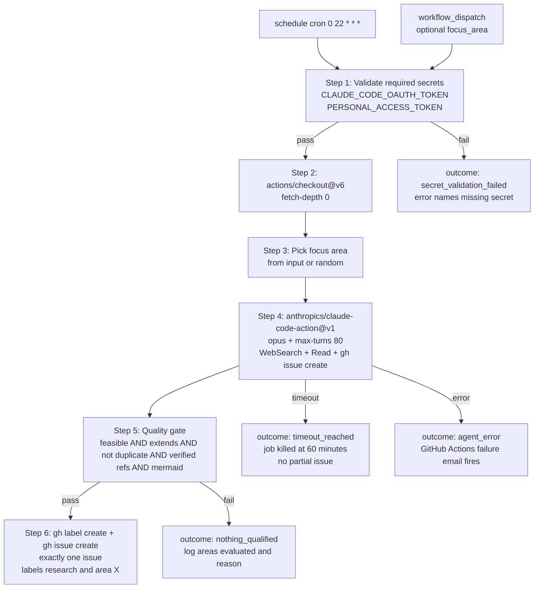

# Quickstart: Scheduled Research Workflow

**Feature**: Scheduled Research Workflow
**Branch**: `20260410-164348-scheduled-research-workflow`
**Audience**: The maintainer (or any future maintainer) of `chrisleekr/github-app-playground`.

This document is **the operational manual** for the workflow. It covers: (1) what to do before merging the PR, (2) how to provision the credentials the workflow needs, (3) how to verify the workflow works, (4) what to do when something goes wrong, and (5) the day-2 maintenance contract.

---

## Run lifecycle (visual)



The diagram is in this quickstart (rather than in `data-model.md` or `plan.md`) because it is the artefact a future maintainer reaches for first when something is broken — having it next to the operational steps is more useful than burying it in the design docs.

---

## Pre-merge checklist

You **must** complete every step below before merging the PR. The workflow runs against the default branch as soon as it lands, so a broken merge means the next scheduled run (within ≤24 hours) will fire on `main` with no opportunity to fix it locally.

### 1. Provision the two required secrets

Both secrets are provisioned at the **repository level**, not the organisation or environment level.

#### `CLAUDE_CODE_OAUTH_TOKEN`

```sh
# In the Claude Code CLI on your local machine:
claude setup-token
# Copy the printed token, then:
gh secret set CLAUDE_CODE_OAUTH_TOKEN --repo chrisleekr/github-app-playground
# Paste the token at the prompt.
```

#### `PERSONAL_ACCESS_TOKEN`

1. Open https://github.com/settings/personal-access-tokens/new
2. Token name: `github-app-playground research workflow`
3. Expiration: pick a value you're comfortable rotating (90 days is a sensible default).
4. Repository access: **Only select repositories** → `chrisleekr/github-app-playground` only.
5. Permissions:
   - `Contents: Read`
   - `Issues: Read and write`
   - `Metadata: Read` (auto-selected)
6. Click "Generate token", copy the printed value.
7. Provision it as the secret:
   ```sh
   gh secret set PERSONAL_ACCESS_TOKEN --repo chrisleekr/github-app-playground
   ```
   Paste the token at the prompt.

**Verification**:

```sh
gh secret list --repo chrisleekr/github-app-playground
```

You should see both `CLAUDE_CODE_OAUTH_TOKEN` and `PERSONAL_ACCESS_TOKEN` in the output, with recent `Updated` timestamps.

### 2. Verify your GitHub account will receive failure emails

Per FR-019, technical failures surface only via GitHub's built-in workflow-failure email. Make sure you'll actually receive them:

1. Open https://github.com/settings/notifications
2. Under "Actions", confirm "Email" is checked for "Failed workflows only" (or "Send notifications for failed workflows only" — exact wording may vary by date).
3. The email goes to the user listed as the workflow file's most recent committer. Confirm that's you (`git log -1 .github/workflows/research.yml` after the file is committed).

### 3. Run `actionlint` on the workflow file

`actionlint` is the static-validation mitigation for the test-coverage gap recorded in `plan.md`'s Complexity Tracking section. It catches malformed YAML, unknown action versions, undefined env var references, and shellcheck issues in `run:` blocks.

```sh
# Install once if you don't have it:
brew install actionlint  # macOS
# or: go install github.com/rhysd/actionlint/cmd/actionlint@latest

# Then validate:
actionlint .github/workflows/research.yml
```

Expected: zero output (any output is a warning/error to fix before merge).

### 4. Run the manual smoke test

This is the **mandatory** end-to-end check. Per the spec's User Story 1 acceptance scenario and the mitigation in `plan.md`'s Complexity Tracking row.

#### Step 4a — push the branch

```sh
git push -u origin 20260410-164348-scheduled-research-workflow
```

#### Step 4b — manually trigger the workflow against the branch

The trigger MUST run against the feature branch, not against `main`, so a malfunction does not pollute the default branch's issue list.

```sh
gh workflow run research.yml \
  --ref 20260410-164348-scheduled-research-workflow \
  --field focus_area=docs
```

`focus_area=docs` is chosen deliberately: documentation findings are the lowest-blast-radius outcome, so any misfire is easy to triage and close.

#### Step 4c — watch the run

```sh
gh run watch --exit-status
```

The run is expected to take 5–30 minutes typically. The hard ceiling is 60 minutes (FR-005).

#### Step 4d — verify the outcome

**Successful outcome A** — exactly one new issue exists:

```sh
gh issue list --label research --label "area: docs" --state open --json number,title,labels,createdAt
```

You should see exactly one issue, with both labels, created within the last hour. Open it in the browser and verify it conforms to `contracts/issue-body.md`:

- ✅ `## Finding` section non-empty
- ✅ `## Diagram` section contains a fenced ` ```mermaid ` block that renders correctly
- ✅ `## Rationale` section non-empty
- ✅ `## References` section has both `**Internal**:` and `**External**:` sub-bullets with ≥1 entry each
- ✅ `## Suggested Next Steps` numbered list with ≥1 item
- ✅ `## Areas Evaluated` mentions `docs`
- ✅ Footer line `*Generated by scheduled research workflow run #<runId> on <YYYY-MM-DD>*`

**Successful outcome B** — no issue, but the run completed cleanly:

```sh
gh run view <run-id> --log | grep -A20 "No Finding"
```

You should see a "No Finding" block in the agent's log explaining what was evaluated and why nothing qualified. This is also a valid outcome (per FR-014).

**Either outcome A or B is a passing smoke test.**

#### Step 4e — verify zero side effects

```sh
# Zero new commits on the default branch since the run started:
git fetch origin main
git log origin/main..origin/main --oneline   # should print nothing

# Zero new branches created by the run:
gh api repos/chrisleekr/github-app-playground/branches --jq '.[].name' | sort

# Zero new PRs created by the run:
gh pr list --state all --search "created:>$(date -u -v-1H +%Y-%m-%dT%H:%M:%SZ)" --json number,title,createdAt
```

All three commands should report no new artefacts attributable to the workflow run. (If outcome was A, the only new artefact in the entire repo should be the single new issue from step 4d.)

#### Step 4f — only after 4a–4e all pass, merge the PR

If any step fails, **do not merge**. See `Troubleshooting` below.

---

## Day-2 operations

### Manually triggering an ad-hoc run after merge

```sh
# Random focus area:
gh workflow run research.yml --ref main

# Specific focus area:
gh workflow run research.yml --ref main --field focus_area=security
```

The `--ref main` flag means "use the workflow file as it exists on `main`". You can also trigger from the GitHub Actions UI: Actions → "Scheduled Research" → Run workflow.

### Checking the most recent runs

```sh
gh run list --workflow research.yml --limit 10
```

### Inspecting per-run LLM cost (token spend + duration)

The workflow does **not** synthesise a `cost_tokens=...` line of its own — see `research.md` §19 for the rationale. Instead, `anthropics/claude-code-action` writes its own per-turn cost lines to stdout, which GitHub Actions captures into the run log automatically. To inspect cost for a specific run:

```sh
# Replace <run-id> with the GitHub Actions run ID:
gh run view <run-id> --log | grep -iE 'cost|tokens|duration|usage'
```

This is the recommended way to satisfy Constitution Principle VI's "AI agent execution cost MUST be logged after every request" requirement for this workflow. The cost data is in every run's log; the grep above is the retrieval interface.

### Viewing the issues the workflow has filed

```sh
gh issue list --label research --state all --limit 50
```

Filter by area:

```sh
gh issue list --label research --label "area: security" --state all
```

### Closing a finding as "won't do" / "not actionable"

Just close the issue normally with `gh issue close <number>` or via the UI. The workflow's duplicate-detection step (FR-010) checks **closed** issues as well as open ones, so closing a finding will prevent the same finding being re-filed in a later run.

### Adjusting the cron hour

Edit the `cron:` line in `.github/workflows/research.yml` and commit. The new schedule takes effect on the next scheduled tick after the commit lands on the default branch.

### Rotating `PERSONAL_ACCESS_TOKEN`

Re-run `gh secret set PERSONAL_ACCESS_TOKEN --repo chrisleekr/github-app-playground` with the new token. No workflow file change needed.

### Rotating `CLAUDE_CODE_OAUTH_TOKEN`

Same — re-run `gh secret set CLAUDE_CODE_OAUTH_TOKEN --repo chrisleekr/github-app-playground` with the new token.

---

## Troubleshooting

| Symptom                                                                                                                    | Likely cause                                                                                  | Fix                                                                                                                                                                                                                                                                       |
| -------------------------------------------------------------------------------------------------------------------------- | --------------------------------------------------------------------------------------------- | ------------------------------------------------------------------------------------------------------------------------------------------------------------------------------------------------------------------------------------------------------------------------- |
| Run fails immediately at "Validate required secrets" with `::error::Missing required secrets: CLAUDE_CODE_OAUTH_TOKEN ...` | One or both secrets are missing or named differently                                          | Re-run `gh secret set` for the named secret (Pre-merge §1). Verify with `gh secret list`.                                                                                                                                                                                 |
| Run fails inside `claude-code-action` with an OIDC-related error                                                           | Missing `id-token: write` permission                                                          | Verify the workflow file has `permissions: id-token: write` (research.md §11).                                                                                                                                                                                            |
| Run fails with "checkHumanActor" or "actor is not a human user" error                                                      | `allowed_bots` input is not set on the action step                                            | Verify the action step has `allowed_bots: '*'` (research.md §7).                                                                                                                                                                                                          |
| Run completes but no issue is created and no "No Finding" block is in the log                                              | Agent ran out of turns before reaching the issue-creation step                                | Check the agent's log for the last few turns; if it was mid-research, increase `--max-turns` cautiously. If it was looping unproductively, the prompt template needs refinement.                                                                                          |
| Run creates an issue but the issue has a malformed body (missing sections, broken Mermaid)                                 | The agent's quality gate is not enforcing all sections                                        | This is a prompt-template bug. Update the prompt's "Issue Body Template" section in `research.yml` to be more explicit, then re-run the smoke test.                                                                                                                       |
| Two issues are created in a single run                                                                                     | Catastrophic violation of FR-015 — should be impossible given the prompt                      | Investigate immediately. Likely cause: the agent retried `gh issue create` after a transient failure. Add a stronger "exactly ONE issue" guard to the prompt and consider a step-level wrapper around `gh issue create` that exits non-zero on the second invocation.     |
| Workflow runs concurrently (two runs in flight)                                                                            | Concurrency block missing or misconfigured                                                    | Verify `concurrency: { group: research-workflow, cancel-in-progress: false }` is at the workflow level (not job level).                                                                                                                                                   |
| The agent tries to commit code, push a branch, or open a PR                                                                | Tool allow-list is too permissive                                                             | Compare the workflow's `--allowedTools` against `research.md` §6. Remove any disallowed tools immediately.                                                                                                                                                                |
| Run is silently delayed by hours                                                                                           | GitHub Actions cron drift (a known platform behaviour during high-load windows)               | Per the spec's edge case "Schedule drift / missed runs": the next successful run behaves identically. No catch-up is required. If drift persists, consider moving the cron hour outside the platform's peak window (research.md §8 recommends 22:00 UTC for this reason). |
| `nothing_qualified` outcomes for several consecutive days in the same area                                                 | Either the area is genuinely well-optimised, or the duplicate-detection step is over-matching | Open one of the closed `area: <area>` research issues from a prior run and check whether the new candidate findings would have been distinct. If they would have been, the prompt's duplicate-detection step needs to be tightened.                                       |
| Failure email never arrives                                                                                                | GitHub Actions notification not enabled at the user level                                     | Re-check Pre-merge §2. Confirm the workflow file's last-committer is the user whose notifications are configured.                                                                                                                                                         |

---

## Disabling the workflow temporarily

If you need to pause the workflow without deleting it (e.g., to avoid LLM cost during a long absence):

```sh
gh workflow disable research.yml
```

Re-enable with:

```sh
gh workflow enable research.yml
```

This is safer than commenting out the `cron:` line because (a) it's reversible with one command, (b) it leaves the workflow file diff-clean, (c) it disables `workflow_dispatch` too, so you can't accidentally trigger a run while paused.

---

## Removing the workflow

If you decide to retire the feature:

1. `gh workflow disable research.yml` — pause it first to prevent any in-flight runs being killed mid-issue-creation.
2. Wait for any in-flight run to finish (`gh run list --workflow research.yml --limit 1` should show no in-progress runs).
3. Delete `.github/workflows/research.yml`.
4. Optionally delete the labels (`gh label delete research --yes` and the ten `area: *` labels). **Only do this** if you're sure you don't want to preserve the historical filter on prior research issues.
5. Optionally rotate or delete the two secrets (`gh secret delete CLAUDE_CODE_OAUTH_TOKEN`, `gh secret delete PERSONAL_ACCESS_TOKEN`) if they're not used by anything else.
6. Commit the deletion with a `chore(ci): remove scheduled research workflow` message.

---

## Spec-to-acceptance trace

For audit purposes, the following maps each spec requirement to the verification step in this quickstart:

| Spec FR / SC                                      | Verified by                                                                                                |
| ------------------------------------------------- | ---------------------------------------------------------------------------------------------------------- |
| FR-001 (recurring schedule)                       | Cron line in workflow + verified empirically by waiting one full day after merge                           |
| FR-002 (manual trigger)                           | Pre-merge §4b                                                                                              |
| FR-003 (optional focus_area, fallback to random)  | Pre-merge §4b (with input) + post-merge "Random focus area" command                                        |
| FR-004 (concurrency control)                      | Concurrency block in workflow (not directly testable in smoke test; verified by inspecting workflow file)  |
| FR-005 (1-hour wall-clock)                        | `timeout-minutes: 60` in workflow + Pre-merge §4c (smoke test must complete or fail by the 60-minute mark) |
| FR-006 (validate secrets, fail fast)              | Pre-merge §1 + Troubleshooting "missing secrets" row                                                       |
| FR-007 (no commits/branches/PRs)                  | Pre-merge §4e                                                                                              |
| FR-008 (constrained tool surface)                 | Tool allow-list in workflow (research.md §6)                                                               |
| FR-009 (single focus area per run)                | Pre-merge §4d (smoke test issue carries exactly one area label)                                            |
| FR-010 (duplicate detection)                      | Verified empirically across multiple runs (SC-006 measures it)                                             |
| FR-011 (issue body completeness)                  | Pre-merge §4d body checklist                                                                               |
| FR-012 (verified internal references)             | Pre-merge §4d body checklist + manual spot-check that cited paths exist                                    |
| FR-013 (feasibility + extends existing)           | Manual triage during day-2 operations                                                                      |
| FR-014 (no issue when nothing qualifies)          | Pre-merge §4d outcome B                                                                                    |
| FR-015 (at most 1 issue per run)                  | Pre-merge §4d (`gh issue list` returns exactly one)                                                        |
| FR-016 (correct labelling)                        | Pre-merge §4d body checklist                                                                               |
| FR-017 (label creation idempotency)               | `gh label create --force` calls in workflow                                                                |
| FR-018 (structured run log)                       | `gh run view <run-id> --log`                                                                               |
| FR-019 (failure visibility via platform defaults) | Pre-merge §2 + Troubleshooting "failure email never arrives" row                                           |
