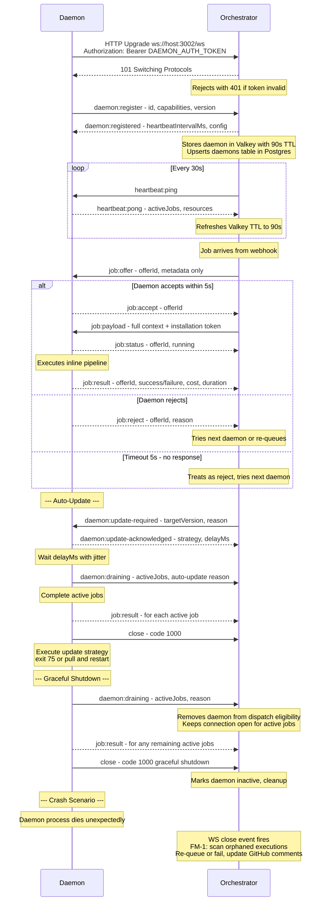

# WebSocket Protocol Contract: Daemon ↔ Orchestrator

**Version**: 1.0.0
**Date**: 2026-04-13
**Transport**: WebSocket (RFC 6455) over TCP
**Encoding**: JSON (UTF-8)
**Validation**: Zod discriminated union at message boundary

---

## Connection Lifecycle



---

## Message Envelope

All messages follow this shape:

```typescript
interface MessageEnvelope {
  type: string;    // Discriminant field for union narrowing
  id: string;      // Correlation ID (UUID v4) for request/response pairing
  timestamp: number; // Unix epoch milliseconds
  payload: unknown;  // Type-specific payload
}
```

---

## Server → Daemon Messages

### `daemon:registered`

Sent after successful registration. Confirms the daemon is active and provides configuration.

```typescript
{
  type: "daemon:registered";
  id: string;
  timestamp: number;
  payload: {
    heartbeatIntervalMs: number; // 30000
    offerTimeoutMs: number;      // 5000
    maxRetries: number;          // 3
  };
}
```

### `daemon:update-required`

Sent when the orchestrator detects a version mismatch. The daemon should drain active jobs and update/restart according to its configured update strategy.

```typescript
{
  type: "daemon:update-required";
  id: string;
  timestamp: number;
  payload: {
    targetVersion: string;  // App version the daemon should update to
    reason: string;          // e.g., "version mismatch", "security patch"
    urgent: boolean;         // true = drain immediately; false = update at next idle window
  };
}
```

### `heartbeat:ping`

Sent by orchestrator at `heartbeatIntervalMs` intervals. Daemon must respond with `heartbeat:pong`.

```typescript
{
  type: "heartbeat:ping";
  id: string;
  timestamp: number;
  payload: Record<string, never>; // empty
}
```

### `job:offer`

Lightweight job offer. Contains metadata + inferred tool requirements so the daemon can make an informed accept/reject decision without needing the full context.

```typescript
{
  type: "job:offer";
  id: string; // This is the offerId — used for accept/reject correlation
  timestamp: number;
  payload: {
    deliveryId: string;
    repoOwner: string;
    repoName: string;
    entityNumber: number;
    isPR: boolean;
    eventName: string;
    triggerUsername: string;
    labels: string[];
    triggerBodyPreview: string; // First 200 chars of trigger comment
    /** Tools the orchestrator infers this job requires.
     *  Always includes ["git", "bun", "node"] as baseline.
     *  Additional tools inferred from labels (bot:docker) and trigger body keywords.
     *  Daemon SHOULD reject if it lacks any of these as functional tools. */
    requiredTools: string[];
  };
}
```

### `job:payload`

Full job context sent after daemon accepts the offer. Contains everything needed for execution.

```typescript
{
  type: "job:payload";
  id: string; // Same offerId from job:offer
  timestamp: number;
  payload: {
    context: SerializableBotContext; // Full serializable context
    installationToken: string;       // Short-lived GitHub installation token (1h TTL)
    maxTurns: number;                // Agent turn limit
    allowedTools: string[];          // Tool allowlist for this execution
  };
}
```

### `job:cancel`

Sent by orchestrator to cancel a job that is currently assigned to this daemon. The daemon should abort execution, clean up resources, and respond with `job:result` (success: false).

```typescript
{
  type: "job:cancel";
  id: string; // Same offerId from job:offer
  timestamp: number;
  payload: {
    reason: string; // e.g., "execution reassigned", "operator cancelled"
  };
}
```

### `error`

Sent when the server encounters an error processing a daemon message.

```typescript
{
  type: "error";
  id: string; // Correlation ID of the message that caused the error
  timestamp: number;
  payload: {
    code: string;   // Machine-readable error code
    message: string; // Human-readable description
  };
}
```

**Error codes**:
- `INVALID_MESSAGE` — Message failed Zod validation
- `UNKNOWN_OFFER` — Accept/reject for a non-existent or expired offer
- `DUPLICATE_REGISTRATION` — Daemon ID already registered by another connection
- `EXECUTION_ALREADY_FINALIZED` — Result received for an execution that is already completed or failed (FM-6 late result)
- `MESSAGE_TOO_LARGE` — Message exceeds 1 MB `maxPayloadLength` limit
- `INTERNAL_ERROR` — Unexpected server error

---

## Daemon → Server Messages

### `daemon:register`

First message after WebSocket connection established. Advertises daemon identity and capabilities.

```typescript
{
  type: "daemon:register";
  id: string;
  timestamp: number;
  payload: {
    daemonId: string;       // Unique daemon identifier
    hostname: string;
    platform: "linux" | "darwin" | "win32";
    osVersion: string;
    protocolVersion: string; // WebSocket protocol semver (e.g., "1.0.0") — major mismatch = reject
    appVersion: string;      // Application version from package.json — mismatch = trigger update
    capabilities: DaemonCapabilities;
  };
}
```

### `heartbeat:pong`

Response to `heartbeat:ping`. Carries real-time resource status.

```typescript
{
  type: "heartbeat:pong";
  id: string; // Same id as the ping
  timestamp: number;
  payload: {
    activeJobs: number;
    resources: {
      cpuCount: number;
      memoryTotalMb: number;
      memoryFreeMb: number;
      diskFreeMb: number;
    };
  };
}
```

### `job:accept`

Daemon accepts a job offer. Orchestrator will send `job:payload` next.

```typescript
{
  type: "job:accept";
  id: string; // Same offerId from job:offer
  timestamp: number;
  payload: Record<string, never>; // empty
}
```

### `job:reject`

Daemon rejects a job offer with a reason.

```typescript
{
  type: "job:reject";
  id: string; // Same offerId from job:offer
  timestamp: number;
  payload: {
    reason: string; // e.g., "at capacity", "missing tool: docker", "insufficient memory"
  };
}
```

### `job:status`

Progress update during execution.

```typescript
{
  type: "job:status";
  id: string; // Same offerId
  timestamp: number;
  payload: {
    status: "running" | "cloning" | "executing";
    message?: string; // Optional progress detail
  };
}
```

### `job:result`

Final result after execution completes (success or failure).

```typescript
{
  type: "job:result";
  id: string; // Same offerId
  timestamp: number;
  payload: {
    success: boolean;
    costUsd?: number;
    durationMs?: number;
    numTurns?: number;
    errorMessage?: string; // Present on failure
  };
}
```

### `daemon:update-acknowledged`

Sent after receiving `daemon:update-required`. Confirms the daemon will update according to its strategy. The daemon then initiates graceful drain (sends `daemon:draining` next).

```typescript
{
  type: "daemon:update-acknowledged";
  id: string; // Same id as the daemon:update-required message
  timestamp: number;
  payload: {
    strategy: "exit" | "pull" | "notify"; // What the daemon will do
    delayMs: number; // How long before the daemon starts draining (includes jitter)
  };
}
```

### `daemon:draining`

Sent when the daemon is shutting down gracefully (SIGTERM/SIGINT received, or update-required). Signals that the daemon will NOT accept new job offers but is still completing active jobs. The orchestrator removes the daemon from dispatch eligibility but keeps the WebSocket connection open until the daemon sends a close frame.

```typescript
{
  type: "daemon:draining";
  id: string;
  timestamp: number;
  payload: {
    activeJobs: number;  // How many jobs are still in-flight
    reason: string;       // e.g., "SIGTERM received", "manual shutdown", "auto-update to v1.2.0"
  };
}
```

---

## Zod Schemas

All message schemas are defined in `src/shared/ws-messages.ts` and used by both server and daemon for validation at the WebSocket boundary.

### Server message schema (validated by daemon)

```typescript
const serverMessageSchema = z.discriminatedUnion("type", [
  z.object({
    type: z.literal("daemon:registered"),
    id: z.string().uuid(),
    timestamp: z.number(),
    payload: z.object({
      heartbeatIntervalMs: z.number().int().positive(),
      offerTimeoutMs: z.number().int().positive(),
      maxRetries: z.number().int().nonnegative(),
    }),
  }),
  z.object({
    type: z.literal("heartbeat:ping"),
    id: z.string().uuid(),
    timestamp: z.number(),
    payload: z.object({}),
  }),
  z.object({
    type: z.literal("job:offer"),
    id: z.string().uuid(),
    timestamp: z.number(),
    payload: z.object({
      deliveryId: z.string(),
      repoOwner: z.string(),
      repoName: z.string(),
      entityNumber: z.number().int(),
      isPR: z.boolean(),
      eventName: z.string(),
      triggerUsername: z.string(),
      labels: z.array(z.string()),
      triggerBodyPreview: z.string(),
      requiredTools: z.array(z.string()),
    }),
  }),
  z.object({
    type: z.literal("job:payload"),
    id: z.string().uuid(),
    timestamp: z.number(),
    payload: z.object({
      context: z.record(z.unknown()), // SerializableBotContext — validated separately
      installationToken: z.string(),
      maxTurns: z.number().int().positive(),
      allowedTools: z.array(z.string()),
    }),
  }),
  z.object({
    type: z.literal("job:cancel"),
    id: z.string().uuid(),
    timestamp: z.number(),
    payload: z.object({
      reason: z.string(),
    }),
  }),
  z.object({
    type: z.literal("daemon:update-required"),
    id: z.string().uuid(),
    timestamp: z.number(),
    payload: z.object({
      targetVersion: z.string(),
      reason: z.string(),
      urgent: z.boolean(),
    }),
  }),
  z.object({
    type: z.literal("error"),
    id: z.string().uuid(),
    timestamp: z.number(),
    payload: z.object({
      code: z.string(),
      message: z.string(),
    }),
  }),
]);
```

### Daemon message schema (validated by server)

```typescript
const daemonMessageSchema = z.discriminatedUnion("type", [
  z.object({
    type: z.literal("daemon:register"),
    id: z.string().uuid(),
    timestamp: z.number(),
    payload: z.object({
      daemonId: z.string().min(1),
      hostname: z.string(),
      platform: z.enum(["linux", "darwin", "win32"]),
      osVersion: z.string(),
      protocolVersion: z.string(),
      appVersion: z.string(),
      capabilities: daemonCapabilitiesSchema,
    }),
  }),
  z.object({
    type: z.literal("heartbeat:pong"),
    id: z.string().uuid(),
    timestamp: z.number(),
    payload: z.object({
      activeJobs: z.number().int().nonnegative(),
      resources: z.object({
        cpuCount: z.number().positive(),
        memoryTotalMb: z.number().positive(),
        memoryFreeMb: z.number().nonnegative(),
        diskFreeMb: z.number().nonnegative(),
      }),
    }),
  }),
  z.object({
    type: z.literal("job:accept"),
    id: z.string().uuid(),
    timestamp: z.number(),
    payload: z.object({}),
  }),
  z.object({
    type: z.literal("job:reject"),
    id: z.string().uuid(),
    timestamp: z.number(),
    payload: z.object({
      reason: z.string(),
    }),
  }),
  z.object({
    type: z.literal("job:status"),
    id: z.string().uuid(),
    timestamp: z.number(),
    payload: z.object({
      status: z.enum(["running", "cloning", "executing"]),
      message: z.string().optional(),
    }),
  }),
  z.object({
    type: z.literal("job:result"),
    id: z.string().uuid(),
    timestamp: z.number(),
    payload: z.object({
      success: z.boolean(),
      costUsd: z.number().nonnegative().optional(),
      durationMs: z.number().int().nonnegative().optional(),
      numTurns: z.number().int().nonnegative().optional(),
      errorMessage: z.string().optional(),
    }),
  }),
  z.object({
    type: z.literal("daemon:update-acknowledged"),
    id: z.string().uuid(),
    timestamp: z.number(),
    payload: z.object({
      strategy: z.enum(["exit", "pull", "notify"]),
      delayMs: z.number().int().nonnegative(),
    }),
  }),
  z.object({
    type: z.literal("daemon:draining"),
    id: z.string().uuid(),
    timestamp: z.number(),
    payload: z.object({
      activeJobs: z.number().int().nonnegative(),
      reason: z.string(),
    }),
  }),
]);
```

---

## Error Handling

1. **Invalid JSON**: Server sends `error` message with code `INVALID_MESSAGE`, then closes connection with code 1008 (Policy Violation).
2. **Schema validation failure**: Server sends `error` message with code `INVALID_MESSAGE` and Zod error details, connection stays open.
3. **Offer timeout**: Server silently transitions offer to rejected state. No message sent to daemon (it may be unresponsive). Job re-queued.
4. **Unexpected disconnection** (FM-1): Server marks daemon as `inactive`, scans for orphaned executions (status `offered` or `running` for this daemon), re-queues if retries remain or marks as `failed` with error `"daemon disconnected during execution"`. Updates GitHub tracking comment for failed executions.
5. **Daemon reconnection with same ID** (FM-8): Server closes the OLD WebSocket connection with code `4002` ("superseded"), cleans up orphaned executions from previous session, then registers the new connection. NOT treated as an error — the new connection takes precedence.
6. **Heartbeat timeout** (FM-2): Server closes connection with code `4001` ("heartbeat timeout"). Triggers the same cleanup path as #4.
7. **Late result for finalized execution** (FM-6): Server sends `error` with code `EXECUTION_ALREADY_FINALIZED`. Result is logged but discarded.
8. **Graceful shutdown** (FM-5): Daemon sends `daemon:draining`, server removes daemon from dispatch eligibility but keeps connection open. After daemon completes active jobs (or drain timeout expires), daemon sends close frame (code 1000). Server runs cleanup only for force-killed jobs (if any).

## Custom WebSocket Close Codes

| Code | Reason | Meaning |
|---|---|---|
| 1000 | `"graceful shutdown"` | Daemon shut down cleanly after draining |
| 1008 | `"policy violation"` | Invalid JSON — protocol error |
| 4001 | `"heartbeat timeout"` | Daemon did not respond to heartbeat within 90s |
| 4002 | `"superseded by new connection"` | Another connection registered with the same daemon ID |
| 4003 | `"incompatible protocol version"` | Daemon's protocol major version doesn't match orchestrator's |

---

## Wire Format Notes

- All messages are UTF-8 JSON strings sent via `ws.sendText()`.
- Binary frames are not used.
- Maximum message size: 1 MB (enforced via `maxPayloadLength` in Bun WebSocket config). Job payloads with large context are truncated before serialization.
- Messages exceeding 1 MB are rejected with `error` code `MESSAGE_TOO_LARGE`.
