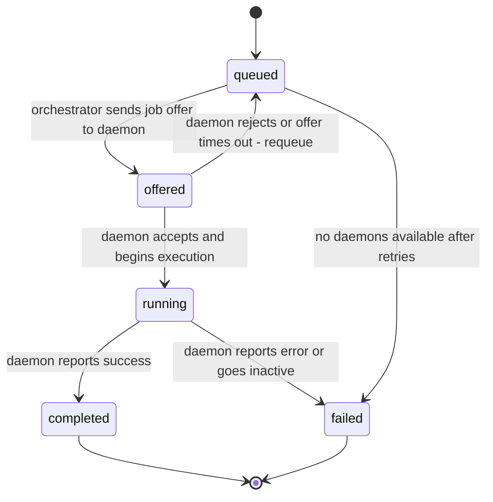
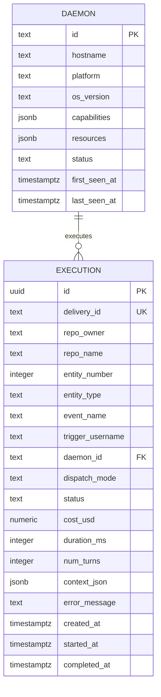

# Data Model: Daemon and Orchestrator Core (Phase 2)

**Branch**: `20260413-191249-daemon-orchestrator-core`
**Date**: 2026-04-13

## Overview

Phase 2 data lives in three stores: **Postgres** (durable records), **Valkey** (ephemeral state + job queue), and **in-memory** (per-connection state in the orchestrator process). The existing `001_initial.sql` migration provides the Postgres schema foundation. No new migrations are needed for Phase 2 — the existing `executions` and `daemons` tables cover all requirements.

---

## Entity: Daemon

A persistent worker process that connects to the orchestrator, advertises capabilities, and executes assigned jobs.

### Postgres (`daemons` table — existing from `001_initial.sql`)

| Column | Type | Constraints | Description |
|---|---|---|---|
| `id` | `TEXT` | `PRIMARY KEY` | Unique daemon identifier (e.g., `daemon-{hostname}-{pid}`) |
| `hostname` | `TEXT` | `NOT NULL` | Machine hostname |
| `platform` | `TEXT` | `NOT NULL` | OS platform (`linux`, `darwin`, `win32`) |
| `os_version` | `TEXT` | `NOT NULL` | OS version string |
| `capabilities` | `JSONB` | `NOT NULL` | Full capability profile (see DaemonCapabilities schema) |
| `resources` | `JSONB` | `NOT NULL` | Current resource snapshot (CPU, memory, disk) |
| `status` | `TEXT` | `NOT NULL DEFAULT 'active'` | Current status: `active`, `inactive` |
| `first_seen_at` | `TIMESTAMPTZ` | `NOT NULL DEFAULT now()` | First registration timestamp |
| `last_seen_at` | `TIMESTAMPTZ` | `NOT NULL DEFAULT now()` | Last heartbeat timestamp |

**Indexes**: `idx_daemons_status ON daemons (status)`

**Column mapping note**: The `DaemonCapabilities` TypeScript type nests `resources: DaemonResources` inside capabilities. On Postgres upsert, `daemon-registry.ts` MUST extract `capabilities.resources` into the `resources` column and store the remainder in the `capabilities` column.

### Valkey (ephemeral liveness)

| Key Pattern | Type | TTL | Description |
|---|---|---|---|
| `daemon:{id}` | `STRING` | 90s | Serialized daemon capabilities JSON. Presence = daemon is alive. Auto-expires on missed heartbeats. |
| `daemon:{id}:active_jobs` | `STRING` | None | Current active job count for this daemon. DEL'd on deregistration. |

### In-Memory (orchestrator process)

| Field | Type | Description |
|---|---|---|
| `connections: Map<string, ServerWebSocket>` | Map | Active WebSocket connections keyed by daemon ID. Used for sending messages to specific daemons. |
| `pendingOffers: Map<string, PendingOffer>` | Map | Outstanding job offers awaiting accept/reject. Keyed by offer ID. 5s timeout per offer. |
| `heartbeatTimers: Map<string, HeartbeatState>` | Map | Per-daemon heartbeat interval + pong timeout timers. Cleared on disconnect. |
| `drainingDaemons: Set<string>` | Set | Daemon IDs that sent `daemon:draining`. Excluded from dispatch but connection stays open. |

---

## Entity: Execution

A record of a single request being processed — from queuing through dispatch, execution, and completion.

### Postgres (`executions` table — existing from `001_initial.sql`)

| Column | Type | Constraints | Description |
|---|---|---|---|
| `id` | `UUID` | `PRIMARY KEY DEFAULT gen_random_uuid()` | Unique execution ID |
| `delivery_id` | `TEXT` | `UNIQUE NOT NULL` | GitHub webhook delivery ID (idempotency key) |
| `repo_owner` | `TEXT` | `NOT NULL` | Repository owner |
| `repo_name` | `TEXT` | `NOT NULL` | Repository name |
| `entity_number` | `INTEGER` | `NOT NULL` | PR or issue number |
| `entity_type` | `TEXT` | `NOT NULL` | `pull_request` or `issue` |
| `event_name` | `TEXT` | `NOT NULL` | Webhook event name |
| `trigger_username` | `TEXT` | `NOT NULL` | Who triggered the bot |
| `triage_model` | `TEXT` | Nullable | Model used for triage classification (Phase 3) |
| `triage_result` | `JSONB` | Nullable | Full triage result (Phase 3) |
| `execution_model` | `TEXT` | Nullable | Model used for agent execution |
| `daemon_id` | `TEXT` | Nullable | ID of daemon that executed the job (null for inline) |
| `dispatch_mode` | `TEXT` | `NOT NULL` | `inline`, `shared-runner`, or `ephemeral-job`. Note: `auto` is a config selector (FR-003), not a recorded value — it resolves to `shared-runner` when dispatching to a daemon or `inline` when falling back. **Phase 2**: only `inline` and `shared-runner` are used at runtime; `ephemeral-job` is reserved for Phase 3+ K8s dispatch. |
| `status` | `TEXT` | `NOT NULL DEFAULT 'queued'` | `queued` → `offered` → `running` → `completed` / `failed` |
| `cost_usd` | `NUMERIC(10,6)` | Nullable | Total API cost |
| `duration_ms` | `INTEGER` | Nullable | Total execution duration |
| `num_turns` | `INTEGER` | Nullable | Agent turns used |
| `context_json` | `JSONB` | Nullable | Serialized BotContext for replay/debugging |
| `error_message` | `TEXT` | Nullable | Error details on failure |
| `created_at` | `TIMESTAMPTZ` | `NOT NULL DEFAULT now()` | When the execution was created |
| `started_at` | `TIMESTAMPTZ` | Nullable | When execution started running |
| `completed_at` | `TIMESTAMPTZ` | Nullable | When execution completed or failed |

**Indexes**: `idx_executions_status`, `idx_executions_created_at`

**Status transitions**:



---

## Entity: Job Queue Item

Ephemeral representation of a job waiting to be dispatched to a daemon.

### Valkey (job queue)

| Key Pattern | Type | Description |
|---|---|---|
| `queue:jobs` | `LIST` | FIFO queue of job payloads (LPUSH to enqueue, BRPOP to dequeue). Each item is a JSON string containing `deliveryId` and dispatch metadata. |
| `job:{deliveryId}:offer` | `STRING (TTL 10s)` | Tracks an active offer. Prevents duplicate offers for the same job. TTL is intentionally 2× `OFFER_TIMEOUT_MS` (default 5s) as a safety net — the in-memory timer handles normal expiry; the Valkey TTL catches leaked keys if the orchestrator crashes mid-offer. |

**Queue item schema**:
```typescript
interface QueuedJob {
  deliveryId: string;
  repoOwner: string;
  repoName: string;
  entityNumber: number;
  isPR: boolean;
  eventName: string;
  enqueuedAt: number; // Unix timestamp ms
  retryCount: number; // Number of times this job has been re-queued after rejection (max 3, then fail)
}
```

**Dispatcher data flow**: `QueuedJob` is intentionally minimal — it contains only the fields needed for queue routing. When the dispatcher dequeues a job, it reads the full execution record from Postgres (`context_json` column) to construct the `job:offer` payload with additional fields (`triggerUsername`, `labels`, `triggerBodyPreview`, `requiredTools`).

---

## TypeScript Type Definitions

### DaemonCapabilities (`src/shared/daemon-types.ts`)

```typescript
/** A CLI tool discovered on the daemon's local environment. */
export interface DiscoveredTool {
  /** Canonical name: "git", "bun", "docker", etc. */
  name: string;
  /** Absolute path on disk: "/usr/bin/git" */
  path: string;
  /** Parsed version string: "2.45.0" */
  version: string;
  /** true = binary exists AND responds to version check (exits 0).
   *  false = binary exists on PATH but fails to execute (permissions, missing lib, etc.)
   *  Orchestrator only considers functional tools for dispatch matching. */
  functional: boolean;
}

/** Container runtime status — more than just "binary exists". */
export interface ContainerRuntime {
  /** Runtime name */
  name: "docker" | "podman";
  /** Absolute path to binary */
  path: string;
  /** Runtime version */
  version: string;
  /** true = `docker info` exits 0, daemon is accessible.
   *  false = binary exists but daemon not running (common on dev machines). */
  daemonRunning: boolean;
  /** true = `docker compose version` exits 0 (v2 plugin). */
  composeAvailable: boolean;
}

export interface DaemonCapabilities {
  platform: "linux" | "darwin" | "win32";
  /** Available shells (bash, zsh, sh, fish) */
  shells: DiscoveredTool[];
  /** Package managers (bun, npm, yarn, pnpm) */
  packageManagers: DiscoveredTool[];
  /** CLI tools available on PATH — see R-007 for exhaustive list */
  cliTools: DiscoveredTool[];
  /** Container runtime with daemon status. null = no docker/podman on PATH. */
  containerRuntime: ContainerRuntime | null;
  /** Available API credentials, inferred from env vars.
   *  Values: "anthropic-api-key", "anthropic-oauth-token", "aws-sso", "aws-keys", etc. */
  authContexts: string[];
  resources: DaemonResources;
  network: NetworkInfo;
  /** Repos already cloned in CLONE_BASE_DIR — daemon with cached repo skips clone step. */
  cachedRepos: string[];
  /** True when daemon runs on ephemeral infrastructure (spot instance, preemptible VM).
   *  Auto-detected via cloud metadata or DAEMON_EPHEMERAL env var.
   *  Dispatcher uses this as a soft signal to prefer stable daemons for long jobs (FM-10). */
  ephemeral: boolean;
  /** Maximum expected remaining uptime in ms, if known. null = indefinite.
   *  For spot instances, set to platform deadline (e.g., 120_000 for AWS Spot 2-min warning).
   *  Dispatcher avoids assigning jobs with estimatedDuration > maxUptimeMs. */
  maxUptimeMs: number | null;
}

export interface DaemonResources {
  cpuCount: number;
  memoryTotalMb: number;
  memoryFreeMb: number;
  diskFreeMb: number;
}

export interface NetworkInfo {
  hostname: string;
  /** Round-trip latency to orchestrator in ms, measured during registration. */
  latencyMs?: number;
}
```

### DaemonInfo (orchestrator-side registry entry)

```typescript
export interface DaemonInfo {
  id: string;
  hostname: string;
  platform: string;
  osVersion: string;
  capabilities: DaemonCapabilities;
  /**
   * Daemon lifecycle status.
   * - "active" / "inactive": persisted to Postgres `daemons.status` column.
   * - "draining" / "updating": transient in-memory states tracked via
   *   `drainingDaemons: Set<string>` in the orchestrator process. These are
   *   NOT written to Postgres — on server restart they reset to "inactive"
   *   via the FM-4 stale execution recovery path.
   */
  status: "active" | "inactive" | "draining" | "updating";
  protocolVersion: string; // WebSocket protocol semver
  appVersion: string;      // Application version from package.json
  activeJobs: number;
  lastSeenAt: number; // Unix timestamp ms
  firstSeenAt: number;
}
```

### PendingOffer (in-memory, orchestrator)

```typescript
export interface PendingOffer {
  offerId: string;
  deliveryId: string;
  daemonId: string;
  timer: Timer;
  offeredAt: number; // Unix timestamp ms
  retryCount: number; // How many times this job has been re-offered after rejection
}
```

### HeartbeatState (in-memory, orchestrator)

```typescript
export interface HeartbeatState {
  intervalTimer: Timer;    // Fires every 30s to send heartbeat:ping
  pongTimer: Timer | null; // 90s timeout waiting for heartbeat:pong — null when not awaiting
  awaitingPong: boolean;   // True after ping sent, cleared on pong received
  missedPongs: number;     // Consecutive missed pongs (for logging)
}
```

### ActiveJob (in-memory, daemon)

```typescript
/** Tracked per active job on the daemon for resource cleanup (FM-9). */
export interface ActiveJob {
  offerId: string;
  deliveryId: string;
  workDir: string;         // Temp directory with cloned repo
  agentPid: number | null; // PID of Claude agent subprocess (null until started)
  startedAt: number;       // Unix timestamp ms
}
```

### SerializableBotContext (`src/shared/daemon-types.ts`)

```typescript
/**
 * BotContext fields that can be JSON-serialized for WebSocket transmission.
 * Excludes `octokit` (class instance) and `log` (pino logger with streams).
 * Daemon reconstructs these locally from the installation token and delivery ID.
 */
export type SerializableBotContext = Omit<BotContext, "octokit" | "log">;
```

---

## Relationships



---

## Validation Rules

1. `daemon.id` must be unique across all daemon instances. Format: `daemon-{hostname}-{pid}` ensures uniqueness even with multiple daemons on the same host.
2. `execution.delivery_id` must be unique (enforced by `UNIQUE` constraint). Prevents duplicate processing.
3. `execution.status` transitions must follow the state machine: `queued → offered → running → completed/failed`. Backward transitions are not allowed except `offered → queued` (rejection/timeout).
4. `execution.daemon_id` must reference an existing daemon when `dispatch_mode` is `"shared-runner"` or `"ephemeral-job"`. For `dispatch_mode = "inline"`, `daemon_id` is null.
5. `execution.cost_usd`, `duration_ms`, `num_turns` are populated only when status reaches `completed` or `failed`.
6. Queue item `retryCount` must not exceed a configurable maximum (default: 3). After max retries, the job is marked `failed` in the executions table.

## No New Migrations

The existing `001_initial.sql` schema is sufficient for Phase 2. The `executions.status` column accommodates the new `offered` state (TEXT type, not ENUM). The `daemons` table has all required columns. No schema changes are needed.
