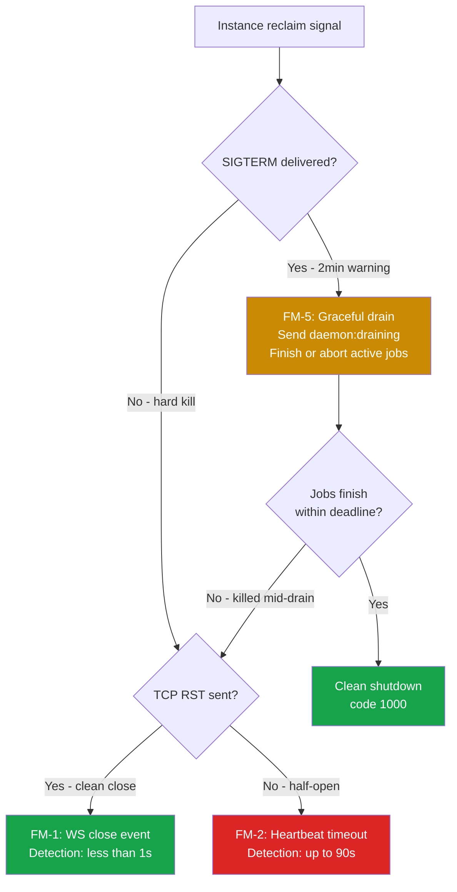

# Implementation Plan: Daemon and Orchestrator Core (Phase 2)

**Branch**: `20260413-191249-daemon-orchestrator-core` | **Date**: 2026-04-13 | **Spec**: [spec.md](spec.md)
**Input**: Feature specification from `/specs/20260413-191249-daemon-orchestrator-core/spec.md`

**Note**: This plan covers **Phase 2 only** — Daemon + Orchestrator Core. Phase 1 (Foundation + Refactor) shipped in PR #13. Phase 3+ (Triage, K8s dispatch, infrastructure) is deferred.

## Summary

Build the daemon application and orchestrator WebSocket layer that enables persistent worker processes to receive and execute GitHub App jobs. The orchestrator (embedded in the webhook server process) manages daemon connections via WebSocket, tracks daemon health through heartbeats in Valkey, queues jobs in Valkey, and records execution history in Postgres. Daemons are standalone processes (same Docker image, different entrypoint) that connect to the orchestrator, advertise their capabilities, accept or reject job offers based on real-time resource availability, and execute jobs using the existing inline pipeline.

## Technical Context

**Language/Version**: TypeScript 5.9.3 strict mode on Bun >=1.3.8
**Primary Dependencies**: `octokit`, `@anthropic-ai/claude-agent-sdk`, `@modelcontextprotocol/sdk`, `pino`, `zod` (all existing). New: Bun built-in `WebSocket` + `RedisClient` (zero new npm dependencies).
**Storage**: PostgreSQL 17 (pgvector-ready, existing `executions` + `daemons` tables from `001_initial.sql`) + Valkey 8 (Redis 7.2-compatible, via Bun built-in `RedisClient`)
**Testing**: `bun test` (existing; >=90% coverage for security-critical, >=70% all others)
**Target Platform**: Linux server (Docker, Kubernetes). Daemon also runs on macOS for local dev.
**Project Type**: Web service (webhook server) + daemon process (worker)
**Performance Goals**: WebSocket handshake + auth < 100ms. Heartbeat processing < 5ms. Job offer round-trip < 500ms. Daemon registration/deregistration < 50ms.
**Constraints**: Webhook pod must still respond within 10s (Constitution Principle II). Global concurrency limit `MAX_CONCURRENT_REQUESTS` applies across all dispatch modes (FR-008). Zero behaviour change when `AGENT_JOB_MODE=inline` (FR-004).
**Scale/Scope**: 1-10 daemons initially. 10-100 concurrent requests/day. Single Valkey instance, single Postgres instance.

## Constitution Check

_GATE: Must pass before Phase 0 research. Re-check after Phase 1 design._

| Principle                                | Status | Notes                                                                                                                                                                                                                                 |
| ---------------------------------------- | ------ | ------------------------------------------------------------------------------------------------------------------------------------------------------------------------------------------------------------------------------------- |
| I. Strict TypeScript and Bun Runtime     | PASS   | All new code TypeScript strict, zero `any`. Bun built-in WebSocket + RedisClient — no Node.js deps added.                                                                                                                             |
| II. Async Webhook Safety                 | PASS   | Webhook response unchanged (< 10s). Orchestrator dispatch is fire-and-forget after 200 OK. WebSocket server on separate port (3002), does not block webhook event loop.                                                               |
| III. Idempotency and Concurrency Control | PASS   | Two-layer idempotency guard unchanged. Concurrency guard in `router.ts` applies before dispatch to daemon. `activeCount` tracks daemon-dispatched jobs too.                                                                           |
| IV. Security by Default                  | PASS   | Pre-shared secret in WebSocket `Authorization` header (FR-012). Installation tokens minted per-job, never persisted (FR-011). Daemon never receives App private key. Valkey connection via `VALKEY_URL` env var.                      |
| V. Test Coverage                         | PASS   | All new modules will have unit tests. WebSocket protocol, daemon registry, job queue, heartbeat — all pure-function testable. Integration test via Docker Compose (2.11).                                                             |
| VI. Structured Observability             | PASS   | Pino child loggers per daemon connection. Delivery ID traceable through daemon dispatch. Cost/duration/turns logged per execution.                                                                                                    |
| VII. MCP Server Extensibility            | PASS   | `daemon-capabilities` MCP server (Tier 3, R-011) exposes daemon registry to Claude agent at runtime.                                                                                                                                  |
| VIII. Documentation Standards            | PASS   | JSDoc on all exports. Mermaid diagrams for WebSocket protocol flow, daemon lifecycle, job dispatch sequence.                                                                                                                          |
| **Technology Constraints**               |        |                                                                                                                                                                                                                                       |
| Runtime: Bun >=1.3.8                     | PASS   | Bun built-in WebSocket server (`Bun.serve()`) and `RedisClient` — zero external deps for core transport.                                                                                                                              |
| HTTP framework: octokit only             | PASS   | WebSocket server is `Bun.serve()` on port 3002, separate from octokit on port 3000. No Express/Fastify added.                                                                                                                         |
| Logging: pino                            | PASS   |                                                                                                                                                                                                                                       |
| Schema validation: zod                   | PASS   | All WebSocket messages validated via `z.discriminatedUnion()` at boundary.                                                                                                                                                            |
| Testing: bun test                        | PASS   |                                                                                                                                                                                                                                       |
| AI orchestration: claude-agent-sdk       | PASS   | Daemon job executor reuses `executeAgent()` from `src/core/executor.ts`.                                                                                                                                                              |
| **Architecture Constraints**             |        |                                                                                                                                                                                                                                       |
| Single Server Model                      | PASS   | Orchestrator is embedded in the webhook server process (same `app.ts` startup). WebSocket listener is a second `Bun.serve()` call in the same process. Daemon is a separate process but is a _client_, not a decomposed microservice. |
| Pipeline Architecture                    | PASS   | Daemon executes the same `runInlinePipeline()` — no pipeline bypass or reorder.                                                                                                                                                       |
| Code Style                               | PASS   | Named exports. Zod validation. One concern per file.                                                                                                                                                                                  |

**No violations. No complexity tracking entries needed.**

## Project Structure

### Documentation (this feature)

```text
specs/20260413-191249-daemon-orchestrator-core/
├── plan.md              # This file
├── research.md          # Phase 0 output
├── data-model.md        # Phase 1 output
├── quickstart.md        # Phase 1 output
├── contracts/           # Phase 1 output
│   └── ws-protocol.md   # WebSocket message protocol specification
├── checklists/
│   └── requirements.md  # Spec quality checklist (already exists)
└── tasks.md             # Phase 2 output (created by /speckit.tasks)
```

### Source Code (repository root)

```text
src/
├── app.ts                          # Modified — start WebSocket server on startup
├── config.ts                       # Existing — already has WS_PORT, VALKEY_URL, etc.
├── types.ts                        # Modified — add serializable BotContext subset
├── core/
│   ├── inline-pipeline.ts          # Existing — reused by daemon job executor
│   ├── executor.ts                 # Modified — accept maxTurns parameter
│   └── prompt-builder.ts           # Modified — add buildEnvironmentHeader()
├── orchestrator/                   # NEW — all orchestrator-side code
│   ├── ws-server.ts                # WebSocket server lifecycle (Bun.serve)
│   ├── connection-handler.ts       # Per-connection message dispatch + heartbeat loop + FM-1/FM-2/FM-8 handlers
│   ├── daemon-registry.ts          # Daemon CRUD in Valkey + Postgres upsert + reconnection handling
│   ├── job-queue.ts                # Job queue in Valkey (LPUSH/BRPOP) + retry logic
│   ├── job-dispatcher.ts           # Offer/accept/reject protocol + FM-3 inline fallback + FM-6 late result guard
│   ├── history.ts                  # Execution history recorder (Postgres) + FM-4 stale execution recovery
│   └── valkey.ts                   # Valkey client singleton + FM-7 health tracking
├── daemon/                         # NEW — all daemon-side code
│   ├── ws-client.ts                # WebSocket client + reconnection + auth
│   ├── health-reporter.ts          # Heartbeat responder + resource metrics
│   ├── tool-discovery.ts           # Local capability detection (9 categories)
│   ├── job-executor.ts             # Receives job, runs inline pipeline, reports result + FM-9 cleanup tracking
│   └── main.ts                     # Daemon entrypoint + FM-5 graceful shutdown (SIGTERM/SIGINT drain)
├── mcp/
│   └── servers/
│       └── daemon-capabilities.ts  # NEW — Tier 3 MCP tool (R-011)
└── shared/                         # NEW — types shared between server + daemon
    ├── ws-messages.ts              # WebSocket message type definitions + zod schemas
    └── daemon-types.ts             # Daemon capability/resource type definitions
```

**Structure Decision**: Orchestrator code lives in `src/orchestrator/`, daemon code in `src/daemon/`, shared protocol types in `src/shared/`. This mirrors the two process roles (server, worker) while sharing types via `src/shared/`. The orchestrator is started by `src/app.ts` when `agentJobMode !== "inline"`. The daemon is started by `src/daemon/main.ts` as a separate process.

## Failure Modes and Resilience

This section maps every spec resilience requirement (FR-004a, FR-007, FR-009, SC-003, SC-005, and all edge cases) to a concrete design.

### FM-1: Daemon Crashes Mid-Execution

**Spec ref**: FR-007, SC-003, Edge Case §5
**Trigger**: WebSocket `close` event fires in `connection-handler.ts` (immediate — no polling required).
**Detection latency**: < 1 second (TCP FIN/RST propagation).

**Orchestrator action sequence** (in `connection-handler.ts` `close` handler):

1. Remove daemon from in-memory `connections` Map.
2. `DEL daemon:{id}` and `DEL daemon:{id}:active_jobs` from Valkey (revoke liveness immediately — don't wait for 90s TTL expiry).
3. Update Postgres `daemons` table: `SET status = 'inactive', last_seen_at = now() WHERE id = $1`.
4. Scan Postgres: `SELECT id, delivery_id FROM executions WHERE daemon_id = $1 AND status IN ('offered', 'running')`.
5. For each orphaned execution:
   - **Status `offered`** (daemon crashed before accepting): The `PendingOffer` in-memory record still holds `retryCount`. If `retryCount < maxRetries` (default 3) AND at least one other active daemon exists: re-queue the job (`LPUSH queue:jobs`, set `status = 'queued'`, clear `daemon_id`, increment `retryCount`).
   - **Status `running`** (daemon crashed mid-execution): This is a different failure class from offer rejection — the job was accepted and work was in progress. Re-queue unconditionally if at least one other active daemon exists (no retry count check — crash-during-execution is rare and warrants a fresh attempt). If no other daemons exist, fail.
   - Otherwise: set `status = 'failed'`, `error_message = 'daemon disconnected during execution'`, `completed_at = now()`.
6. For each failed execution: update the GitHub tracking comment with an error message via `finalizeTrackingComment()` — the user must not see "Working..." forever.
7. Cancel any `pendingOffers` entries for this daemon (clear timeouts, re-queue those jobs).
8. Log at `warn` level with daemon ID, list of orphaned delivery IDs, and action taken.

**Daemon-side cleanup** (in `job-executor.ts`):

- Each active job tracks its temp directory path and Claude agent subprocess PID.
- On unexpected process exit (uncaught exception, SIGKILL), the OS reclaims the subprocess. Temp directories in `/tmp/daemon-workspaces/` are cleaned up by the OS or a periodic cron — not guaranteed immediate.
- Constitution Principle II requires resource cleanup "even when operations fail." The daemon's `main.ts` registers a `process.on('exit')` handler that attempts synchronous cleanup of tracked temp directories via `fs.rmSync()`.

---

### FM-2: Daemon Unresponsive (Heartbeat Timeout)

**Spec ref**: FR-002, SC-003
**Trigger**: Orchestrator's heartbeat loop detects a missing `heartbeat:pong` response.
**Detection latency**: Up to 90 seconds (worst case: daemon becomes unresponsive immediately after a successful heartbeat).

**Design**: The orchestrator manages heartbeat tracking per connection, not via Valkey TTL expiry alone. This avoids relying on Valkey keyspace notifications (which require `notify-keyspace-events` config and add complexity).

**Orchestrator heartbeat loop** (in `connection-handler.ts`):

1. On `daemon:registered`: start a per-daemon interval timer at `heartbeatIntervalMs` (30s).
2. On each tick: send `heartbeat:ping`. Set `awaitingPong = true`. Start a `pongTimeout` timer at `heartbeatTimeoutMs` (90s).
3. On `heartbeat:pong` received: clear `pongTimeout`, set `awaitingPong = false`, refresh Valkey `SETEX daemon:{id} 90 ...`.
4. On `pongTimeout` expiry (no pong within 90s of first unanswered ping):
   - Log at `warn`: `"Daemon heartbeat timeout"`.
   - Call `ws.close(4001, "heartbeat timeout")` — triggers the `close` handler → FM-1 cleanup path.
5. On `close` event: clear both the heartbeat interval and pong timeout timers.

**Why not rely on Bun's `idleTimeout`?** Bun's `sendPings: true` (default) sends WebSocket-level pings. The daemon OS TCP stack responds to these even if the daemon application is hung (e.g., stuck in a blocking syscall). Application-level heartbeat detects "process alive but unresponsive" — a strictly stronger liveness signal.

**Bun WebSocket config**:

```typescript
websocket: {
  sendPings: true,       // Keep TCP alive (catches half-open)
  idleTimeout: 120,      // Backstop: close if zero traffic for 120s
}
```

The 120s `idleTimeout` is a safety net. The 90s application heartbeat fires first in all realistic scenarios.

---

### FM-3: All Daemons Offline

**Spec ref**: Edge Case §1
**Trigger**: Job dispatcher calls `getActiveDaemons()` and receives an empty list, OR all daemons reject the offer and no daemons remain.

**Design** (in `job-dispatcher.ts`):

1. Before offering a job, query active daemons from Valkey: `KEYS daemon:*` (filtered by presence, not Postgres status).
2. If **zero active daemons** AND `config.agentJobMode === 'auto'`:
   - Log at `warn`: `"No active daemons — falling back to inline execution"`.
   - Execute the job via `runInlinePipeline(ctx)` directly (same path as `agentJobMode === 'inline'`).
   - Record `dispatch_mode = 'inline'` in the execution record (not `'shared-runner'` — reflects actual execution path).
   - When `auto` successfully dispatches to a daemon: record `dispatch_mode = 'shared-runner'` (the effective runtime mode per FR-003).
3. If **zero active daemons** AND `config.agentJobMode` is explicitly `'shared-runner'` or `'ephemeral-job'` (not `'auto'`):
   - Do NOT fall back to inline — the operator chose a specific mode intentionally.
   - Post an error comment to GitHub: `"No daemons are currently available to process this request. Please try again later or contact the administrator."`
   - Set execution status to `failed` with `error_message = 'no active daemons'`.
4. If all daemons reject the offer (capacity full, capability mismatch) after `maxRetries` (3) re-queue attempts:
   - Same logic as above — fall back to inline in `auto` mode, fail with error in explicit modes.

**Why not always fall back to inline?** If an operator configures `AGENT_JOB_MODE=shared-runner`, they're asserting that inline execution is not acceptable (e.g., the webhook pod has insufficient resources). Silent fallback would mask an operational problem. `auto` mode explicitly opts into fallback.

---

### FM-4: Server (Orchestrator) Restarts

**Spec ref**: Edge Case §5
**Trigger**: Server process restarts (deploy, OOM kill, crash).

**Design**: Startup recovery scan in `app.ts`, after database migrations and before accepting webhooks.

**Recovery scan** (in `src/orchestrator/history.ts` → `recoverStaleExecutions()`):

1. Query (two conditions to handle NULL `started_at` for `offered` records):
   ```sql
   SELECT id, delivery_id, daemon_id, status, started_at, created_at
   FROM executions
   WHERE (status = 'running' AND started_at < now() - interval '${staleThresholdMs} milliseconds')
      OR (status = 'offered' AND created_at < now() - interval '${staleThresholdMs} milliseconds')
   ```
   Note: `started_at` is NULL for `offered` records (only populated on transition to `running`), so the query uses `created_at` for `offered` status to avoid `NULL < value` evaluating to NULL and silently skipping stale offers.
2. **Stale threshold**: `STALE_EXECUTION_THRESHOLD_MS` env var, default `600_000` (10 minutes). Any execution that started running more than 10 minutes ago and is still `running` is considered stale. Any execution that was created more than 10 minutes ago and is still `offered` (daemon never accepted) is also stale. This aligns with `AGENT_TIMEOUT_MS` (default 10 minutes) — if an execution exceeded the agent timeout and the server restarted, it's definitively stale.
3. For each stale execution:
   - Set `status = 'failed'`, `error_message = 'server restarted — execution state unknown'`, `completed_at = now()`.
   - Attempt to update the GitHub tracking comment with a failure message. This requires reconstructing an Octokit instance from the installation — the `context_json` column stores the serialized context including `owner` and `repo`.
4. Log at `warn`: `"Recovered N stale executions on startup"` with delivery IDs.
5. Clear all Valkey daemon keys (`KEYS daemon:*` → `DEL` each) — daemons will re-register when they reconnect after the restart.

**Why not re-queue stale executions?** After a server restart, we don't know the state of the daemon that was executing the job. The daemon may have completed successfully and posted results to GitHub already. Re-queueing could cause duplicate processing. Failing is the safe choice — the user can re-trigger.

**Execution ordering**: `recoverStaleExecutions()` runs AFTER `db.migrate()` but BEFORE `startWebSocketServer()` and the HTTP webhook listener begins accepting connections. This ensures cleanup completes before new work arrives.

---

### FM-5: Daemon Graceful Shutdown

**Spec ref**: Constitution Principle II ("graceful shutdown MUST drain in-flight requests")
**Trigger**: SIGTERM or SIGINT received by daemon process (e.g., `docker stop`, Kubernetes pod termination, Ctrl+C).

**New protocol message**: `daemon:draining` (daemon → server). See updated `contracts/ws-protocol.md`.

**Daemon shutdown sequence** (in `src/daemon/main.ts`):

1. `process.on('SIGTERM')` / `process.on('SIGINT')` handler fires.
2. Send `daemon:draining` message to orchestrator — signals "I won't accept new jobs, but I'm finishing active ones."
3. Orchestrator receives `daemon:draining`:
   - Removes daemon from dispatch eligibility (won't send new `job:offer` messages).
   - Does NOT close the WebSocket connection — the daemon is still alive and may send `job:result` for active jobs.
   - Keeps heartbeat loop running (daemon is still alive, just draining).
4. Daemon waits for all active jobs to complete (with a drain timeout of `DAEMON_DRAIN_TIMEOUT_MS`, default 300,000ms = 5 minutes).
5. After all jobs complete OR drain timeout expires:
   - Clean up all temp directories.
   - Send WebSocket `close` frame (code 1000, reason "graceful shutdown").
   - `process.exit(0)`.
6. If drain timeout expires with jobs still running:
   - Log at `warn`: `"Drain timeout expired with N active jobs — forcing shutdown"`.
   - Kill Claude agent subprocesses via `process.kill(pid)`.
   - Clean up temp directories.
   - Close WebSocket connection.
   - `process.exit(1)`.

**Orchestrator distinction**: When the `close` handler fires after `daemon:draining` was received, the orchestrator knows this was a planned shutdown. It still runs FM-1 cleanup for any jobs that were force-killed by the drain timeout, but logs at `info` instead of `warn` for the draining case.

**Config additions**:

- `DAEMON_DRAIN_TIMEOUT_MS`: default 300,000 (5 minutes). Maximum time to wait for active jobs to complete during graceful shutdown.

---

### FM-6: Late Result from Reassigned Execution

**Spec ref**: Edge Case §2
**Trigger**: A daemon that was declared dead (FM-1/FM-2) reconnects or delivers a `job:result` for an execution that has already been reassigned to another daemon or marked failed.

**Design** (in `connection-handler.ts`, `job:result` handler):

1. On receiving `job:result`, query Postgres: `SELECT status, daemon_id FROM executions WHERE delivery_id = $1`.
2. If `status` is already `completed` or `failed`:
   - Log at `info`: `"Late result received for already-finalized execution"` with `deliveryId`, reporting daemon ID, current status, current `daemon_id`.
   - Discard the result — do NOT update the execution record or the GitHub tracking comment.
   - Send `error` message to daemon with code `EXECUTION_ALREADY_FINALIZED`.
3. If `daemon_id` does not match the reporting daemon:
   - Same as above — the execution was reassigned. Log and discard.
4. The idempotency here is enforced by the Postgres `status` column. The first `job:result` to arrive wins.

---

### FM-7: Valkey Unavailable

**Spec ref**: FR-004a
**Trigger**: Valkey connection drops or is unreachable.

**Design** (in `src/orchestrator/valkey.ts`):

1. The Bun `RedisClient` has built-in reconnection (`autoReconnect: true`, `maxRetries: 10`, `enableOfflineQueue: true`).
2. Track connection state via `client.onconnect` and `client.onclose` callbacks:
   ```typescript
   let valkeyConnected = false;
   client.onconnect = () => {
     valkeyConnected = true;
   };
   client.onclose = () => {
     valkeyConnected = false;
   };
   ```
3. Export `isValkeyHealthy(): boolean` — returns `valkeyConnected`.
4. In `router.ts`, before dispatching to daemon mode:
   ```typescript
   if (config.agentJobMode !== "inline" && !isValkeyHealthy()) {
     ctx.log.error("Valkey unavailable — rejecting request");
     await ctx.octokit.rest.issues.createComment({
       owner: ctx.owner,
       repo: ctx.repo,
       issue_number: ctx.entityNumber,
       body: `**${config.triggerPhrase}** cannot process this request — the job queue service is temporarily unavailable. Please try again in a few minutes.`,
     });
     return;
   }
   ```
5. **Recovery is automatic**: When Valkey reconnects, `valkeyConnected` flips to `true`, and new requests flow through normally. No restart required.
6. **Inline mode unaffected**: The `isValkeyHealthy()` check is only in the non-inline dispatch path. `AGENT_JOB_MODE=inline` never touches Valkey.
7. **Health endpoint**: `/readyz` reports `503` when Valkey is down (non-inline mode only). `/healthz` (liveness) is unaffected — the process is still alive, just unable to dispatch.

---

### FM-8: Daemon Reconnection with Same ID

**Spec ref**: Edge Case §4, FR-009, SC-005
**Trigger**: A daemon crashes and restarts with the same daemon ID (same hostname + new PID, or configured static ID).

**Design** (in `connection-handler.ts` and `daemon-registry.ts`):

1. On `daemon:register`, check if `connections` Map already has an entry for this daemon ID.
2. If an **existing active connection** exists for this daemon ID:
   - Close the OLD connection with code `4002` and reason `"superseded by new connection"`.
   - Remove old connection from `connections` Map.
   - This handles the case where the old TCP connection hasn't been cleaned up yet (half-open).
3. If orphaned executions exist for this daemon ID (status `offered` or `running`):
   - Run the FM-1 orphaned job cleanup for those executions BEFORE registering the new connection.
   - This ensures stale state from the previous incarnation doesn't leak into the new session.
4. Register the new connection:
   - Upsert Postgres `daemons` table (update capabilities, resources, status = `active`, `last_seen_at = now()`).
   - `SETEX daemon:{id} 90 ...` in Valkey.
   - Add to in-memory `connections` Map.
5. Send `daemon:registered` response.
6. Log at `info`: `"Daemon reconnected"` (vs `"Daemon registered"` for first-time connections).

**SC-005 compliance**: The daemon becomes eligible for dispatch immediately after step 4. "Within one heartbeat interval" is satisfied because registration is immediate — no need to wait for a heartbeat cycle.

---

### FM-9: Daemon-Side Resource Cleanup

**Spec ref**: Constitution Principle II ("resource cleanup MUST be guaranteed even when operations fail or time out")

**Tracked resources per job** (in `job-executor.ts`):

- `workDir: string` — temp directory containing the cloned repo.
- `agentPid: number | undefined` — PID of the Claude agent subprocess (if started).

**Cleanup guarantees**:

1. **Normal completion**: `finally` block in `executeJob()` calls `cleanup()` (same as inline pipeline).
2. **Uncaught exception in job**: `try/catch` around `executeJob()` in `job-executor.ts`. Catch block calls cleanup, reports `job:result` with `success: false`.
3. **Daemon process exit**: `process.on('exit')` in `main.ts` does synchronous `fs.rmSync(workDir, { recursive: true, force: true })` for all tracked work directories.
4. **SIGKILL (untrappable)**: Cannot intercept. Temp directories in `/tmp/daemon-workspaces/` are cleaned up by OS tmpfs recycling or a periodic cron job. This is the same risk as the inline pipeline today — accepted.
5. **Agent subprocess**: Wraps `executeAgent()` in `Promise.race([agentLoop, timeoutPromise])` (same as current `executor.ts`). On timeout, the subprocess is killed via `process.kill(agentPid, 'SIGTERM')`.

---

### FM-10: Ephemeral Instance Termination (Spot Instance, Preemptible VM)

**Spec ref**: FR-007, SC-003 (generalised — spec says "daemon failures mid-execution")
**Trigger**: Cloud provider reclaims the instance. Typical warning: AWS Spot gives 2-minute SIGTERM notice. GCP Preemptible gives 30 seconds. Hard kills give nothing.

**Problem**: Ephemeral instances create three detection scenarios that FM-1 through FM-5 handle differently — and the worst case (half-open TCP) has a 90-second detection gap that the plan previously understated.

#### Detection path per scenario



#### Design: 4 additions to handle ephemeral environments

**1. Daemon lifecycle flag: `ephemeral`**

Add `ephemeral: boolean` to daemon capabilities (reported at registration). Set to `true` when the daemon detects it's running on a preemptible instance.

**Auto-detection** (in `tool-discovery.ts`):

```typescript
async function detectEphemeral(): Promise<boolean> {
  // AWS: check instance metadata for spot
  try {
    const resp = await fetch("http://169.254.169.254/latest/meta-data/instance-life-cycle", {
      signal: AbortSignal.timeout(500),
    });
    if (resp.ok && (await resp.text()) === "spot") return true;
  } catch {
    /* not on AWS or metadata unavailable */
  }

  // GCP: check metadata for scheduling/preemptible
  try {
    const resp = await fetch(
      "http://metadata.google.internal/computeMetadata/v1/instance/scheduling/preemptible",
      { headers: { "Metadata-Flavor": "Google" }, signal: AbortSignal.timeout(500) },
    );
    if (resp.ok && (await resp.text()) === "TRUE") return true;
  } catch {
    /* not on GCP or metadata unavailable */
  }

  // Manual override via env var
  return process.env["DAEMON_EPHEMERAL"] === "true";
}
```

**Dispatch impact** (in `job-dispatcher.ts`):

- When selecting a daemon for a job offer, prefer non-ephemeral daemons for jobs classified as complex.
- **Job complexity heuristic** (dispatcher implementation detail, not a spec-level classification): a job is treated as complex when the effective `maxTurns > 30` (derived from `config.maxTurnsPerComplexity`; in Phase 2 without triage, all jobs default to the `complex` tier = 50, so all are treated as complex for ephemeral ranking). This is a soft dispatcher preference used only for ephemeral-vs-stable ranking — it does not block ephemeral daemons from receiving complex jobs.
- Ephemeral daemons are still eligible — they're just ranked lower for long jobs. This is a soft preference, not a hard block. Avoids wasted work when a cheaper alternative exists.

**2. Platform-aware drain timeout**

The daemon's drain timeout should be shorter than the platform's termination deadline. If the platform gives a 2-minute warning and the drain timeout is 5 minutes, the daemon is killed mid-drain.

```typescript
// In daemon main.ts, compute effective drain timeout
const platformDeadlineMs = await detectPlatformTerminationDeadline();
// platformDeadlineMs: AWS Spot = 120_000 (2min), GCP = 30_000, default = Infinity
const effectiveDrainTimeout = Math.min(
  config.daemonDrainTimeoutMs, // operator-configured (default 5min)
  platformDeadlineMs - 10_000, // platform deadline minus 10s safety margin
);
```

Detection of platform deadline:

- AWS Spot: 120,000ms (2 minutes). Source: [AWS Spot Instance Interruptions](https://docs.aws.amazon.com/AWSEC2/latest/UserGuide/spot-instance-termination-notices.html).
- GCP Preemptible: 30,000ms. Source: [GCP Preemptible VM shutdown](https://cloud.google.com/compute/docs/instances/preemptible#preemption_process).
- Unknown/bare metal: use `DAEMON_DRAIN_TIMEOUT_MS` as-is.

**3. Spot termination notice polling (optional, AWS-specific)**

AWS provides a 2-minute early warning via instance metadata before SIGTERM is sent. Polling this lets the daemon start draining before the OS signal arrives — giving active jobs more time.

```typescript
// In daemon main.ts — poll every 5s (AWS recommendation)
const spotCheckInterval = setInterval(async () => {
  try {
    const resp = await fetch("http://169.254.169.254/latest/meta-data/spot/instance-action", {
      signal: AbortSignal.timeout(1000),
    });
    if (resp.ok) {
      // Termination notice received — start draining NOW
      log.warn("Spot termination notice detected — initiating graceful drain");
      clearInterval(spotCheckInterval);
      initiateGracefulShutdown("spot termination notice");
    }
  } catch {
    /* 404 = no termination pending, network error = ignore */
  }
}, 5_000);
spotCheckInterval.unref();
```

This is **opt-in** — only runs when `ephemeral === true` and `platform === "linux"` (instance metadata is a Linux construct). On macOS dev machines and non-cloud environments, the interval is never started.

**4. FM-1 correction: half-open TCP detection latency**

The original FM-1 claimed "< 1s" detection for daemon crash. This is only true when the OS sends a TCP RST (process crash on a running machine). When the entire VM disappears (spot reclaim, hardware failure), the TCP connection enters a half-open state. Detection falls through to FM-2 (heartbeat timeout, ≤ 90s).

Corrected FM-1 detection latency:

- Process crash on running host: < 1s (TCP RST/FIN).
- VM hard-kill (spot, preemptible, power loss): **≤ 90s** (falls through to FM-2 heartbeat timeout). This is the true worst-case detection latency for ephemeral environments.

The 90s gap is acceptable at Phase 2 scale (1-10 daemons, 10-100 jobs/day). The orchestrator re-queues orphaned jobs automatically (FM-1 step 5), so the user sees a brief delay, not a permanent failure. The GitHub tracking comment is updated once the timeout fires.

**Why not reduce the heartbeat interval to 10s / 30s timeout?** Could be done. But at 1-10 daemons, the operational impact of 90s vs 30s detection is minimal. The job is already in-flight — the user is waiting regardless. Faster detection trades Valkey write load for marginally faster error reporting. Leave as a tuning knob (`HEARTBEAT_INTERVAL_MS`, `HEARTBEAT_TIMEOUT_MS`) for operators who need tighter SLAs.

---

### Failure Mode Summary

| ID    | Failure                        | Detection                                                         | Latency                                                    | Action                                                    | Spec Ref             |
| ----- | ------------------------------ | ----------------------------------------------------------------- | ---------------------------------------------------------- | --------------------------------------------------------- | -------------------- |
| FM-1  | Daemon crash mid-execution     | WS `close` event                                                  | < 1s (clean close) or ≤ 90s (half-open TCP, falls to FM-2) | Orphan cleanup, re-queue or fail, update GitHub comment   | FR-007, SC-003       |
| FM-2  | Daemon unresponsive            | Heartbeat pong timeout                                            | ≤ 90s                                                      | Close connection → FM-1                                   | FR-002               |
| FM-3  | All daemons offline            | Empty active daemon list                                          | Immediate                                                  | Inline fallback (`auto`) or error comment                 | Edge Case §1         |
| FM-4  | Server restarts                | Startup scan                                                      | On boot                                                    | Fail stale executions, clear Valkey state                 | Edge Case §5         |
| FM-5  | Daemon graceful shutdown       | SIGTERM handler                                                   | Controlled                                                 | Drain active jobs, then disconnect                        | Principle II         |
| FM-6  | Late result after reassignment | Status check on `job:result`                                      | Immediate                                                  | Log and discard                                           | Edge Case §2         |
| FM-7  | Valkey unavailable             | `onclose` callback                                                | Immediate                                                  | Reject new requests with error comment                    | FR-004a              |
| FM-8  | Daemon reconnect same ID       | Registration check                                                | Immediate                                                  | Close old connection, clean orphans, re-register          | Edge Case §4, FR-009 |
| FM-9  | Resource leak on daemon        | Process exit handler                                              | On exit                                                    | Sync cleanup of temp dirs + subprocess kill               | Principle II         |
| FM-10 | Ephemeral instance termination | Spot metadata poll (early) or SIGTERM or heartbeat timeout (late) | 0s (poll) / 2min (SIGTERM) / ≤90s (half-open)              | Platform-aware drain, prefer stable daemons for long jobs | FR-007               |

## Complexity Tracking

No constitution violations to justify. Feature complexity is substantial — bidirectional WebSocket state machine, 10 failure modes, 3-store data synchronization (Postgres + Valkey + in-memory), and dual-process architecture — but each element is justified by spec requirements (FR-001 through FR-016). No element requires a constitution waiver or complexity exception.
