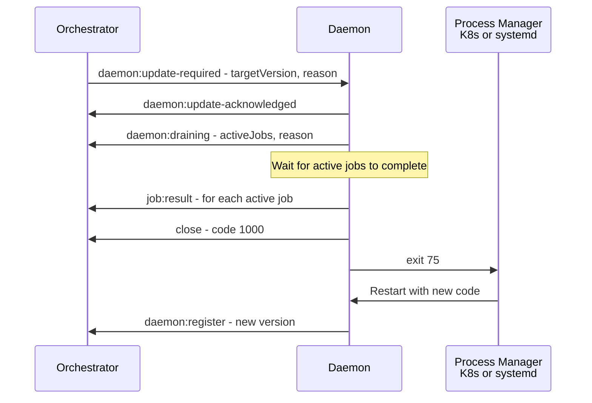

# Research: Daemon and Orchestrator Core (Phase 2)

**Branch**: `20260413-191249-daemon-orchestrator-core`
**Date**: 2026-04-13
**Status**: Complete

## Overview

This document resolves all technical unknowns identified during plan creation for Phase 2 — Daemon + Orchestrator Core. Each section follows the format: Decision, Rationale, Alternatives Considered.

---

## R-001: WebSocket Server Technology

**Decision**: Use Bun's built-in `Bun.serve()` WebSocket support on a separate port (`WS_PORT`, default 3002).

**Rationale**:
- Bun >=1.2 has production-ready WebSocket server support integrated into `Bun.serve()`. The `fetch` handler performs HTTP→WS upgrade via `server.upgrade(req)`, and the `websocket` handler object defines lifecycle callbacks (`open`, `message`, `close`, `ping`, `pong`).
- Multiple `Bun.serve()` calls in the same process are supported — the existing octokit webhook server stays on port 3000; the WebSocket server runs on port 3002. No framework conflict.
- Built-in `sendPings: true` (default) provides automatic WebSocket-level ping/pong heartbeat. The `idleTimeout` (default 120s) auto-closes idle connections.
- Zero new npm dependencies — aligns with Constitution Technology Constraints (no Express/Fastify).
- `ServerWebSocket` API provides `send()`, `close()`, `ping()`, `subscribe(topic)`, `publish(topic, msg)` — sufficient for daemon-orchestrator communication.

**Alternatives Considered**:
- `ws` npm package: Feature-complete but adds a dependency. Bun's built-in is faster (Zig implementation) and has identical API coverage for server-side use.
- Socket.IO: Too heavy — adds its own protocol layer, reconnection, rooms. Our protocol is simpler.
- HTTP long-polling: Higher latency, more complex state management. WebSocket is the right choice for persistent bidirectional communication.

**References**:
- [Bun WebSocket docs](https://bun.sh/docs/api/websockets)
- [Bun.serve API](https://bun.sh/docs/api/http)

---

## R-002: WebSocket Client (Daemon Side)

**Decision**: Use Bun's built-in `WebSocket` class (standard browser API + Bun extensions) with custom reconnection logic using decorrelated jitter.

**Rationale**:
- Bun implements the standard `WebSocket` class. It works identically to the browser API but with Bun-specific extensions: custom `headers` in constructor (for `Authorization` header), and `ping()`/`pong()` methods.
- No built-in reconnection — must be implemented manually. This is expected (same as browser WebSocket, Node.js `ws`).
- Custom headers during upgrade are supported: `new WebSocket(url, { headers: { Authorization: "Bearer ..." } })`.

**Reconnection Algorithm**: Decorrelated jitter (AWS recommended):
```
sleep = min(cap, random_between(base, previous_sleep * 3))
```
- `base`: 1,000ms (1 second)
- `cap`: 30,000ms (30 seconds)
- `maxAttempts`: Infinity (daemon should never give up)
- Reset on successful connection.

**References**:
- [Bun WebSocket client docs](https://bun.sh/docs/api/websockets)
- [AWS Architecture Blog: Exponential Backoff and Jitter (2015)](https://aws.amazon.com/blogs/architecture/exponential-backoff-and-jitter/)

---

## R-003: Valkey/Redis Client

**Decision**: Use Bun's built-in `RedisClient` (available since Bun 1.2, stabilized in 1.3).

**Rationale**:
- Bun has a native Redis client implemented in Zig, using RESP3 protocol. Documented as 7.9x faster than `ioredis`.
- Explicitly supports Valkey — reads `VALKEY_URL` as a connection environment variable (second precedence after `REDIS_URL`).
- Supports 66+ commands including strings, hashes, sets, pub/sub, plus `send()` escape hatch for any raw command (LPUSH, BRPOP, etc.).
- Built-in reconnection with exponential backoff (50ms→2000ms, up to `maxRetries` attempts). `enableOfflineQueue: true` buffers commands during disconnection.
- Connection events: `onconnect`, `onclose`.
- Zero npm dependencies.

**API shape**:
```typescript
import { RedisClient } from "bun";

const client = new RedisClient("redis://localhost:6379", {
  autoReconnect: true,
  maxRetries: 10,
  enableOfflineQueue: true,
});

// String operations
await client.set("key", "value");
await client.get("key");

// Raw commands for lists
await client.send("LPUSH", ["queue:jobs", JSON.stringify(job)]);
await client.send("BRPOP", ["queue:jobs", "5"]); // 5s timeout
```

**Limitations** (acceptable for Phase 2):
- No Redis Cluster or Sentinel — not needed (single Valkey instance).
- No Lua scripting — not needed for Phase 2 operations.
- No MULTI/EXEC transactions via high-level API — must use `send()`. Acceptable; our operations are simple SET/GET/LPUSH/BRPOP.

**Alternatives Considered**:
- `ioredis`: Full-featured, supports Cluster/Sentinel/Lua. But adds a dependency, slower than Bun built-in, and our use case is simple enough for the built-in client.
- `@redis/client` (node-redis v5): Official Node.js client. No Bun-specific optimizations.

**References**:
- [Bun Redis docs](https://bun.sh/docs/runtime/redis)
- [Bun 1.3 blog](https://bun.sh/blog/bun-v1.3)

---

## R-004: WebSocket Message Protocol Design

**Decision**: JSON messages with a discriminated union `type` field, validated via `zod` at the boundary. Correlation via `id` field for request/response pairing.

**Rationale**:
- Discriminated union on `type` field is the dominant pattern (used by graphql-ws, Socket.IO internals, Kubernetes watch API, JSON-RPC 2.0).
- TypeScript's narrowing on discriminated unions (`switch (msg.type)`) provides compile-time exhaustiveness checks.
- `zod.discriminatedUnion()` validates incoming messages at the WebSocket boundary — untrusted input from daemon connections (Constitution Principle IV).
- Correlation `id` field enables request/response pairing for offer/accept/reject.

**Message categories** (detailed in `contracts/ws-protocol.md`):
1. **Connection lifecycle**: `daemon:register`, `daemon:registered`
2. **Heartbeat**: `heartbeat:ping`, `heartbeat:pong`
3. **Job dispatch**: `job:offer`, `job:accept`, `job:reject`, `job:payload`, `job:status`, `job:result`
4. **Error**: `error`
5. **Daemon lifecycle**: `daemon:draining`, `daemon:update-required`, `daemon:update-acknowledged` _(added during protocol design — see `contracts/ws-protocol.md`)_
6. **Job control**: `job:cancel` _(forward-compatible, no orchestrator emission in Phase 2)_

**Note**: The authoritative protocol specification is `contracts/ws-protocol.md`. Categories 5-6 were added during detailed protocol design and are not part of the initial R-004 decision.

**References**:
- [TypeScript Handbook: Discriminated Unions](https://www.typescriptlang.org/docs/handbook/2/narrowing.html#discriminated-unions)
- [Zod discriminatedUnion](https://zod.dev/?id=discriminated-unions)

---

## R-005: Heartbeat Mechanism

**Decision**: Dual-layer heartbeat — WebSocket-level ping/pong (Bun built-in, connection liveness) + application-level heartbeat (daemon status reporting). 30s interval, 90s Valkey TTL (3x ratio).

**Rationale**:
- WebSocket ping/pong (RFC 6455 §5.5.2) handles TCP half-open detection. Bun's `sendPings: true` (default) manages this automatically.
- Application-level heartbeat carries daemon metadata: active jobs, CPU load, memory usage, available capacity. This data feeds the job dispatcher's capacity-aware routing decisions.
- 3x ratio (30s/90s) tolerates 2 missed heartbeats before declaring daemon inactive. Comparable to Consul (3x), slightly below Kubernetes kubelet (4x).
- 30s interval is appropriate for the expected scale (1-10 daemons). Faster intervals (10-15s) would be premature optimization at this scale and increase Valkey write load.
- Valkey `SETEX` with 90s TTL for daemon registry entries. If heartbeat stops, entry auto-expires and daemon becomes ineligible for dispatch.

**Implementation in Valkey** _(note: data-model.md supersedes — the finalized design uses a single `daemon:{id}` STRING key + `daemon:{id}:active_jobs` STRING key; the `daemon:{id}:meta` hash key below was an early draft and is not used)_:
```
SETEX daemon:{id} 90 {JSON capabilities + timestamp}
HSET daemon:{id}:meta hostname {hostname} platform {platform} ...  # SUPERSEDED — see data-model.md
```

On heartbeat:
```
SETEX daemon:{id} 90 {updated capabilities}  // refresh TTL
```

On deregistration or timeout:
```
DEL daemon:{id}
DEL daemon:{id}:active_jobs
```

**Alternatives Considered**:
- 15s/45s (faster detection): Rejected — at 1-10 daemons, 90s detection latency is acceptable. Orphaned job reassignment handles the gap.
- Application-only heartbeat (no WS ping/pong): Rejected — WS ping/pong is free (Bun default) and catches TCP issues that app heartbeat misses.
- Postgres-only heartbeat tracking: Rejected — Valkey is faster for TTL-based expiry. Postgres is used for durable execution history, not ephemeral liveness.

**References**:
- [RFC 6455 §5.5.2: Ping/Pong](https://www.rfc-editor.org/rfc/rfc6455#section-5.5.2)
- [Kubernetes Node Heartbeats](https://kubernetes.io/docs/concepts/architecture/nodes/#heartbeats) (10s interval, 40s grace = 4x)

---

## R-006: Job Queue Design

**Decision**: Valkey list-based queue with `LPUSH`/`BRPOP` pattern. Simple, reliable, no external library.

**Rationale**:
- At the expected scale (10-100 jobs/day), a simple Valkey list is sufficient. No need for Redis Streams, BullMQ, or other queue libraries.
- `LPUSH queue:jobs {payload}` to enqueue. `BRPOP queue:jobs 5` to dequeue with 5s blocking timeout.
- Job state tracked in Postgres `executions` table (status: queued → offered → running → completed/failed). Valkey queue is the dispatch buffer; Postgres is the durable record.
- Valkey list ordering is FIFO (LPUSH adds to head, BRPOP takes from tail). Good enough; priority queuing is out of scope for Phase 2.

**Offer/Accept/Reject Protocol**:
1. Job arrives → insert `executions` row (status: `queued`) → `LPUSH queue:jobs {deliveryId}`
2. Orchestrator dequeues → selects best daemon → sends `job:offer` → marks `offered` with 5s timeout
3. Daemon responds `job:accept` → orchestrator sends `job:payload` → marks `running`
4. Daemon responds `job:reject` or timeout → try next daemon or re-queue
5. Daemon completes → sends `job:result` → marks `completed` or `failed`

**Alternatives Considered**:
- Redis Streams (`XADD`/`XREADGROUP`): More robust consumer groups, message acknowledgment. Overkill for Phase 2 scale. Migrate later if needed.
- BullMQ: Full-featured Node.js queue. Adds a heavy dependency, not Bun-native. Over-engineered for 10-100 jobs/day.
- Postgres-only queue (`SELECT ... FOR UPDATE SKIP LOCKED`): Viable but adds DB load. Valkey is faster for ephemeral queue operations.

---

## R-007: Daemon Tool Discovery and Capability Reporting

**Decision**: Daemon inspects its local environment at startup and reports structured capability data to the orchestrator. The orchestrator uses this data for two purposes: (1) dispatch matching — routing jobs to daemons that have the required tools, and (2) `allowedTools` generation — building a per-daemon tool allowlist for the Claude agent.

### What the daemon reports

The daemon reports **everything the orchestrator needs to make dispatch decisions and configure the Claude agent**. Data is organized into 9 categories:

| # | Category | What it answers | Type |
|---|---|---|---|
| 1 | `platform` | What OS? | `"linux" \| "darwin" \| "win32"` |
| 2 | `shells` | What shells can run scripts? | `DiscoveredTool[]` |
| 3 | `packageManagers` | What can install deps? | `DiscoveredTool[]` |
| 4 | `cliTools` | What CLIs are on PATH? | `DiscoveredTool[]` |
| 5 | `containerRuntime` | Can it run Docker/Podman? Is the daemon running? | `ContainerRuntime \| null` |
| 6 | `authContexts` | What API credentials are available? | `string[]` (enum-like) |
| 7 | `resources` | CPU, memory, disk | `DaemonResources` |
| 8 | `network` | Hostname, connectivity | `NetworkInfo` |
| 9 | `cachedRepos` | What repos are already cloned? | `string[]` |

### How the daemon detects CLI tools

Each tool is discovered via `Bun.which()` (Bun's built-in PATH resolution — returns the absolute path or `null`) followed by a version probe. This is faster than spawning `which` as a subprocess.

```typescript
// In src/daemon/tool-discovery.ts

interface DiscoveredTool {
  name: string;       // Canonical name: "git", "bun", "docker", etc.
  path: string;       // Absolute path: "/usr/bin/git"
  version: string;    // Parsed version: "2.45.0"
  functional: boolean; // true = binary exists AND responds to --version (or equivalent)
}

async function discoverTool(name: string, versionCmd: string[]): Promise<DiscoveredTool | null> {
  const path = Bun.which(name);
  if (!path) return null;

  try {
    const proc = Bun.spawn(versionCmd, { stdout: "pipe", stderr: "pipe" });
    const stdout = await new Response(proc.stdout).text();
    const exitCode = await proc.exited;
    return {
      name,
      path,
      version: parseVersionString(stdout), // extracts semver-like string
      functional: exitCode === 0,
    };
  } catch {
    // Binary exists but can't execute (permissions, missing shared lib, etc.)
    return { name, path, version: "unknown", functional: false };
  }
}
```

**Exhaustive tool list checked at startup**:

| Tool | Version Command | Why checked |
|---|---|---|
| `git` | `git --version` | Required for repo cloning (all jobs) |
| `bun` | `bun --version` | Required for running the inline pipeline |
| `node` | `node --version` | Required for Claude Code CLI |
| `npm` | `npm --version` | Package management |
| `gh` | `gh --version` | GitHub CLI (optional, used by some Claude tools) |
| `curl` | `curl --version` | HTTP requests from Bash |
| `docker` | `docker --version` | Container runtime (Phase 3 ephemeral jobs) |
| `docker compose` | `docker compose version` | Multi-container orchestration |
| `make` | `make --version` | Build tool |
| `python3` | `python3 --version` | Scripting |
| `jq` | `jq --version` | JSON processing |
| `sed` | `sed --version` (Linux) or `sed` (macOS, no --version) | Text processing |
| `grep` | `grep --version` | Search |
| `find` | `find --version` (Linux) or presence check (macOS) | File search |

**Container runtime gets special treatment** — binary existence is not enough:

```typescript
interface ContainerRuntime {
  name: "docker" | "podman";
  path: string;
  version: string;
  daemonRunning: boolean; // docker info exits 0 = daemon accessible
  composeAvailable: boolean; // docker compose version exits 0
}

async function discoverContainerRuntime(): Promise<ContainerRuntime | null> {
  const dockerPath = Bun.which("docker");
  if (!dockerPath) return null;

  // Check if Docker daemon is actually running (not just binary on PATH)
  const infoProc = Bun.spawn(["docker", "info"], {
    stdout: "pipe", stderr: "pipe",
  });
  const daemonRunning = (await infoProc.exited) === 0;

  // Check docker compose (v2 plugin, not docker-compose v1)
  const composeProc = Bun.spawn(["docker", "compose", "version"], {
    stdout: "pipe", stderr: "pipe",
  });
  const composeAvailable = (await composeProc.exited) === 0;

  const versionProc = Bun.spawn(["docker", "--version"], { stdout: "pipe" });
  const version = parseVersionString(await new Response(versionProc.stdout).text());

  return { name: "docker", path: dockerPath, version, daemonRunning, composeAvailable };
}
```

### How the orchestrator uses capabilities

**1. Dispatch matching** (in `job-dispatcher.ts`):

The orchestrator selects the best daemon for a job based on three criteria:

```typescript
function selectDaemon(
  activeDaemons: DaemonInfo[],
  jobHints: JobHints,
): DaemonInfo | null {
  const eligible = activeDaemons.filter((d) => {
    // Hard requirements — must have these or the job will fail
    if (!hasRequiredTools(d.capabilities, jobHints.requiredTools)) return false;
    // Resource floor — must have minimum free resources
    if (d.capabilities.resources.memoryFreeMb < 512) return false;
    return true;
  });

  if (eligible.length === 0) return null;

  // Soft preferences — rank among eligible daemons
  return eligible.sort((a, b) => {
    // Prefer non-ephemeral for long jobs (FM-10)
    if (jobHints.estimatedComplexity === "complex") {
      if (a.capabilities.ephemeral !== b.capabilities.ephemeral) {
        return a.capabilities.ephemeral ? 1 : -1;
      }
    }
    // Prefer daemons with cached repo (saves clone time)
    const aHasRepo = a.capabilities.cachedRepos.includes(jobHints.repoFullName);
    const bHasRepo = b.capabilities.cachedRepos.includes(jobHints.repoFullName);
    if (aHasRepo !== bHasRepo) return aHasRepo ? -1 : 1;
    // Prefer least-loaded daemon
    return a.activeJobs - b.activeJobs;
  })[0]!;
}

function hasRequiredTools(caps: DaemonCapabilities, required: string[]): boolean {
  const availableToolNames = new Set(
    caps.cliTools.filter((t) => t.functional).map((t) => t.name),
  );
  // Container runtime counts as a tool
  if (caps.containerRuntime?.daemonRunning) {
    availableToolNames.add("docker");
    if (caps.containerRuntime.composeAvailable) availableToolNames.add("docker-compose");
  }
  return required.every((tool) => availableToolNames.has(tool));
}
```

**Where do `requiredTools` come from?** The orchestrator infers them from the job context at dispatch time (before offering to any daemon):

```typescript
interface JobHints {
  requiredTools: string[];        // Inferred from labels + trigger body
  repoFullName: string;           // owner/repo — for cached repo preference
  estimatedComplexity: "trivial" | "moderate" | "complex"; // From triage (Phase 3) or default
}

function inferRequiredTools(ctx: SerializableBotContext): string[] {
  const required = ["git", "bun", "node"]; // Always required — can't execute without these

  // Label-based hints
  if (ctx.labels.includes("bot:docker")) required.push("docker");

  // Keyword-based hints from trigger comment
  const body = ctx.triggerBody.toLowerCase();
  if (/\b(docker|compose|container)\b/.test(body)) required.push("docker");
  if (/\b(docker.compose|compose.up|compose.down)\b/.test(body)) required.push("docker-compose");
  if (/\b(make|makefile)\b/.test(body)) required.push("make");
  if (/\b(python|pip)\b/.test(body)) required.push("python3");

  return [...new Set(required)]; // deduplicate
}
```

**2. Daemon-side accept/reject enrichment** (in daemon's `job:offer` handler):

The `job:offer` now carries `requiredTools` so the daemon can check before accepting:

```typescript
// Daemon receives job:offer with requiredTools
function evaluateOffer(offer: JobOffer, localCapabilities: DaemonCapabilities): AcceptOrReject {
  // Check tool requirements
  const missingTools = offer.requiredTools.filter(
    (tool) => !localCapabilities.cliTools.some((t) => t.name === tool && t.functional),
  );
  if (missingTools.length > 0) {
    return { accept: false, reason: `missing tools: ${missingTools.join(", ")}` };
  }

  // Check resource availability
  if (localCapabilities.resources.memoryFreeMb < 512) {
    return { accept: false, reason: "insufficient memory" };
  }

  // Check active job capacity (self-regulated per FR-010a)
  if (activeJobs >= maxConcurrentJobs()) {
    return { accept: false, reason: "at capacity" };
  }

  return { accept: true };
}
```

**3. Dynamic `allowedTools` for the Claude agent** (in `prompt-builder.ts`):

When a job runs on a daemon, `resolveAllowedTools()` is influenced by what the daemon actually has:

```typescript
function resolveAllowedTools(daemonCapabilities: DaemonCapabilities | null): string[] {
  // Base tools — always allowed (file system + MCP)
  const tools = [
    "Edit", "MultiEdit", "Glob", "Grep", "LS", "Read", "Write",
    "mcp__github_comment__update_claude_comment",
  ];

  // Git tools — only if git is functional
  if (!daemonCapabilities || hasToolByName(daemonCapabilities, "git")) {
    tools.push(
      "Bash(git add:*)", "Bash(git commit:*)", "Bash(git push:*)",
      "Bash(git status:*)", "Bash(git diff:*)", "Bash(git log:*)", "Bash(git rm:*)",
    );
  }

  // Docker tools — only if daemon has docker running
  if (daemonCapabilities?.containerRuntime?.daemonRunning) {
    tools.push("Bash(docker:*)", "Bash(docker-compose:*)");
  }

  // General CLI tools — conditionally based on availability
  const cliMapping: Record<string, string[]> = {
    curl:   ["Bash(curl:*)"],
    make:   ["Bash(make:*)"],
    jq:     ["Bash(jq:*)"],
    python3:["Bash(python3:*)", "Bash(python:*)"],
  };
  for (const [tool, bashTools] of Object.entries(cliMapping)) {
    if (!daemonCapabilities || hasToolByName(daemonCapabilities, tool)) {
      tools.push(...bashTools);
    }
  }

  return tools;
}
```

### Reporting frequency

| When | What's reported | Why |
|---|---|---|
| **Registration** (`daemon:register`) | Full `DaemonCapabilities` — all 9 categories | Orchestrator needs complete picture for first dispatch |
| **Heartbeat** (`heartbeat:pong`) | `resources` (CPU, memory, disk) + `activeJobs` count | Changes every second — stale capability data causes bad dispatch |
| **Every 10th heartbeat** (~5 min) | Full `DaemonCapabilities` rescan | Catches tool installs/uninstalls, new repo clones, Docker daemon start/stop |

The full rescan detects environment changes without requiring daemon restart — e.g., if an operator installs Docker on a running daemon, the next full scan picks it up and the orchestrator starts routing Docker jobs to it.

---

## R-008: Offer/Accept/Reject Timeout

**Decision**: 5-second offer timeout. Server-enforced. Implicit reject on timeout.

**Rationale**:
- 5 seconds is generous for a daemon to evaluate local resources (CPU/memory check takes < 50ms).
- Follows SQS visibility timeout pattern — if no response, re-offer to next eligible daemon.
- Server maintains a `pendingOffers: Map<offerId, { job, timer, daemonId }>`. On timeout, delete entry, try next daemon or re-queue.
- Daemon should respond within 100ms in the happy path. 5s allows for network jitter, GC pauses, or daemon under load.

---

## R-009: Connection Authentication

**Decision**: Pre-shared secret in `Authorization` header during WebSocket HTTP upgrade handshake. Server rejects with HTTP 401 before WebSocket connection is established.

**Rationale**:
- Server-side daemon (not browser) — custom headers in `new WebSocket(url, { headers })` are supported by Bun.
- Token never appears in URLs (no log leakage). Authentication completes before any WebSocket frames are exchanged.
- Server validates in the `fetch` handler of `Bun.serve()` — returns `Response(401)` for invalid/missing credentials, preventing unauthenticated connections from entering the `websocket.open` handler.
- Pre-shared secret is sufficient for Phase 2 (trusted network, same cluster). Upgradeable to JWT or mTLS in Phase 5 (multi-platform daemons over Tailscale).
- Secret provided via `DAEMON_AUTH_TOKEN` env var (same value on server and daemon).

**Implementation**:
```typescript
// Daemon side
const ws = new WebSocket(`ws://${orchestratorHost}:${wsPort}/ws`, {
  headers: { Authorization: `Bearer ${process.env.DAEMON_AUTH_TOKEN}` },
});

// Server side (in Bun.serve fetch handler)
const authHeader = req.headers.get("Authorization");
if (authHeader !== `Bearer ${config.daemonAuthToken}`) {
  return new Response("Unauthorized", { status: 401 });
}
server.upgrade(req, { data: { daemonId } });
```

**Config additions**: `DAEMON_AUTH_TOKEN` env var in `config.ts`. Required when `agentJobMode !== "inline"`.

---

## R-014: Resilience Configuration

**Decision**: Add 4 resilience-related config env vars with conservative defaults.

| Env Var | Zod Field | Default | Purpose |
|---|---|---|---|
| `DAEMON_AUTH_TOKEN` | `daemonAuthToken` | — (required when non-inline) | Pre-shared secret for WebSocket handshake |
| `HEARTBEAT_INTERVAL_MS` | `heartbeatIntervalMs` | `30000` (30s) | How often orchestrator sends `heartbeat:ping` |
| `HEARTBEAT_TIMEOUT_MS` | `heartbeatTimeoutMs` | `90000` (90s) | How long to wait for `heartbeat:pong` before declaring daemon unresponsive |
| `STALE_EXECUTION_THRESHOLD_MS` | `staleExecutionThresholdMs` | `600000` (10min) | Threshold for server-restart recovery scan (FM-4). Aligns with `AGENT_TIMEOUT_MS`. |
| `DAEMON_DRAIN_TIMEOUT_MS` | `daemonDrainTimeoutMs` | `300000` (5min) | Max time daemon waits for active jobs during graceful shutdown (FM-5) |
| `JOB_MAX_RETRIES` | `jobMaxRetries` | `3` | Max re-queue attempts after daemon rejection or crash before marking failed |
| `OFFER_TIMEOUT_MS` | `offerTimeoutMs` | `5000` (5s) | How long to wait for daemon accept/reject before treating as rejection |

**Validation**: `heartbeatTimeoutMs` must be > `heartbeatIntervalMs` (enforced via `superRefine`). `staleExecutionThresholdMs` should be >= `agentTimeoutMs` to avoid prematurely failing long-running but healthy executions.

---

## R-015: Ephemeral Instance Detection and Handling

**Decision**: Daemon auto-detects ephemeral infrastructure via cloud instance metadata at startup. Reports `ephemeral: true` and `maxUptimeMs` in capabilities. Dispatcher uses these as soft dispatch preference signals.

**Detection methods**:
- **AWS Spot**: `GET http://169.254.169.254/latest/meta-data/instance-life-cycle` → `"spot"`. Termination deadline: 120,000ms (2 minutes). Source: [AWS Spot Instance Interruptions](https://docs.aws.amazon.com/AWSEC2/latest/UserGuide/spot-instance-termination-notices.html).
- **GCP Preemptible**: `GET http://metadata.google.internal/computeMetadata/v1/instance/scheduling/preemptible` with `Metadata-Flavor: Google` header → `"TRUE"`. Termination deadline: 30,000ms. Source: [GCP Preemptible VM shutdown](https://cloud.google.com/compute/docs/instances/preemptible#preemption_process).
- **Manual override**: `DAEMON_EPHEMERAL=true` env var (for environments where metadata is unavailable).

**Spot termination early warning** (optional, AWS-specific):
- Poll `http://169.254.169.254/latest/meta-data/spot/instance-action` every 5 seconds.
- Returns 404 when no termination is pending. Returns 200 with JSON when termination imminent.
- On 200: immediately initiate graceful drain (FM-5) — up to 2 minutes before SIGTERM arrives.
- Polling is opt-in: only runs when `ephemeral === true` and `platform === "linux"`.

**Alternatives Considered**:
- systemd `TimeoutStopSec` for controlling drain deadline: Only works on systemd-managed daemons. Phase 5 scope.
- IMDS v2 (token-based) for AWS: More secure but adds a PUT+GET round-trip. Not worth the complexity for a 5-second poll of non-sensitive metadata. Can upgrade later.

**Config addition**:

| Env Var | Default | Purpose |
|---|---|---|
| `DAEMON_EPHEMERAL` | Auto-detected | Force `ephemeral: true` in daemon capabilities |

---

## R-016: Daemon Auto-Update via Orchestrator Version Check

**Decision**: Orchestrator detects version mismatch at daemon registration and on heartbeat. When a mismatch is found, the orchestrator sends a `daemon:update-required` message. The daemon drains active jobs (FM-5 graceful shutdown path), performs the update, and restarts. Three update strategies are supported, selected by `DAEMON_UPDATE_STRATEGY` env var.

### Version model

Two version fields, serving different purposes:

| Field | Source | Purpose |
|---|---|---|
| `protocolVersion` | Hardcoded in `src/shared/ws-messages.ts` | WebSocket protocol compatibility. Semver. Major mismatch = reject registration outright (incompatible protocol). |
| `appVersion` | `package.json` `version` field | Application code version. Semver. Mismatch = trigger update notification. |

The orchestrator knows its own versions (same codebase). When a daemon connects:

```typescript
// In connection-handler.ts, on daemon:register
const compat = checkVersionCompatibility(daemon.protocolVersion, daemon.appVersion);
switch (compat) {
  case "protocol-incompatible":
    // Hard reject — protocol mismatch means messages will fail to parse
    ws.close(4003, "incompatible protocol version");
    return;
  case "app-outdated":
    // Accept registration but schedule update
    registerDaemon(daemon);
    sendUpdateRequired(ws, { targetVersion: OWN_APP_VERSION, reason: "version mismatch" });
    return;
  case "app-ahead":
    // Daemon is newer than orchestrator (orchestrator hasn't been updated yet)
    // Log warning but allow — daemon should be backward-compatible
    log.warn({ daemonVersion: daemon.appVersion, serverVersion: OWN_APP_VERSION },
      "Daemon is running a newer version than orchestrator");
    registerDaemon(daemon);
    return;
  case "compatible":
    registerDaemon(daemon);
    return;
}
```

**Version comparison logic**:
- `protocolVersion`: Compare major version only. Major mismatch = incompatible. Minor/patch differences are backward-compatible.
- `appVersion`: Exact semver comparison. Any difference triggers update notification (daemon may be ahead or behind).

### Update strategies

Three strategies, selected by `DAEMON_UPDATE_STRATEGY` env var on the daemon:

| Strategy | Env Value | How it works | When to use |
|---|---|---|---|
| **Exit with restart code** | `exit` (default) | Daemon drains → exits with code `75`. External process manager restarts with new code already deployed. | K8s (rolling update), systemd (`Restart=on-failure`), Docker (`restart: unless-stopped`) |
| **Pull and restart** | `pull` | Daemon drains → executes update script → `exec`s into new process. | Standalone daemons on VMs or dev machines with git clone of the repo |
| **Notify only** | `notify` | Log warning, continue running. No automatic action. | Testing, CI, or when operator wants manual control |

**Exit code 75**: Chosen because it's in the `sysexits.h` range (64-78) and `EX_TEMPFAIL` (75) semantically means "temporary failure, try again later" — which accurately describes "I need to restart with new code." Systemd treats non-zero exit as a restart trigger when `Restart=on-failure` is set.

### Strategy: `exit` (default — K8s and process managers)



**How the new code gets there**: This strategy assumes the deployment pipeline has already placed the new code:
- **K8s**: Helm upgrade changes the image tag → K8s does a rolling update. Old pods get SIGTERM → FM-5 drain → exit. New pods start with new image.
- **systemd**: Operator runs `git pull && bun run build && systemctl restart daemon`. The daemon restarts automatically.
- **Docker Compose**: `docker compose pull && docker compose up -d` replaces the container.

The daemon doesn't download anything — it just exits so the process manager can restart it with whatever code is currently deployed.

### Strategy: `pull` (standalone daemons)

For daemons running directly from a git clone (dev machines, VMs without container orchestration):

```typescript
// In src/daemon/updater.ts
async function pullAndRestart(): Promise<never> {
  const log = createLogger("updater");

  // 1. Pull latest code
  log.info("Pulling latest code from git...");
  const pull = Bun.spawn(["git", "pull", "--ff-only"], {
    cwd: REPO_ROOT,
    stdout: "pipe", stderr: "pipe",
  });
  if ((await pull.exited) !== 0) {
    const stderr = await new Response(pull.stderr).text();
    log.error({ stderr }, "git pull failed — aborting update");
    throw new Error(`git pull failed: ${stderr}`);
  }

  // 2. Install dependencies
  log.info("Installing dependencies...");
  const install = Bun.spawn(["bun", "install", "--frozen-lockfile"], {
    cwd: REPO_ROOT,
    stdout: "pipe", stderr: "pipe",
  });
  if ((await install.exited) !== 0) {
    throw new Error("bun install failed");
  }

  // 3. Build
  log.info("Building...");
  const build = Bun.spawn(["bun", "run", "build"], {
    cwd: REPO_ROOT,
    stdout: "pipe", stderr: "pipe",
  });
  if ((await build.exited) !== 0) {
    throw new Error("bun run build failed");
  }

  // 4. Exec into new process (replaces current process, preserves PID)
  log.info("Restarting with new code...");
  // Bun.spawn with 'replace' would be ideal but doesn't exist.
  // Instead, exit with restart code and let the wrapper script handle it.
  process.exit(75);
}
```

**Rollback safety**: If `git pull` or `bun install` or `bun run build` fails, the update aborts. The daemon continues running the old version and logs the error. The orchestrator will retry the update on the next heartbeat cycle.

**Wrapper script** (for standalone daemons without a process manager):
```bash
#!/bin/bash
# scripts/run-daemon.sh — restart loop with update support
while true; do
  bun run dist/daemon/main.ts
  EXIT_CODE=$?
  if [ $EXIT_CODE -eq 75 ]; then
    echo "Daemon requested restart for update, restarting..."
    continue
  fi
  echo "Daemon exited with code $EXIT_CODE, restarting in 5s..."
  sleep 5
done
```

### Strategy: `notify` (no automatic action)

Daemon logs the version mismatch at `warn` level and continues operating. Useful when:
- Running in a test environment where restarts are disruptive
- Operator wants to manually coordinate updates across a fleet
- Debugging a version-specific issue and don't want the daemon to restart

### When does the orchestrator check?

| Event | Check | Action |
|---|---|---|
| `daemon:register` | Compare `protocolVersion` (hard) and `appVersion` (soft) | Reject if protocol incompatible. Send `daemon:update-required` if app version differs. |
| Every 10th heartbeat (~5 min) | Compare `appVersion` (the full rescan includes version) | Send `daemon:update-required` if version still differs. |

The 5-minute recheck handles the case where the orchestrator is upgraded while daemons are connected — the version mismatch won't be detected until the next full capability rescan.

### Config additions

| Env Var | Zod Field | Default | Side | Purpose |
|---|---|---|---|---|
| `DAEMON_UPDATE_STRATEGY` | `daemonUpdateStrategy` | `exit` | Daemon | How to handle update requests |
| `DAEMON_UPDATE_DELAY_MS` | `daemonUpdateDelayMs` | `30000` (30s) | Daemon | Delay before starting drain after receiving `daemon:update-required`. Allows current heartbeat cycle to complete and avoids thundering herd when multiple daemons receive update simultaneously. |

**Thundering herd mitigation**: When the orchestrator is upgraded, all connected daemons receive `daemon:update-required` at the next heartbeat cycle. If they all drain simultaneously, the fleet has zero capacity. `DAEMON_UPDATE_DELAY_MS` adds a base delay, and each daemon adds jitter: `delay = DAEMON_UPDATE_DELAY_MS + random(0, DAEMON_UPDATE_DELAY_MS)`. This spreads restarts over ~60 seconds for the default 30s delay.

**References**:
- [sysexits.h exit codes](https://man.freebsd.org/cgi/man.cgi?query=sysexits) — EX_TEMPFAIL (75)
- [systemd Restart= documentation](https://www.freedesktop.org/software/systemd/man/latest/systemd.service.html#Restart=)
- [Kubernetes rolling update strategy](https://kubernetes.io/docs/concepts/workloads/controllers/deployment/#rolling-update-deployment)

---

## R-010: Daemon Entrypoint — Same Image, Different CMD

**Decision**: Daemon uses the same Docker image as the webhook server. Entrypoint is `bun run dist/daemon/main.js`. Controlled by Kubernetes/Docker CMD override.

**Rationale**:
- Single image simplifies CI/CD pipeline, Helm chart, version management (ADR-004 from feature note).
- `src/daemon/main.ts` is the daemon entrypoint. It imports from `src/shared/` for types and from `src/core/` for the inline pipeline.
- Daemon does NOT start the webhook HTTP server or WebSocket server. It only starts the WebSocket client.
- Dockerfile already compiles all TypeScript to `dist/`. Daemon entrypoint is just a different CMD target.

**Dockerfile change**:
```dockerfile
# Default: webhook server
CMD ["bun", "run", "dist/app.js"]
# Override for daemon: bun run dist/daemon/main.js
```

**Helm chart**: Daemon Deployment uses the same image with `command: ["bun", "run", "dist/daemon/main.js"]`.

---

## R-011: Three-Tier Capability Injection (ADR-012)

**Decision**: Three tiers for surfacing daemon capabilities to the Claude agent during execution.

| Tier | What | Where | When |
|---|---|---|---|
| 1 | System prompt context | `prompt-builder.ts` `buildPrompt()` | Always — tells Claude it's running on a daemon with specific tools |
| 2 | Condensed environment header | `prompt-builder.ts` `buildEnvironmentHeader()` | When `agentJobMode !== "inline"` — one-paragraph summary of daemon capabilities |
| 3 | MCP tool `query_daemon_capabilities` | `src/mcp/servers/daemon-capabilities.ts` | On-demand — Claude can query the full daemon capability registry via MCP |

**Tier 2 header example** (injected into system prompt):
```
You are running on a daemon worker (hostname: dev-mac, platform: darwin, CPU: 8 cores, RAM: 16GB).
Available tools: git 2.45, bun 1.3.12, docker 27.x. Container runtime: available.
```

**Tier 3 MCP tool**: Exposes a single `query_daemon_capabilities` tool that returns the full capabilities JSON for the daemon executing the current job. Useful for Claude to make runtime decisions about tool usage.

---

## R-012: Installation Token Minting for Daemon Jobs

**Decision**: Orchestrator mints a fresh GitHub App installation token per job and includes it in the `job:payload` WebSocket message. Token has 1-hour TTL (GitHub's maximum). Daemon uses it for repo cloning and API calls.

**Rationale**:
- Daemons never receive the GitHub App private key (FR-011). Token minting stays centralized.
- Installation token is scoped to the specific repository installation, not the entire App.
- Token is short-lived (1 hour) and transmitted over WebSocket (authenticated connection), not persisted to disk.
- Same mechanism used by `inline-pipeline.ts` step 2: `ctx.octokit.auth({ type: "installation" })`.

**Implementation**: Orchestrator calls `octokit.auth({ type: "installation", installationId })` before sending `job:payload`. The token string is included in the payload alongside the serialized BotContext.

---

## R-013: Serializable BotContext for WebSocket Transmission

**Decision**: Define a `SerializableBotContext` type that excludes non-serializable fields (`octokit`, `log`) from `BotContext`. Daemon reconstructs these locally.

**Rationale**:
- `BotContext` contains `octokit: Octokit` (class instance with methods) and `log: Logger` (pino logger with streams). These cannot be JSON-serialized.
- `SerializableBotContext` contains all primitive/object fields: `owner`, `repo`, `entityNumber`, `isPR`, `eventName`, `triggerUsername`, `triggerTimestamp`, `triggerBody`, `commentId`, `deliveryId`, `headBranch`, `baseBranch`, `defaultBranch`, `labels`.
- Daemon reconstructs `octokit` from the installation token provided in `job:payload`.
- Daemon creates `log` as a pino child logger scoped to the delivery ID.

```typescript
export type SerializableBotContext = Omit<BotContext, "octokit" | "log">;
```
