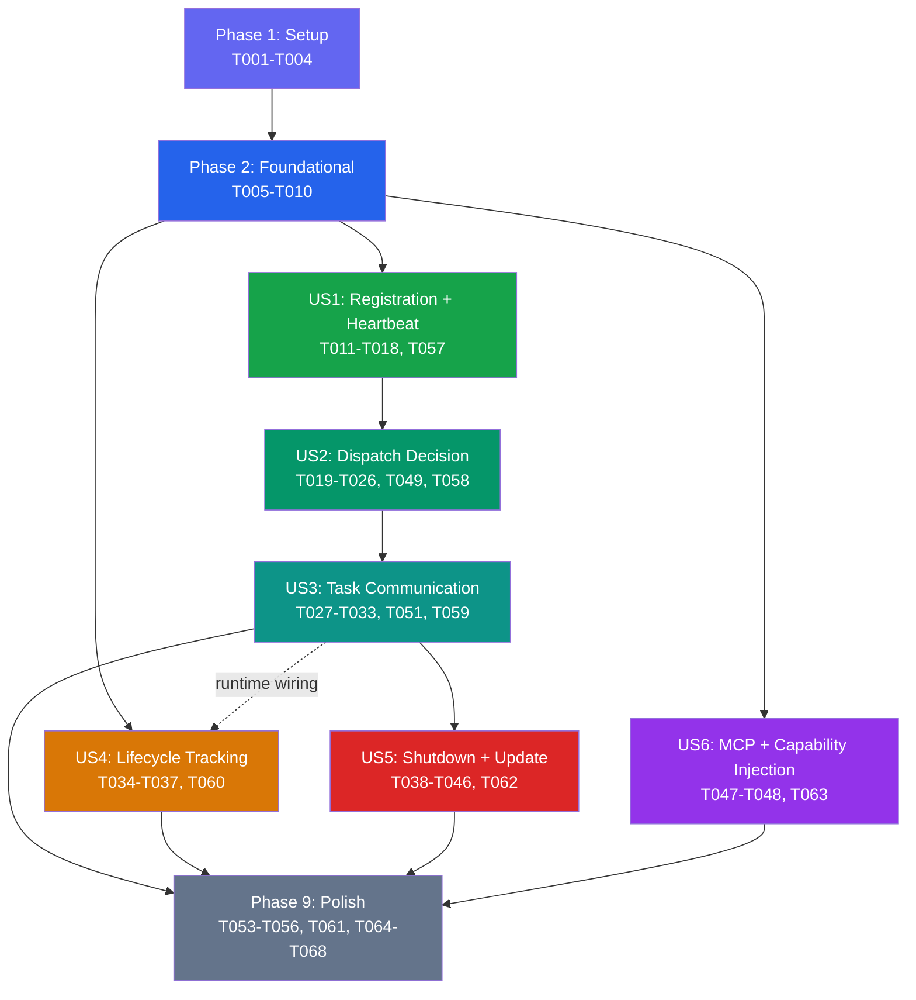

# Tasks: Daemon and Orchestrator Core (Phase 2)

**Input**: Design documents from `/specs/20260413-191249-daemon-orchestrator-core/`
**Prerequisites**: plan.md (required), spec.md (required), research.md, data-model.md, contracts/ws-protocol.md, quickstart.md

**Tests**: Test tasks are included per user story checkpoint (T057-T063). Coverage is enforced by existing `bun test` infrastructure (>=90% security-critical, >=70% all others).

**Organization**: Tasks are grouped by user story to enable independent implementation and testing of each story.

**Cross-reference**: `R-###` identifiers refer to research decisions in `research.md`. `FR-###` identifiers refer to functional requirements in `spec.md`. `FM-#` identifiers refer to failure modes in `plan.md`.

**Numbering**: Task IDs T050 and T052 were removed during planning and are intentionally skipped.

## Format: `[ID] [P?] [Story] Description`

- **[P]**: Can run in parallel (different files, no dependencies)
- **[Story]**: Which user story this task belongs to (e.g., US1, US2, US3)
- Include exact file paths in descriptions

## Path Conventions

- Single project: `src/` at repository root
- New directories: `src/orchestrator/`, `src/daemon/`, `src/shared/`

---

## Phase 1: Setup (Shared Infrastructure)

**Purpose**: Create the shared type system and directory structure required by all subsequent phases

- [x] T001 Create shared WebSocket message types and zod schemas in `src/shared/ws-messages.ts` (discriminated unions for all server and daemon messages per `contracts/ws-protocol.md`)
- [x] T002 Create shared daemon type definitions in `src/shared/daemon-types.ts` (`DaemonCapabilities`, `DaemonResources`, `NetworkInfo`, `DiscoveredTool`, `ContainerRuntime`, `DaemonInfo`, `PendingOffer`, `HeartbeatState`, `ActiveJob`, `SerializableBotContext` per `data-model.md`). **Import direction**: `SerializableBotContext = Omit<BotContext, 'octokit' | 'log'>` imports `BotContext` from `src/types.ts` — this bidirectional type-only dependency is safe in TypeScript
- [x] T003 Add new config fields to `src/config.ts` for daemon/orchestrator mode. **New fields only** (already existing: `agentJobMode`, `cloneBaseDir`, `valkeyUrl`, `databaseUrl`, `wsPort`, `maxTurnsPerComplexity`): `DAEMON_AUTH_TOKEN` (string, required in non-inline), `HEARTBEAT_INTERVAL_MS` (default 30000), `HEARTBEAT_TIMEOUT_MS` (default 90000), `STALE_EXECUTION_THRESHOLD_MS` (default 600000), `DAEMON_DRAIN_TIMEOUT_MS` (default 300000), `JOB_MAX_RETRIES` (default 3), `OFFER_TIMEOUT_MS` (default 5000), `ORCHESTRATOR_URL` (daemon-side: ws://host:port/ws), `DAEMON_UPDATE_STRATEGY` (exit|pull|notify, default exit), `DAEMON_UPDATE_DELAY_MS` (default 0), `DAEMON_EPHEMERAL` (boolean, default false) per R-014, R-015, R-016. **Verify**: `agentJobMode` zod enum already includes `shared-runner`, `ephemeral-job`, `auto` from PR #13 — add if missing
- [x] T004 Add `serializeBotContext()` function to `src/types.ts` that converts `BotContext` to `SerializableBotContext` (strips `octokit` and `log` per R-013). Note: the `SerializableBotContext` type itself is defined in `src/shared/daemon-types.ts` (T002) — this task adds the serializer function only

---

## Phase 2: Foundational (Blocking Prerequisites)

**Purpose**: Core infrastructure modules that MUST be complete before ANY user story can be implemented

**CRITICAL**: No user story work can begin until this phase is complete

- [x] T005 Implement Valkey client singleton in `src/orchestrator/valkey.ts` (Bun built-in `RedisClient`, `autoReconnect`, `onconnect`/`onclose` state tracking, `isValkeyHealthy()` export per R-003 and FM-7)
- [x] T006 Implement WebSocket server lifecycle in `src/orchestrator/ws-server.ts` (`Bun.serve()` on `WS_PORT`, `Authorization` header validation in fetch handler, `server.upgrade()`, websocket open/message/close/ping/pong callbacks per R-001 and R-009)
- [x] T007 Implement daemon registry CRUD in `src/orchestrator/daemon-registry.ts` (Valkey `SETEX daemon:{id}` with 90s TTL, Postgres `daemons` table upsert, `getActiveDaemons()`, `deregisterDaemon()`, reconnection handling per FM-8 and data-model.md)
- [x] T008 Implement execution history recorder in `src/orchestrator/history.ts` (Postgres `executions` table: create, update status transitions queued->offered->running->completed/failed, basic `recoverStaleExecutions()` startup scan that marks stale executions as failed per FM-4 — GitHub comment updating and Valkey cleanup are deferred to T035 which enhances this function)
- [x] T009 [P] Implement daemon tool discovery in `src/daemon/tool-discovery.ts` (`Bun.which()` + version probes for 14 CLI tools, `discoverContainerRuntime()`, `detectEphemeral()` cloud metadata checks, full `DaemonCapabilities` assembly per R-007 and R-015)
- [x] T010 [P] Implement WebSocket client with reconnection in `src/daemon/ws-client.ts` (Bun built-in `WebSocket`, `Authorization` header, decorrelated jitter backoff 1s-30s cap, `onopen`/`onmessage`/`onclose`/`onerror` handlers, auto-reconnect per R-002)

**Checkpoint**: Foundation ready — user story implementation can now begin

---

## Phase 3: User Story 1 — Daemon Registration and Heartbeat (Priority: P1) MVP

**Goal**: A daemon process connects to the orchestrator via WebSocket, registers its identity and capabilities, and continuously signals liveness via heartbeats. The orchestrator maintains an up-to-date registry of active daemons.

**Independent Test**: Start a daemon process, verify it appears as "active" in Valkey and Postgres, stop it, confirm it transitions to "inactive" after heartbeat timeout (90s).

### Implementation for User Story 1

- [x] T011 [US1] Implement connection handler per-connection message dispatch in `src/orchestrator/connection-handler.ts` (parse incoming messages via `daemonMessageSchema`, dispatch by `type`, handle `daemon:register` -> validate protocol version -> call daemon-registry -> send `daemon:registered` response, handle `daemon:draining` -> add to `drainingDaemons` set per ws-protocol.md)
- [x] T012 [US1] Implement heartbeat loop in `src/orchestrator/connection-handler.ts` (start per-daemon interval timer at `heartbeatIntervalMs`, send `heartbeat:ping`, track `awaitingPong`, `pongTimeout` at `heartbeatTimeoutMs`, on pong -> refresh Valkey TTL, on timeout -> `ws.close(4001)` -> FM-1 cleanup per FM-2)
- [x] T013 [US1] Implement `daemon:register` message handling in connection-handler with FM-8 reconnection logic (check existing connection for same daemon ID -> close old with code 4002 -> clean orphaned executions -> re-register per FM-8)
- [x] T014 [US1] Implement WebSocket close handler in `src/orchestrator/connection-handler.ts` for FM-1 cleanup (remove from `connections` Map, DEL Valkey keys, update Postgres status to `inactive`, scan orphaned executions, mark as failed + update GitHub tracking comment, cancel pending offers per FM-1). Re-queue logic: `offered` orphans use `PendingOffer.retryCount` with `maxRetries` cap; `running` orphans re-queue unconditionally if active daemons exist (crash-during-execution is a different failure class — no retry budget). **Phase dependency note**: re-queue path requires job queue (T019, Phase 4) — Phase 3 implementation supports fail-only; re-queue wiring is added after T019 is complete
- [x] T015 [US1] Implement daemon health reporter in `src/daemon/health-reporter.ts` (respond to `heartbeat:ping` with `heartbeat:pong` carrying `activeJobs` count and real-time `DaemonResources` snapshot — CPU, memory, disk; trigger full capability rescan every 10th heartbeat per R-007)
- [x] T016 [US1] Implement `daemon:register` message assembly in `src/daemon/ws-client.ts` (send on WebSocket open: daemonId, hostname, platform, osVersion, protocolVersion, appVersion, full `DaemonCapabilities` from tool-discovery per ws-protocol.md `daemon:register` schema)
- [x] T017 [US1] Wire WebSocket server startup into `src/app.ts` (call `startWebSocketServer()` after `db.migrate()` and `recoverStaleExecutions()` but only when `agentJobMode !== "inline"`, log WS_PORT per plan.md execution ordering)
- [x] T018 [US1] Add Valkey health check to readiness endpoint in `src/app.ts` (`/readyz` returns 503 when `!isValkeyHealthy()` in non-inline mode, `/healthz` unaffected per FM-7)
- [ ] T057 [US1] Write unit tests for ws-server auth, daemon-registry CRUD, heartbeat loop, and connection close handler; integration test for daemon connect → register → heartbeat → disconnect lifecycle; timing assertion for SC-005: verify reconnected daemon is dispatch-eligible immediately (not after a heartbeat cycle)

**Checkpoint**: Daemon registration and heartbeat lifecycle fully functional and independently testable

---

## Phase 4: User Story 2 — Orchestrator Dispatch Decision (Priority: P2)

**Goal**: When a webhook event arrives, the orchestrator evaluates available daemons and dispatch mode to route the job — inline when no daemons, daemon-based when active daemons exist. Includes offer/accept/reject protocol and inline fallback for `auto` mode.

**Independent Test**: Configure `AGENT_JOB_MODE=auto`, trigger a webhook with an active daemon registered, verify the job is offered to the daemon and dispatched. Trigger with no daemons, verify inline fallback.

### Implementation for User Story 2

- [x] T019 [US2] Implement job queue in `src/orchestrator/job-queue.ts` (Valkey `LPUSH queue:jobs` to enqueue, `BRPOP queue:jobs 5` to dequeue, `QueuedJob` interface defined locally in this file — canonical schema in data-model.md, implemented here as orchestrator-only type, retry logic with `retryCount` cap at `jobMaxRetries`). After completion: wire T014's deferred FM-1 crash re-queue path (`LPUSH queue:jobs` for orphaned `offered`/`running` executions in connection-handler close handler)
- [x] T020 [US2] Implement job dispatcher in `src/orchestrator/job-dispatcher.ts` (`selectDaemon()` with capability matching via `hasRequiredTools()`, ephemeral preference for complex jobs per FM-10 using `maxUptimeMs` comparison against estimated job duration — job complexity heuristic: treat as complex when effective `maxTurns > 30` (derived from `config.maxTurnsPerComplexity`; Phase 2 without triage defaults to `complex` tier = 50) per FM-10, cached repo preference, least-loaded sorting per R-007; `inferRequiredTools()` from labels + trigger body keywords per R-007)
- [x] T021 [US2] Implement offer/accept/reject protocol in `src/orchestrator/job-dispatcher.ts` (send `job:offer` with metadata + `requiredTools`, manage `pendingOffers` Map with `offerTimeoutMs` timer, on `job:accept` -> send `job:payload` with `SerializableBotContext` + installation token + `allowedTools` + `maxTurns` (Phase 2 default: `config.maxTurnsPerComplexity.complex` since triage is not yet active), on `job:reject`/timeout -> try next daemon or re-queue, on max retries exhausted -> inline fallback or error per FR-010a and ws-protocol.md)
- [x] T022 [US2] Implement FM-3 all-daemons-offline fallback in `src/orchestrator/job-dispatcher.ts` (`auto` mode -> inline fallback with `dispatch_mode='inline'`, explicit `shared-runner`/`ephemeral-job` mode -> error comment to GitHub + execution failed per FM-3)
- [x] T023 [US2] Implement installation token minting in `src/orchestrator/job-dispatcher.ts` (call `octokit.auth({ type: "installation" })` before sending `job:payload`, include token string in payload per R-012 and FR-011)
- [x] T024 [US2] Wire dispatch decision into `src/webhook/router.ts` (replace the existing non-inline rejection guard at lines 122-138 with daemon dispatch path: when `agentJobMode !== "inline"` and `isValkeyHealthy()`: create execution record -> enqueue job -> dispatcher picks up; add Valkey unavailable guard per FM-7; preserve existing inline path unchanged per FR-004)
- [x] T025 [US2] Add `buildEnvironmentHeader()` to `src/core/prompt-builder.ts` (Tier 2 capability injection: one-paragraph daemon environment summary — platform, shell, package managers, CLI tools, container runtime status, memory/disk available — injected into system prompt when `agentJobMode !== "inline"` per R-011/R-012). **Also modify `runInlinePipeline()` in `src/core/inline-pipeline.ts`** to accept optional `DaemonCapabilities` parameter and forward to `buildEnvironmentHeader()` and `resolveAllowedTools()` — inline callers pass `undefined` (no behavior change), daemon callers (T027) pass local capabilities
- [x] T026 [US2] Modify existing `resolveAllowedTools()` in `src/core/prompt-builder.ts` (conditionally include git/docker/curl/make/python3 Bash tools based on `DaemonCapabilities` per R-007 section 3)
- [x] T049 [US2] Modify `src/core/executor.ts` to accept optional `maxTurns` parameter (forwarded from `job:payload` per plan.md project structure; required by T027's job executor to forward per-job turn limits)
- [ ] T058 [US2] Write unit tests for job-queue enqueue/dequeue, job-dispatcher capability matching, offer/accept/reject state machine, FM-3 fallback logic; integration test for webhook → dispatch → daemon offer → accept → payload delivery

**Checkpoint**: Dispatch decision and offer protocol fully functional — jobs route to daemons or fall back to inline

---

## Phase 5: User Story 3 — Task Communication Between Server and Daemon (Priority: P2)

**Goal**: The daemon receives complete task payloads, executes the inline pipeline, and reports results back to the orchestrator. Communication survives transient interruptions gracefully.

**Independent Test**: Dispatch a task to a daemon, verify it receives the full payload, executes the pipeline, and the result (success/failure, cost, duration, turns) is delivered back to the orchestrator and recorded.

### Implementation for User Story 3

- [x] T027 [US3] Implement job executor in `src/daemon/job-executor.ts` (receive `job:payload` -> clone repo using installation token to `CLONE_BASE_DIR` temp dir -> reconstruct `BotContext` from `SerializableBotContext` + token (create Octokit instance via `createAppAuth` with installation token, create pino child logger with deliveryId) -> call `runInlinePipeline()` with daemon's local `DaemonCapabilities` passed as additional parameter for `buildEnvironmentHeader()` and `resolveAllowedTools()` -> send `job:result` with success/costUsd/durationMs/numTurns per FM-9 resource tracking)
- [x] T028 [US3] Implement FM-9 resource cleanup in `src/daemon/job-executor.ts` (`ActiveJob` tracking per job: workDir + agentPid, `finally` block cleanup, `try/catch` for uncaught exceptions, `process.on('exit')` sync `fs.rmSync` for all tracked work dirs per FM-9)
- [x] T029 [US3] Handle `job:offer` evaluation in `src/daemon/job-executor.ts` (`evaluateOffer()`: check `requiredTools` against local capabilities, check memory floor ≥512 MB, check disk floor ≥1024 MB, check active job capacity -> return accept or reject with reason per FR-010 and R-007 daemon-side section)
- [x] T030 [US3] Implement `job:status` progress updates in `src/daemon/job-executor.ts` (send `job:status` with `cloning`/`running`/`executing` states during pipeline execution per ws-protocol.md)
- [x] T031 [US3] Handle `job:cancel` message in `src/daemon/job-executor.ts` (kill agent subprocess via `process.kill(agentPid, 'SIGTERM')`, cleanup workDir, send `job:result` with `success: false` per ws-protocol.md). **Note**: Forward-compatible protocol infrastructure — no orchestrator-side emission task in Phase 2 (no spec requirement triggers cancellation yet). Daemon-side handler is defensive.
- [x] T032 [US3] Implement FM-6 late result guard in `src/orchestrator/connection-handler.ts` (on `job:result`: check Postgres execution status + daemon_id, discard if already finalized, send `error` with code `EXECUTION_ALREADY_FINALIZED` per FM-6)
- [x] T033 [US3] Wire `job:accept`, `job:reject`, `job:status`, `job:result` message handling into `src/orchestrator/connection-handler.ts` (dispatch to job-dispatcher for offer responses, call history.ts for status updates, finalize tracking comment on result per ws-protocol.md). **Valkey active jobs tracking**: INCR `daemon:{id}:active_jobs` on `job:accept`, DECR on `job:result`, DEL on deregistration (per data-model.md)
- [x] T051 [US3] Implement cross-module concurrency tracking for `MAX_CONCURRENT_REQUESTS` (FR-008): extract `activeCount` from `src/webhook/router.ts` into a shared module (e.g., `src/orchestrator/concurrency.ts`), increment on daemon dispatch in `router.ts`, decrement on `job:result` receipt in `connection-handler.ts`. Reject new requests when limit reached across all dispatch modes (inline + daemon). Must handle edge case: daemon crash → FM-1 cleanup must also decrement the counter. **Promoted from Phase 9**: without this, daemon-dispatched jobs leak `activeCount` (increment in router but never decrement), eventually exhausting `MAX_CONCURRENT_REQUESTS` and blocking all requests
- [ ] T059 [US3] Write unit tests for job-executor pipeline, FM-9 cleanup, FM-6 late result guard, offer evaluation, cross-module concurrency tracking; integration test for full job:offer → job:accept → job:payload → execution → job:result round-trip

**Checkpoint**: Full task communication lifecycle works end-to-end — daemon receives, executes, and reports

---

## Phase 6: User Story 4 — Execution Lifecycle Tracking (Priority: P3)

**Goal**: Every execution is tracked from creation through completion in Postgres. Operators can query execution state, daemon assignment, timing, and cost.

**Independent Test**: Trigger a request, verify the execution record progresses through status transitions (queued -> offered -> running -> completed/failed), and confirm cost, duration, daemon_id, and dispatch_mode are recorded.

### Implementation for User Story 4

- [x] T034 [US4] Implement full execution record lifecycle in `src/orchestrator/history.ts` (create record on webhook arrival with delivery_id/repo/entity/dispatch_mode/status=queued, update on offer with daemon_id/status=offered, update on accept with status=running/started_at, update on result with status=completed|failed/cost_usd/duration_ms/num_turns/completed_at/error_message per data-model.md status transitions)
- [x] T035 [US4] Enhance `recoverStaleExecutions()` in `src/orchestrator/history.ts` (basic version created in T008; this task adds: query executions with `(status = 'running' AND started_at < threshold) OR (status = 'offered' AND created_at < threshold)` — note: `started_at` is NULL for `offered` records so `created_at` must be used; mark failed, reconstruct Octokit from `context_json` to update GitHub tracking comments, clear all Valkey `daemon:*` keys per FM-4). **Note**: uses `KEYS daemon:*` for cleanup — acceptable at Phase 2 scale (1-10 daemons); replace with `SCAN` if daemon count grows significantly
- [x] T036 [US4] Implement execution record creation for inline-dispatched jobs in `src/webhook/router.ts` (when `DATABASE_URL` is configured and job runs inline: create execution record with `dispatch_mode='inline'` and `daemon_id=null`, update on completion per FR-005). **Note**: T024 (Phase 4) adds daemon dispatch wiring to the same file — build on those changes, not the pre-T024 version
- [x] T037 [US4] Record execution context_json for debugging in `src/orchestrator/history.ts` (serialize `SerializableBotContext` to `context_json` column on creation for post-mortem replay per data-model.md)
- [ ] T060 [US4] Write unit tests for execution record lifecycle transitions, stale recovery scan, context_json serialization, and inline-dispatched record creation

**Checkpoint**: All executions are tracked with full lifecycle data — queryable for operational visibility

---

## Phase 7: User Story 5 — Daemon Graceful Shutdown and Auto-Update (Cross-Cutting)

**Goal**: Daemon handles SIGTERM/SIGINT gracefully by draining active jobs. Orchestrator detects version mismatches and triggers daemon updates via the configurable update strategy.

**Independent Test**: Send SIGTERM to a daemon with active jobs, verify it sends `daemon:draining`, completes jobs, then disconnects cleanly. Start a daemon with an old `appVersion`, verify the orchestrator sends `daemon:update-required` and the daemon follows its configured strategy.

### Implementation for User Story 5

- [x] T038 Implement daemon entrypoint in `src/daemon/main.ts` (initialize logger, run tool discovery, connect via ws-client, register signal handlers for SIGTERM/SIGINT per FM-5)
- [x] T039 Implement graceful shutdown in `src/daemon/main.ts` (on SIGTERM/SIGINT: send `daemon:draining` with activeJobs + reason, wait for active jobs with `DAEMON_DRAIN_TIMEOUT_MS`, on complete -> close WS code 1000 -> `process.exit(0)`, on timeout -> kill subprocesses -> cleanup -> `process.exit(1)` per FM-5)
- [x] T040 Implement platform-aware drain timeout in `src/daemon/main.ts` (`detectPlatformTerminationDeadline()`: AWS Spot 120s, GCP Preemptible 30s, default Infinity; `effectiveDrainTimeout = min(config, platform - 10s)` per FM-10)
- [x] T041 [P] Implement spot termination notice polling in `src/daemon/main.ts` (optional, when `ephemeral === true` and `platform === "linux"`: poll AWS metadata every 5s, on 200 -> `initiateGracefulShutdown("spot termination notice")` per FM-10 and R-015)
- [x] T042 Implement version compatibility check in `src/orchestrator/connection-handler.ts` (`checkVersionCompatibility()`: major `protocolVersion` mismatch -> close 4003, `appVersion` mismatch -> send `daemon:update-required`, daemon ahead -> warn + allow per R-016)
- [x] T043 Handle `daemon:update-acknowledged` in `src/orchestrator/connection-handler.ts` (log strategy + delayMs, daemon will send `daemon:draining` after delay per R-016)
- [x] T044 Implement daemon-side update handler in `src/daemon/ws-client.ts` (receive `daemon:update-required` -> send `daemon:update-acknowledged` with strategy + jitter delay -> wait delay -> initiate graceful drain per R-016; thundering herd mitigation via `DAEMON_UPDATE_DELAY_MS + random jitter`)
- [x] T045 [P] Implement daemon updater for `pull` strategy in `src/daemon/updater.ts` (`pullAndRestart()`: `git pull --ff-only` -> `bun install --frozen-lockfile` -> `bun run build` -> `process.exit(75)` per R-016; rollback safety on failure)
- [x] T046 [P] Create daemon wrapper script `scripts/run-daemon.sh` (restart loop: run daemon, on exit 75 -> restart immediately, on other exit -> wait 5s -> restart per R-016)

- [ ] T062 [US5] Write unit tests for graceful shutdown (SIGTERM sends `daemon:draining`, drain timeout forces exit), platform-aware drain detection (`detectPlatformTerminationDeadline()`), spot termination polling, version compatibility check (`checkVersionCompatibility()` major/minor/ahead cases), `daemon:update-acknowledged` handler, thundering herd jitter in update delay; integration test for SIGTERM → drain → complete active job → close code 1000

**Checkpoint**: Daemon shutdown and auto-update lifecycle complete

---

## Phase 8: User Story 6 — MCP Server and Capability Injection (Cross-Cutting)

**Goal**: Claude agent running on a daemon has access to daemon capability information via system prompt injection and MCP tool.

**Prerequisites from Phase 4**: T025 (`buildEnvironmentHeader()`) and T026 (`resolveAllowedTools()`) implement Tier 2 system prompt injection as part of US2. This phase adds Tier 3 MCP server. Together, T025 + T026 + T047 + T048 fulfill spec US6's full scope ("system prompt header **and** MCP server tool").

### Implementation for User Story 6

- [x] T047 Implement `daemon-capabilities` MCP server in `src/mcp/servers/daemon-capabilities.ts` (Tier 3: expose `query_daemon_capabilities` tool that returns full `DaemonCapabilities` JSON for the executing daemon per R-011/R-012)
- [x] T048 Wire `daemon-capabilities` MCP server into MCP server registry in `src/mcp/` (register when `agentJobMode !== "inline"`, pass daemon capabilities context per existing MCP pattern)

- [ ] T063 [US6] Write unit tests for `daemon-capabilities` MCP server (`query_daemon_capabilities` returns accurate DaemonCapabilities JSON), `buildEnvironmentHeader()` output format and content, `resolveAllowedTools()` filtering based on capabilities, inline-mode exclusion (no MCP server registered and no environment header when `agentJobMode === "inline"`)

**Checkpoint**: Claude agent has full awareness of daemon environment

---

## Phase 9: Polish and Cross-Cutting Concerns

**Purpose**: Improvements that affect multiple user stories and final integration

- [x] T053 Update Dockerfile to support dual entrypoint (`CMD ["bun", "run", "dist/app.js"]` default, document daemon override `CMD ["bun", "run", "dist/daemon/main.js"]` per R-010)
- [x] T054 Run `bun run typecheck` and fix any type errors across all new modules
- [x] T055 Run `bun run lint` and fix any lint violations across all new modules
- [ ] T056 Run quickstart.md validation — manually verify end-to-end flow per quickstart.md steps 1-5 (requires running infrastructure)
- [ ] T064 Write integration test validating SC-002: measure end-to-end dispatch overhead (WebSocket handshake + offer/accept round-trip + token minting) and assert ≤2 seconds above baseline inline latency
- [ ] T065 Write integration test validating SC-004: send 10 concurrent webhook requests with multiple active daemons, assert all 10 are dispatched without drops or duplicates, and verify distribution across daemons
- [ ] T066 Write integration test for database unavailability during dispatch: simulate Postgres connection failure after Valkey health check passes, verify error comment is posted to GitHub and execution is not left in dangling state
- [ ] T061 Verify JSDoc coverage on all new exports in `src/orchestrator/`, `src/daemon/`, `src/shared/` (Constitution Principle VIII)
- [ ] T067 Create Mermaid diagrams for daemon lifecycle state machine, WebSocket connection lifecycle, and job dispatch sequence in source-level JSDoc or repository documentation (Constitution Principle VIII — visual explanation of flows, structures, and lifecycles that materially improve comprehension)
- [ ] T068 [SC-001] Write regression test for inline-only backward compatibility: start server with `AGENT_JOB_MODE=inline`, no `DATABASE_URL`, no `VALKEY_URL`, verify webhook processing works unchanged with zero configuration changes (validates SC-001 and FR-004)

---

## Dependencies and Execution Order

### Phase Dependencies

- **Setup (Phase 1)**: No dependencies — can start immediately
- **Foundational (Phase 2)**: Depends on Phase 1 (shared types) — BLOCKS all user stories
- **US1 (Phase 3)**: Depends on Phase 2 — foundational modules required
- **US2 (Phase 4)**: Depends on Phase 3 — needs daemon registry and connection handler
- **US3 (Phase 5)**: Depends on Phase 4 — needs job dispatch protocol. Includes T051 (concurrency tracking, promoted from Phase 9 — required for correctness when daemon dispatch is active)
- **US4 (Phase 6)**: T034/T035/T037 can start after Phase 2. **T036 depends on T024 (Phase 4)** — it modifies `router.ts` and must build on T024's daemon dispatch wiring. Full lifecycle wiring needs US2/US3 (soft runtime dependency shown as dashed edge in diagram)
- **US5 (Phase 7)**: Depends on Phase 3 (connection handler) + Phase 5 (job executor)
- **US6 (Phase 8)**: Can start after Phase 2 (MCP is independent), but Tier 2 injection needs Phase 4
- **Polish (Phase 9)**: Depends on all user stories being complete

### User Story Dependencies



### Within Each User Story

- Models/types before services
- Services before protocol handlers
- Core implementation before integration wiring
- Story complete before moving to next priority

### Parallel Opportunities

- **Phase 1**: T001 and T002 can run in parallel (different files). T003 depends on T002 (daemon types). T004 depends on existing types.
- **Phase 2**: T009 and T010 can run in parallel (daemon-side, different files). T005-T008 are server-side and have light dependencies on each other.
- **Phase 7**: T041, T045, T046 are marked [P] — different files, no cross-dependencies.
- **US4 and US6** can proceed in parallel with US2/US3 (independent concerns).

---

## Parallel Example: Phase 2 (Foundational)

```bash
# Sequential server-side (light dependencies):
Task T005: Valkey client singleton
Task T006: WebSocket server lifecycle (needs T005 for health check)
Task T007: Daemon registry (needs T005 for Valkey, T006 for WS types)
Task T008: Execution history (needs DB, independent of T005-T007)

# Parallel daemon-side:
Task T009: Tool discovery in src/daemon/tool-discovery.ts
Task T010: WebSocket client in src/daemon/ws-client.ts
```

---

## Implementation Strategy

### MVP First (User Story 1 Only)

1. Complete Phase 1: Setup (shared types)
2. Complete Phase 2: Foundational (Valkey, WS server, registry, history)
3. Complete Phase 3: User Story 1 (registration + heartbeat)
4. **STOP and VALIDATE**: Start a daemon, verify it registers as "active", stop it, confirm "inactive" after heartbeat timeout
5. This proves the WebSocket transport and daemon registry work end-to-end

### Incremental Delivery

1. Setup + Foundational -> Foundation ready
2. Add US1 -> Test registration/heartbeat independently -> MVP!
3. Add US2 -> Test dispatch decision + offer protocol -> Can route jobs
4. Add US3 -> Test full task execution -> End-to-end working
5. Add US4 -> Test lifecycle tracking -> Operational visibility
6. Add US5 -> Test graceful shutdown + auto-update -> Production-ready
7. Add US6 -> Test MCP capability injection -> Claude-aware
8. Polish -> Final validation

### Suggested MVP Scope

User Story 1 (daemon registration + heartbeat) is the minimum viable increment. It proves the WebSocket transport, authentication, daemon registry, and heartbeat lifecycle without any job dispatch complexity.
