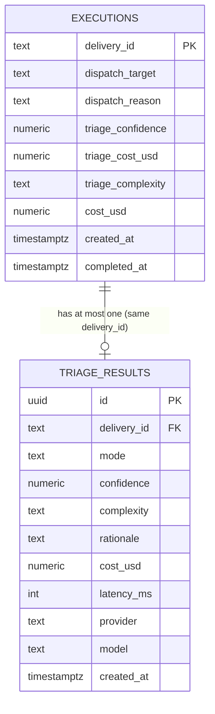

# Phase 1 Data Model — Triage and Dispatch Modes

**Date**: 2026-04-15
**Scope**: schema and in-memory shapes introduced or modified by this feature. All entities are defined against the existing Postgres (schema v1 from migration `001_initial.sql`) and Valkey (Bun `RedisClient`) foundations from Phase 1.

---

## 1. DispatchTarget (enum)

A string literal union. Single source of truth: `src/shared/dispatch-types.ts` (exports `DISPATCH_TARGETS` tuple + `DispatchTarget` type + `DispatchTargetSchema` Zod enum). `src/config.ts` and the Postgres `dispatch_target` `CHECK` constraint both mirror this vocabulary.

```text
"inline" | "daemon" | "shared-runner" | "isolated-job"
```

`"auto"` is a **configuration mode**, not a dispatch target; auto mode resolves per-event into one of the four concrete targets. The DB column therefore never stores `"auto"`.

**Validation**: the config Zod schema rejects any value outside this union. A Postgres `CHECK (dispatch_target IN (...))` constraint enforces the same at the storage layer.

---

## 2. DispatchReason (enum)

Why the router chose the target it did. Used for operator visibility (FR-010, FR-014) and the tracking-comment "why here?" line (SC-007).

```text
"label"                  -- explicit bot:shared / bot:job applied
"keyword"                -- deterministic keyword classifier matched
"triage"                 -- auto-mode LLM classification accepted (confidence ≥ threshold)
"default-fallback"       -- triage below threshold → configured default target
"triage-error-fallback"  -- triage failed (timeout/parse/circuit-open) → configured default
"static-default"         -- static classifier returned "ambiguous" and platform is not in auto mode
```

Stored in `executions.dispatch_reason` as `TEXT` with a `CHECK` constraint.

---

## 3. TriageResult (table `triage_results` + Zod schema)

Structured output of one triage LLM call. One row per invocation; zero rows for events where triage was bypassed.

| Column        | Type          | Nullable | Notes                                                               |
| ------------- | ------------- | -------- | ------------------------------------------------------------------- |
| `id`          | UUID          | NO       | PK, `DEFAULT gen_random_uuid()`                                     |
| `delivery_id` | TEXT          | NO       | `UNIQUE` — matches `executions.delivery_id`                         |
| `mode`        | TEXT          | NO       | one of `daemon`, `shared-runner`, `isolated-job` — `CHECK` enforced |
| `confidence`  | NUMERIC(3,2)  | NO       | 0.00–1.00, attached to `mode` decision only                         |
| `complexity`  | TEXT          | NO       | one of `trivial`, `moderate`, `complex` — `CHECK` enforced          |
| `rationale`   | TEXT          | NO       | one sentence; `LENGTH(rationale) <= 500` `CHECK`                    |
| `cost_usd`    | NUMERIC(10,6) | NO       | per-call billing cost                                               |
| `latency_ms`  | INTEGER       | NO       | provider round-trip                                                 |
| `provider`    | TEXT          | NO       | `"anthropic"` or `"bedrock"`                                        |
| `model`       | TEXT          | NO       | resolved provider-specific model ID                                 |
| `created_at`  | TIMESTAMPTZ   | NO       | `DEFAULT now()`                                                     |

**Index**: `triage_results (created_at DESC)` for 30-day aggregate queries (FR-014).

**In-memory shape** (`src/orchestrator/triage.ts`):

```ts
export const TriageResponseSchema = z.object({
  mode: z.enum(["daemon", "shared-runner", "isolated-job"]),
  confidence: z.number().min(0).max(1),
  complexity: z.enum(["trivial", "moderate", "complex"]),
  rationale: z.string().min(1).max(500),
});
export type TriageResponse = z.infer<typeof TriageResponseSchema>;

export interface TriageResult extends TriageResponse {
  costUsd: number;
  latencyMs: number;
  provider: "anthropic" | "bedrock";
  model: string;
  deliveryId: string;
}
```

**State transitions**: none. A `TriageResult` is immutable once written.

**Validation rules** (FR-007, FR-009):

- Schema parse via `TriageResponseSchema.safeParse(...)`. On parse failure, the router records the outcome as `triage-error-fallback`, increments the circuit-breaker failure counter, and **does not** persist a row.
- An unknown `mode` value (schema drift) trips the same path even if other fields are valid.

---

## 4. ExecutionRecord (table `executions` — extended)

Existing columns from migration `001_initial.sql` are unchanged. This feature adds five columns:

| Column              | Type          | Nullable | Default            | Notes                                                    |
| ------------------- | ------------- | -------- | ------------------ | -------------------------------------------------------- |
| `dispatch_target`   | TEXT          | NO       | `'inline'`         | FR-013 — one of DispatchTarget enum                      |
| `dispatch_reason`   | TEXT          | NO       | `'static-default'` | FR-013 — one of DispatchReason enum                      |
| `triage_confidence` | NUMERIC(3,2)  | YES      | NULL               | present iff dispatch_reason ∈ {triage, default-fallback} |
| `triage_cost_usd`   | NUMERIC(10,6) | YES      | NULL               | present iff triage actually ran (parse succeeded)        |
| `triage_complexity` | TEXT          | YES      | NULL               | one of {trivial, moderate, complex} or NULL              |

Rationale for denormalising these into `executions` rather than joining against `triage_results`: the FR-014 aggregate queries group by target + date and need confidence/cost without a per-row join across a multi-million-row `executions` table over time.

**Index**: `executions (dispatch_target, created_at DESC)`.

**State transitions**: a single row per delivery id. Written once at start with `dispatch_target`/`dispatch_reason` set; updated once on completion with `cost_usd`, `status`, `completed_at` (existing Phase 2 update path). No status field changes in this feature.

---

## 5. DispatchDecision (transient — no persistence of its own)

The in-memory record produced by the router cascade. It is _not_ a separate table — its data is split across `executions` (for the chosen target + reason) and `triage_results` (for the triage details if any). The type exists only to pass data cleanly from the classifier/triage step to the dispatcher.

```ts
export interface DispatchDecision {
  target: DispatchTarget; // "inline" | "daemon" | "shared-runner" | "isolated-job"
  reason: DispatchReason;
  complexity?: "trivial" | "moderate" | "complex"; // from triage when available
  maxTurns: number; // derived from complexity via documented mapping
  triage?: TriageResult; // present iff triage ran
}
```

**Derivation rule for `maxTurns`** (FR-008a):

| complexity                 | maxTurns                                |
| -------------------------- | --------------------------------------- |
| `trivial`                  | `TRIAGE_MAXTURNS_TRIVIAL` (default 10)  |
| `moderate`                 | `TRIAGE_MAXTURNS_MODERATE` (default 30) |
| `complex`                  | `TRIAGE_MAXTURNS_COMPLEX` (default 50)  |
| _unknown / triage skipped_ | `DEFAULT_MAXTURNS` (default 30)         |

All four bounds are operator-configurable via env.

---

## 6. PendingIsolatedJobQueueEntry (Valkey list `dispatch:isolated-job:pending`)

FIFO queue for requests awaiting isolated-job capacity. List entries are JSON strings; one per queued request.

```ts
export const PendingIsolatedJobEntrySchema = z.object({
  deliveryId: z.string().min(1),
  enqueuedAt: z.string().datetime(),
  botContextKey: z.string().min(1), // Valkey key holding gzipped BotContext JSON
  triageResult: TriageResponseSchema.nullable(),
  source: z.object({
    owner: z.string(),
    repo: z.string(),
    issueOrPrNumber: z.number().int().positive(),
  }),
});
export type PendingIsolatedJobEntry = z.infer<typeof PendingIsolatedJobEntrySchema>;
```

**Related Valkey keys**:

- `bot-context:<deliveryId>` — value: gzipped JSON of the `BotContext`; TTL 1h; created at enqueue, deleted on dequeue or TTL expiry.
- `dispatch:isolated-job:in-flight` — Redis set of delivery ids currently running as isolated-jobs. Cardinality bounded by `MAX_CONCURRENT_ISOLATED_JOBS`.

**Operations**:

- **Enqueue**: `LLEN dispatch:isolated-job:pending` < `PENDING_ISOLATED_JOB_QUEUE_MAX` → `SET bot-context:<id>` → `RPUSH dispatch:isolated-job:pending <entry>` → return position (`LLEN` at enqueue time, 1-indexed). If full, reject.
- **Dequeue**: `LPOP dispatch:isolated-job:pending` → parse → `GET bot-context:<id>` → `SADD dispatch:isolated-job:in-flight <id>` → spawn Job. On Job completion, `SREM dispatch:isolated-job:in-flight <id>`, `DEL bot-context:<id>`.

**State transitions**: `enqueued → running → {succeeded, failed}`. No `cancelled` state in Phase 3 — an event whose queue entry was never dequeued before a restart is lost (the idempotency layer prevents duplicate processing on redelivery).

---

## 7. DispatchModeConfiguration (env-derived, Zod-validated at startup)

Single platform-wide configuration block. Extends the existing `src/config.ts` Zod schema. Entries new in this feature:

| Env var                          | Zod type             | Default                       | Notes                                                                                    |
| -------------------------------- | -------------------- | ----------------------------- | ---------------------------------------------------------------------------------------- |
| `AGENT_JOB_MODE`                 | enum                 | `"inline"`                    | `"inline" \| "daemon" \| "shared-runner" \| "isolated-job" \| "auto"`                    |
| `DEFAULT_DISPATCH_TARGET`        | enum(DispatchTarget) | `"shared-runner"`             | fallback when triage sub-threshold or errored; cannot be `"inline"` when auto mode is on |
| `TRIAGE_MODEL`                   | string               | `"haiku-3-5"`                 | alias resolved by `MODEL_MAP`                                                            |
| `TRIAGE_CONFIDENCE_THRESHOLD`    | number 0–1           | `1.0`                         | per /speckit.clarify Q5 — strict on day 1                                                |
| `TRIAGE_TIMEOUT_MS`              | integer              | `5000`                        | hard cap per call                                                                        |
| `TRIAGE_MAXTURNS_TRIVIAL`        | integer              | `10`                          | complexity→maxTurns map                                                                  |
| `TRIAGE_MAXTURNS_MODERATE`       | integer              | `30`                          | "                                                                                        |
| `TRIAGE_MAXTURNS_COMPLEX`        | integer              | `50`                          | "                                                                                        |
| `DEFAULT_MAXTURNS`               | integer              | `30`                          | used when triage skipped / unknown complexity                                            |
| `MAX_CONCURRENT_ISOLATED_JOBS`   | integer              | `3`                           | cardinality cap on the `in-flight` set                                                   |
| `PENDING_ISOLATED_JOB_QUEUE_MAX` | integer              | `20`                          | `LLEN` ceiling                                                                           |
| `INTERNAL_RUNNER_URL`            | URL                  | `undefined`                   | required iff `shared-runner` is reachable                                                |
| `INTERNAL_RUNNER_TOKEN`          | secret string        | `undefined`                   | required iff `INTERNAL_RUNNER_URL` is set                                                |
| `JOB_NAMESPACE`                  | string               | `"default"`                   | K8s namespace for isolated-jobs                                                          |
| `JOB_IMAGE`                      | string               | inherits webhook server image | same tag as orchestrator per ADR-004                                                     |
| `JOB_TTL_SECONDS`                | integer              | `3600`                        | `ttlSecondsAfterFinished` on the Job                                                     |

**Cross-field validation** (Zod `superRefine`):

- `AGENT_JOB_MODE === "auto"` ⇒ `DEFAULT_DISPATCH_TARGET !== "inline"`.
- `AGENT_JOB_MODE` ∈ {`shared-runner`, `auto`} ⇒ `INTERNAL_RUNNER_URL` and `INTERNAL_RUNNER_TOKEN` are present.
- `AGENT_JOB_MODE` ∈ {`isolated-job`, `auto`} ⇒ either `KUBERNETES_SERVICE_HOST` env is set (in-cluster) or `KUBECONFIG` is readable; otherwise the app MUST log a warning at startup stating the isolated-job path will reject all dispatches.
- `TRIAGE_CONFIDENCE_THRESHOLD` ≥ 0 AND ≤ 1.

---

## Entity relationship diagram



The Valkey pending queue is transient and not modelled in the ER diagram — nothing in Postgres references a queue entry.
