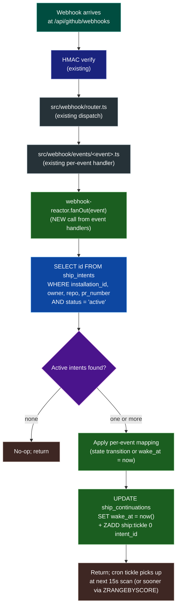

# Contract: Webhook Event Subscriptions for the Reactor

**Phase**: P4
**Module**: `src/workflows/ship/webhook-reactor.ts` + per-event hooks in `src/webhook/events/`
**Reference**: research.md §R6

The reactor early-wakes intents whose state may have changed. This document is the authoritative list of events the reactor consumes and how each maps to intent action.

---

## Subscribed events (6 types, specific actions)

| Event                         | Action(s)                      | Purpose                                                                                                                                                                                                                                                                                                    | Reactor mapping                                                                                                                                                                                                                                                                                                                                                                                                                                                                                            |
| ----------------------------- | ------------------------------ | ---------------------------------------------------------------------------------------------------------------------------------------------------------------------------------------------------------------------------------------------------------------------------------------------------------- | ---------------------------------------------------------------------------------------------------------------------------------------------------------------------------------------------------------------------------------------------------------------------------------------------------------------------------------------------------------------------------------------------------------------------------------------------------------------------------------------------------------- |
| `pull_request`                | `synchronize`                  | Push to PR head ref. May be bot or human.                                                                                                                                                                                                                                                                  | Match by `(installation_id, owner, repo, pr.number)`. If push author is non-bot AND head SHA != `ship_intents.target_head_sha`, transition intent to `human_took_over` (FR-010). Otherwise update `target_head_sha` and re-enqueue continuation with `wake_at = now()`.                                                                                                                                                                                                                                    |
| `pull_request`                | `closed`                       | PR closed or merged externally.                                                                                                                                                                                                                                                                            | Match by `(installation_id, owner, repo, pr.number)`. If `merged === true`, transition intent to `merged_externally`; else `pr_closed`.                                                                                                                                                                                                                                                                                                                                                                    |
| `pull_request`                | `labeled`                      | **Trigger surface** — maintainer added one of the recognised labels (`bot:ship`, `bot:stop`, `bot:resume`, `bot:abort-ship`, or override-suffixed variant such as `bot:ship/deadline=2h`). Per FR-026.                                                                                                     | Gated on `SHIP_USE_TRIGGER_SURFACES_V2=true`. When on, after the existing 200-OK path, dispatch via `trigger-router.routeTrigger({surface:'label', payload:{label_name, sender_login, pr}})`. `ALLOWED_OWNERS` is evaluated against `sender.login` (FR-028). The bot self-removes the label after acting (success, ineligible, already-in-progress, or unauthorised) per FR-026a. The `unlabeled` action is NOT subscribed — removing a label does NOT issue any command.                                  |
| `issue_comment`               | `created`, `edited`            | **Trigger surface** — PR comment may carry a literal `bot:<verb>`, OR a natural-language phrasing with mention prefix per FR-025/025a. Note: `issue_comment` events fire for both Issues and PRs; the reactor MUST filter by `event.payload.issue.pull_request !== undefined` to skip true Issue comments. | Gated on `SHIP_USE_TRIGGER_SURFACES_V2=true` for the NL path. Always dispatch the literal `bot:<verb>` parser first; if no literal match, run `nl-classifier.classifyComment(...)` (which itself gates on the `TRIGGER_PHRASE` mention prefix per FR-025a — comments without the mention return early with zero LLM cost). Forward any non-null classifier output through `trigger-router.routeTrigger({surface:'nl', ...})`. The reactor's existing fan-out for early-wake (state changes) is unaffected. |
| `pull_request_review`         | `submitted`                    | New review submitted.                                                                                                                                                                                                                                                                                      | Match. Re-enqueue continuation with `wake_at = now()`.                                                                                                                                                                                                                                                                                                                                                                                                                                                     |
| `pull_request_review_comment` | `created`, `edited`, `deleted` | Thread mutation.                                                                                                                                                                                                                                                                                           | Match. Re-enqueue continuation with `wake_at = now()`.                                                                                                                                                                                                                                                                                                                                                                                                                                                     |
| `check_run`                   | `completed`                    | Per-job CI signal.                                                                                                                                                                                                                                                                                         | Match by `(installation_id, owner, repo)`; resolve PR(s) via `check_run.pull_requests[]`. For each matched intent, re-enqueue continuation with `wake_at = now()`.                                                                                                                                                                                                                                                                                                                                         |
| `check_suite`                 | `completed`                    | Aggregate CI signal.                                                                                                                                                                                                                                                                                       | Match by `(installation_id, owner, repo)`; resolve PR(s) via `check_suite.pull_requests[]`. For each matched intent, re-enqueue continuation with `wake_at = now()`.                                                                                                                                                                                                                                                                                                                                       |

All other events (label, review_request, assigned, milestone, etc.) are ignored by the reactor.

---

## Reactor flow

---

## Latency target

Webhook arrival → `wake_at` updated AND Valkey sorted set updated: ≤ **500 ms p95**.

This must happen _after_ the 200-OK is returned (Constitution II). Implementation pattern: event handler returns 200 immediately, then `setImmediate(() => reactor.fanOut(event))`.

---

## Idempotency

The reactor is idempotent under duplicate event delivery (GitHub retries):

- Re-running the matching query is read-only.
- Setting `wake_at = now()` on an already-now value is a no-op.
- Adding to the Valkey sorted set with the same score is a no-op (`ZADD` overwrites).
- State transitions (e.g., `synchronize` → `human_took_over`) check current `status` first; transitioning an already-terminal intent is silently skipped.

---

## GitHub App manifest changes

The installation manifest must include event subscriptions for:

- `pull_request` (with `labeled` action enabled when `SHIP_USE_TRIGGER_SURFACES_V2=true`; per FR-026)
- `pull_request_review`
- `pull_request_review_comment`
- `issue_comment` (already subscribed for the existing comment-command surface; reused for FR-025 NL classifier when `SHIP_USE_TRIGGER_SURFACES_V2=true`)
- `check_run`
- `check_suite`

`pull_request` and `issue_comment` are likely already subscribed; the others may need to be added per installation. This is documented in the same-PR `docs/SETUP.md` update (Constitution VIII).

---

## Tests

`test/workflows/ship/webhook-reactor.test.ts` MUST cover:

1. `pull_request.synchronize` from bot → updates `target_head_sha`, re-enqueues.
2. `pull_request.synchronize` from non-bot → transitions intent to `human_took_over`.
3. `pull_request.closed` with `merged=true` → transitions to `merged_externally`.
4. `pull_request.closed` with `merged=false` → transitions to `pr_closed`.
5. `pull_request_review.submitted` → re-enqueues, no transition.
6. `pull_request_review_comment.created` → re-enqueues, no transition.
7. `check_run.completed` matching one PR with active intent → re-enqueues.
8. `check_run.completed` matching no active intents → no-op.
9. `check_suite.completed` with `pull_requests` containing two active intents → both re-enqueued.
10. Duplicate event delivery → second call is a no-op (idempotency).
11. State transition on already-terminal intent → silently skipped (no error).
